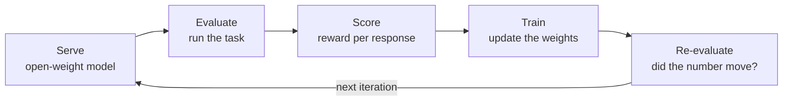

# Preface

I wrote this book because I got tired of treating the pieces of a modern reasoning-model pipeline as separate black boxes. I could serve a model. I could point an eval harness at an endpoint and read a number off the screen. I could, on a good day, run a fine-tune. What I could not do was hold the whole loop in my head at once and say, honestly, why each number came out the way it did. The eval score was a number the harness handed me. The reward was a function I copied from somebody's repo. The gradient step was whatever the trainer did between two log lines. I wanted to close the loop and see the seams.

So this is a book about one loop, run end to end, on one GPU, with the math left in.

## The loop is the spine

Everything here hangs off a single cycle: serve a model, evaluate it on a task, turn each response into a score, use those scores to train, then evaluate again and see whether the number moved. That is the whole argument of the book compressed into five words, and I come back to it constantly.

That is Figure 0.0, and it is the mental model I want you to carry into every chapter. When we are deep in the weeds of a KL penalty or a vLLM flag or a bootstrap confidence interval, the question is always the same: which arrow of this diagram am I standing on right now, and what does this piece feed into next? "Evals as rewards," the title, is really a claim about the middle of this diagram: that the thing you measure with (the eval) and the thing you train against (the reward) are two readings of the same underlying signal, and that if you understand one you are most of the way to understanding the other. A well-posed eval is a reward function you have not plugged into an optimizer yet. A reward function is an eval you have decided to differentiate through. Keeping those two ideas in the same frame is the point.

The reason the loop matters more than any single stage is that reasoning models are trained by closing it. You do not get a model that reasons better by staring at a static benchmark. You get it by scoring responses, pushing the weights toward the responses that scored well, and checking that the benchmark actually moved and did not just wobble inside its own noise. If you only ever run the top arc (serve and evaluate) you are doing measurement. If you only ever run the bottom arc (score and train) you are optimizing something you cannot see. The whole point is to run the circle.

## Why one 16GB GPU

The obvious way to write a book like this is to assume a cluster, or at least a rented 80GB card, and wave at the parts that do not fit. I deliberately did the opposite. Every lab in this book runs on a single NVIDIA RTX 5080 with 16GB of VRAM, in the machine I describe in the hardware baseline chapter, and that constraint is not an apology. It is a design input.

Sixteen gigabytes is enough to be real and small enough to hurt, which is exactly the regime where you are forced to understand what is actually consuming memory. When the whole model plus its KV cache plus optimizer state plus activations has to fit inside a budget you can count on your fingers, you cannot treat memory as infinite and you cannot hand-wave the arithmetic. You end up knowing, to within a few hundred megabytes, where every gigabyte went, because you had to. That knowledge is transferable in a way that "it fit on the A100" never is. Throughout the book I keep a running `vram-budget` admonition precisely so the memory accounting stays in the foreground rather than being the thing that mysteriously blows up at 2am.

The constraint also keeps the book honest about tradeoffs. Quantization, LoRA and its low-rank cousins, gradient checkpointing, paged KV caches, small-batch RL: these stop being optional cleverness and become the load-bearing structure of every lab. You learn them because you have no choice, which is the best reason to learn anything.

## Three readers, one book

I am writing for three audiences at once, and I owe each of them a different thing.

The first reader is future me, six months from now, trying to re-run a lab on a machine whose driver has moved on. That reader needs reproducibility above charm: exact commands, pinned versions, artifacts written to disk, and numbers stamped with the date and driver they were measured under. Wherever this book feels almost pedantically specific about how something was run, that is me writing to future me, who will not remember and will not forgive vagueness.

The second reader is the Substack reader, arriving one chapter at a time. The book is built so that chapters extract cleanly into posts, which is why each one opens with intuition before it earns the right to show you an equation, and why I seed shareable framings in `substack-seed` admonitions as I go. If you are that reader, you should be able to drop into a chapter, get the idea, and leave with something you could explain to a colleague over coffee.

The third reader is a thesis committee, and this one sets the floor for rigor. Every derivation has to survive being read by someone whose job is to find the step I skipped. Every statistic (every confidence interval, every claim that a training run "improved" something) has to be defensible, not vibes. When I compute an uncertainty I show the estimator; when I claim a difference is real I say how I know it is not noise. The `derivation` admonitions are where I pay that debt in full, working things from definitions rather than asserting them.

Serving three readers at once is a discipline, not a compromise. Intuition first keeps the Substack reader; math in full keeps the committee; exact commands and dated numbers keep future me. A chapter is done when all three are satisfied.

## The main line and the Thesis Thread

The book runs on two tracks. The main line is generic: it works with open-weight reasoning models and standard tasks, and nothing in it depends on my particular research problem. You can follow the main line, learn the loop, and apply it to whatever you care about.

Braided through the main line is a recurring worked example I call the Thesis Thread, flagged wherever it appears with a `thesis-thread` admonition. The thread follows one concrete problem in verifiable reasoning (an SDA-flavored task where a response can be checked, not just liked) from first eval to trained model. It exists to show the whole loop applied to a single problem with real stakes, so the generic machinery has somewhere to land. If you only want the general skills, you can skip the thread and lose nothing structural. If you want to see how the pieces actually compose on a problem someone cared enough to write a thesis about, follow it. Keeping the two tracks visibly separate is deliberate: it lets the general book stay general while still getting the payoff of a sustained example.

## What this book is not

To keep the contract clean, here is what I am leaving out on purpose.

This is an open-source-stack book. Every tool in it is something you can read the source of, run locally, and pin to a version. I lean on hosted APIs only as a point of comparison, never as a dependency, because a book about closing the loop on your own machine cannot have its core steps happen on someone else's. If a lab needs a component, that component is open weights or open source, full stop.

It is also not a business book. There is nothing here about pricing a product, sizing a market, or deciding whether any of this is worth doing commercially. Those are real questions and other people write about them well. My scope is the technical loop and the understanding required to run it, on the assumption that you already decided you want to. Where a real deployment would raise a cost or product question, I will name it and move on rather than pretend to answer it.

That is the deal. One loop, one GPU, all the math, three readers, two tracks, open source only. The next chapter teaches you how the book is put together so the conventions never get in your way. After that we start unboxing the machine.
