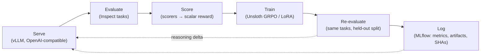
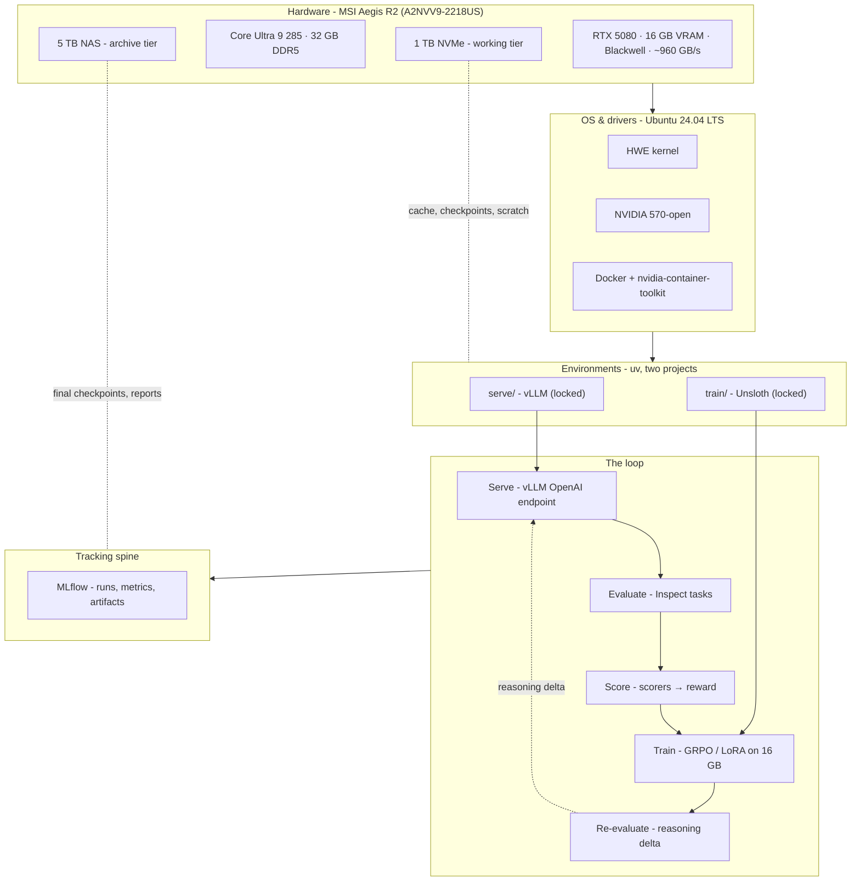

# Why this machine, this stack

**Goal.** Orient the reader: what the loop is, and why one number, 16 GB of VRAM, drives every downstream choice in this book.

**Covers.** The loop diagram (Figure 0.1); the 16 GB constraint as the central design input; working (NVMe) versus archive (NAS) storage tiers; the open-data boundary and why any business stack stays separate.

## Theory

### The loop is the thesis

Everything in this book is one loop. I serve an open-weight reasoning model, evaluate it on tasks with checkable answers, score those answers into a scalar reward, use that reward to train the model, and then re-evaluate to see whether the number moved. That is the whole machine. The rest of the book is me refusing to treat any box in that loop as opaque.



<p align="center"><em>Figure 0.1 - the serve → evaluate → score → train → re-evaluate loop. The dotted return edge is the only thing I actually care about: did the model get better at reasoning, measured the same way twice?</em></p>

The reason I draw it as a cycle and not a pipeline is that the interesting quantity lives on the return edge. A pipeline ends with a deliverable. This loop ends with a comparison: the same evaluation, run before and after training, on data the model never trained on. I call that difference the reasoning delta, and Part 7 is entirely about measuring it honestly. If I cannot trust the evaluation, the delta is noise dressed up as progress, so a surprising amount of this book is spent making the "evaluate" and "score" boxes boring and defensible before I ever let the "train" box touch a weight.

### One GPU is a feature, not an apology

The subtitle says "on one GPU," and I mean it as a design constraint I chose, not a limitation I am making excuses for. The baseline machine is an MSI Aegis R2 (A2NVV9-2218US): an Intel Core Ultra 9 285, an NVIDIA RTX 5080 with 16 GB of VRAM (Blackwell, roughly 960 GB/s of memory bandwidth per NVIDIA's RTX 5080 product specification), 32 GB of DDR5, a 1 TB NVMe system drive, and a 5 TB NAS for archive. Ubuntu 24.04 LTS, NVIDIA 570-open driver. Every measured number in this book is relative to exactly that machine, which is why I date and driver-stamp all of them.

The single most consequential number in that list is 16 GB. Not the core count, not the 960 GB/s, not the 32 GB of system RAM. Sixteen gigabytes of VRAM is the constraint that, once you internalize it, predicts almost every architectural decision I make later. So it is worth sitting with the number before we get anywhere near a command line.

```admonish vram-budget title="The 16 GB budget, in round numbers"
A budget only means something if you know what it has to cover. On one 16 GB card, VRAM is spent on, roughly in order of size: model weights, the KV cache for whatever context length I serve, activations during a forward pass, and (only when training) optimizer state and gradients. A 7B-parameter model in bf16 is about $7 \times 10^9 \times 2 = 14$ GB of weights alone, which already overflows the card before a single token of KV cache exists. That single arithmetic fact is why quantization (Part 2) and parameter-efficient training (Part 6) are not optional flourishes in this book; they are the load-bearing walls.
```

Let me make the weights arithmetic explicit, because it is the seed of everything. A parameter count $N$ stored at $b$ bytes per parameter needs

$$
\text{weight bytes} = N \times b.
$$

At bf16, $b = 2$. At 4-bit quantization, $b = 0.5$, plus a small overhead for scales and zero-points. So the same 7B model is about 14 GB at bf16 and roughly 4 GB at 4-bit. On a 16 GB card, the difference between those two numbers is the difference between "will not load" and "loads with 12 GB left over for cache and activations." I will derive the KV-cache and activation terms carefully in Part 1 and Part 2; here I only want the reader to feel the shape of the constraint. VRAM is a fixed pie. Every design choice is really a question of which slice something is allowed to take.

```admonish derivation title="Why the constraint propagates so far"
Consider the loop again. Serving needs weights plus KV cache. Training needs weights plus gradients plus optimizer state plus activations. If I tried to hold a serving engine and a full-fine-tune trainer resident on the same 16 GB at the same time, I would lose before I started: full-parameter SGD-style training of a model needs, very roughly, weights for the parameters, an equal-sized buffer for gradients, and (for Adam) two more buffers for the first and second moment estimates. That is about $4\times$ the weight memory just for the trainable state, i.e. $\sim 56$ GB for a 7B model at bf16, before activations. The 16 GB card makes that a non-starter, which is exactly why the loop separates serving from training in time and in software (Chapter 0.4), and why training uses LoRA/QLoRA so that only a tiny fraction of parameters carry optimizer state (Part 6). The constraint does not just shrink the model; it reshapes the whole workflow into "do one heavy thing at a time, and make the trainable surface small."
```

### Two storage tiers, because weights are heavy and cheap to lose

The second design input is mundane and I ignored it at my peril the first time: model weights and datasets are large, and the two things I want from them, fast access and durable retention, pull in opposite directions. Fast access wants the local NVMe. Durable retention wants somewhere I will not accidentally `rm -rf` during a cache cleanup. So I split storage into two tiers from day one.

The working tier is the 1 TB NVMe. It holds the Hugging Face cache, the currently active model weights, in-flight checkpoints, and scratch. It is fast (an NVMe Gen4/Gen5 SSD delivers multiple GB/s of sequential read; the exact figure is a machine-log entry, measured on the baseline machine; record value, date, driver) and it is treated as disposable. Anything on the working tier should be reconstructible from a revision hash and a lockfile. If the NVMe died tomorrow, I should lose time, not results.

The archive tier is the 5 TB NAS. It holds things I want to keep: final checkpoints I have decided are worth keeping, acceptance reports, MLflow artifact stores I have exported, and datasets I have curated. The NAS is slower over the network than local NVMe, and that is fine, because I touch it deliberately and rarely. Chapter 0.5 makes this split concrete with `HF_HOME`, `hf_transfer`, and a written retention policy; here the point is only that "where does this file live" is a decision I make on purpose, tier by tier, and not something I let a tool decide for me by defaulting into `~/.cache`.

### The open-data boundary

There is one more line I draw before any code, and it is as much about discipline as architecture. Everything in this book runs on open weights and open data. Open-weight models (Qwen, Llama, and friends, pinned to specific revisions), open evaluation datasets, open benchmarks. Nothing in the loop depends on a private dataset, a proprietary API, or anything I could not hand to a thesis committee and say "here, reproduce it."

That boundary exists for two reasons. The obvious one is reproducibility: a thesis result that leans on data nobody else can see is not a result, it is an anecdote. The less obvious one is contamination of purpose. I also do consulting and product work, and that work has its own private data, its own models, its own infrastructure. If I let that stack bleed into this one, two bad things happen. First, I can no longer publish cleanly, because I cannot separate the open result from the private input. Second, I create a compliance and confidentiality hazard where private client data could end up in a public checkpoint or a Substack post. So the business stack stays on separate machines, separate accounts, separate storage, with no shared caches and no shared credentials. This book never touches it, and I will not gesture at it again except to say: if you are reading this to build your own loop, keep your paid work and your published work in different houses.

### Why reasoning models, and why open weights

One more design input deserves a paragraph, because it shapes what the loop is even for. The subject of this book is reasoning models: models trained or coaxed to produce an explicit chain of intermediate steps before committing to an answer. That choice is not incidental to the 16 GB constraint, it is synergistic with it. Reasoning happens at inference time, in tokens, which means a modestly sized model that thinks for longer can close a surprising amount of the gap to a much larger model that answers immediately. On a card that cannot hold a 70B model, "spend more tokens, not more parameters" is exactly the trade the hardware wants me to make, and it is the trade the loop is built to measure and then reinforce.

Open weights are the other half. I need models whose weights I can download, quantize, serve, and fine-tune locally, with no API gatekeeper between me and the tensors. Only open-weight families (Qwen, Llama, and their kin) let me do the full serve-and-train loop on my own GPU, and only open weights let me pin a revision hash and hand a reviewer something they can reproduce byte for byte (Chapter 0.5). A closed model behind an API can be evaluated but never trained here, and never fully inspected, which would make half the loop a black box and violate the book's founding promise. So the loop runs on open reasoning models specifically because that is the intersection where I can both measure a model honestly and change it.

```admonish thesis-thread
For the committee, this framing pins the intervention variable. The thesis does not claim to build a better base model; it claims that a specific, measurable training signal (a scorer used as a reward) moves a specific, pre-registered reasoning metric on a fixed open model, on fixed hardware. Choosing open reasoning models is what makes that claim both testable (I can train) and reproducible (I can pin), which are the two properties a committee will press on hardest.
```

## Tooling

This chapter has no command surface of its own, but it is worth naming the tools each box in Figure 0.1 will become, so the later chapters land in a frame that already exists in the reader's head.

The **serve** box is vLLM, run as an OpenAI-compatible server on localhost. I chose it because it gives me paged KV-cache memory management and continuous batching, which are exactly the two things that let a 16 GB card serve a real model at usable throughput. Part 2 opens the box.

The **evaluate** box is Inspect (the UK AI Safety Institute's evaluation framework). Evaluations are defined as tasks; the model under test is just an endpoint. Because the model is an endpoint, the same eval runs against the served base model and the trained model with no change, which is what makes the before/after comparison fair. Part 3 opens this box.

The **score** box is Inspect scorers plus, later, my own reward functions. A scorer turns a model's answer into a number: exact-match, a parsed numeric answer, a judged rubric. In Part 7 those same scorers become the reward signal for training, which is the pun in the book's title: evals as rewards. The eval and the reward are the same function, used twice.

The **train** box is Unsloth running GRPO (and LoRA/QLoRA for the parameter-efficient plumbing). Unsloth is what makes reinforcement-style training of a reasoning model fit on 16 GB at all. Parts 5, 6, and 7 open this box, math first.

The **log** box is MLflow on localhost, and it is the least glamorous and most important tool in the stack. Every run in this book logs its git SHA, its uv lockfile hash, the driver version, the VRAM peak, and its seeds, so that a number in a figure can always be traced back to the exact state of the world that produced it. Chapter 0.6 stands it up.

A note on why the boxes are tools and not one monolithic script. It would be possible to write a single Python program that loads a model, evaluates it, computes rewards, trains, and re-evaluates, all in one process. I deliberately do not, and the reason connects back to the 16 GB constraint and to the endpoint seam. A monolith would have to hold serving state and training state in the same process and the same environment, which the memory budget forbids and the dependency split (Chapter 0.4) makes painful. More importantly, a monolith hides its own seams: when a number moves, I want to know which box moved it, and a pipeline of separable tools with a logged interface between each stage lets me answer that. So each box is its own tool with its own environment, talking to the next through a defined interface (an HTTP endpoint, a scored dataset, a checkpoint on disk), and the whole thing is coordinated by small scripts rather than fused into one process. The loop is modular because modularity is what lets me attribute a change to a cause.

Wrapping all of it is **uv** for Python environments and **Docker** for the few services (like MLflow) that are cleaner as containers. The doctrine that serve and train live in two separate uv projects (Chapter 0.4) is a direct consequence of the 16 GB constraint: two environments means I can lock two mutually incompatible dependency trees (vLLM's and Unsloth's) without either poisoning the other, and it means I never accidentally hold both heavyweights resident at once.

```admonish under-the-hood title="Why an endpoint, not an in-process model"
It would be simpler, on the face of it, to load the model once in Python and call it directly for both evaluation and training. I deliberately do not. Serving behind an HTTP endpoint forces a clean seam: the evaluator cannot reach into the model's internals, so an eval that passes against the endpoint is an eval that would pass against any conforming endpoint, including a hosted one or a future different engine. That seam is what lets me swap vLLM's internals in Part 2 without rewriting a single eval, and it is what keeps the "evaluate" box honest. The cost is a little latency and a serialization boundary. On a single-GPU, single-user machine that cost is negligible, and the discipline it buys is worth far more than the microseconds it spends.
```

## Lab

There is no runnable lab in this chapter. The deliverable is the annotated stack diagram below, which I keep as the reference picture for the whole book. Everything I build later is an implementation of one of these layers, and when I get lost in a later chapter, this is the diagram I come back to.



<p align="center"><em>Figure 0.2 - the annotated stack. Read it top to bottom: hardware constrains the OS and drivers, which host two locked uv environments, which run the loop, which logs into MLflow. The 16 GB card at the top is the reason every layer below it looks the way it does.</em></p>

**What you should see.** Not on a screen (there is nothing to run yet), but in your head: a single card at the top with a hard 16 GB ceiling, and a chain of decisions falling out of it. Weights must be quantized or the model will not load. Serving and training must be separated in time, because they cannot both hold their heavyweight state at once. Storage must be tiered, because weights are big and results are precious. And a boundary must be drawn around open data, because a result you cannot reproduce is not a result. If those four consequences feel inevitable rather than arbitrary by the end of this diagram, the chapter did its job, and the rest of the book is just me making each of them concrete, one command at a time.

```admonish thesis-thread
For the committee: this chapter fixes the unit of analysis. Every quantitative claim later is of the form "on the baseline machine, under driver X, at seed Y, metric M moved by $\Delta$." The loop in Figure 0.1 is the experimental apparatus; the reasoning delta on its return edge is the dependent variable. Naming the apparatus this early is what lets Part 9 assemble logs into figures without special pleading.
```

```admonish substack-seed
The clarifying move for a general-audience post is to reframe "I only have one GPU" from a confession into a specification. A 16 GB ceiling is not a smaller version of a datacenter; it is a different design problem with its own elegant answers, the way a bicycle is not a failed car. Show the one line of arithmetic - a 7B model is 14 GB at bf16, 4 GB at 4-bit - and let the reader watch every subsequent decision (quantize, separate serve from train, shrink the trainable surface) fall out of that single number like dominoes. The hook: constraints do not limit good engineering, they generate it.
```
