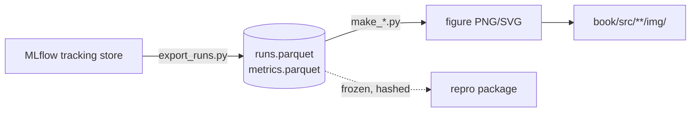

# From logs to figures

Every run in this book left a trail in MLflow. Every claim I want to make in the thesis, in the Substack series, or to my future self, has to come back out of that trail as a figure I can regenerate on demand. This chapter is about the join between those two facts: how I get from an MLflow export to a PNG that goes in a chapter, and how I make sure that PNG is never a one-off I can't reproduce.

The rule I'm defending here is simple to state and annoying to live by: no figure ships unless a script makes it from logged data. No hand-tuned axes in a notebook that I closed three weeks ago. No screenshot of the MLflow UI. If a reviewer asks "where did this number come from," the honest answer is a file path and a git commit, not my memory.

```admonish read-along
Open the book repo alongside this chapter. Everything here lands in two places: `figures/` for the scripts that make plots, and `book/src/**/img/` for the PNGs the chapters embed. If you built the loop from Part VII, you already have MLflow runs to export. If not, the lab below ships a tiny synthetic export so the pipeline runs with zero GPU. All timings and file sizes I quote as "(measured on the baseline machine)" are placeholders you fill in on your own MSI Aegis R2 (RTX 5080 16GB, Ubuntu 24.04) with the value, the date, and the driver version, because there is no GPU where I'm writing this and I refuse to invent measured numbers.
```

## Theory

### Why the export, not the store

MLflow is a database plus an artifact store. It is a great place to *write* runs and a bad place to *read* them for publication. The tracking store schema changes across MLflow versions, the SQLite or Postgres backend is a moving target, and a figure script that queries the live store couples my thesis figures to whatever state my tracking server happens to be in on the day I build the book. That coupling is exactly the reproducibility hole I'm trying to close.

So I put a boundary in the middle. On one side, runs flow into MLflow during experiments. On the other side, figures are made only from a frozen, flat export: Parquet files (or CSV, if I want them human-diffable) that snapshot the runs and metrics I care about. The export is an artifact with a date and a hash. Figures are a pure function of that artifact. This is the same discipline as separating raw data from derived data in any analysis pipeline, and it buys the same thing: I can delete my MLflow server, restore it from backup six months later with a different schema, and my figures still build because they never touched it.



The arrow that matters is the dashed one. The frozen export is what goes into the reproducibility package in chapter 10.3. The live store does not.

### The shape of an MLflow export

MLflow's data model is runs and, under each run, three kinds of logged things: params (set once, strings), metrics (time series, floats with a step and a timestamp), and tags (mutable strings). When I flatten that for analysis I get two tables that cover almost everything I plot.

The first is a **runs table**: one row per run, wide, with columns for `run_id`, `experiment`, the params I set (model, learning rate, task suite version), the `seed` (which the 0.6 logging schema records as a *tag*, not a param, so the export has to lift it out of the tags explicitly), and the *final* value of each metric. This is the table I use for anything comparative: bar charts across seeds, before/after deltas, ablation grids. One row per run keeps the pandas easy and the joins obvious.

The second is a **metrics table**: long, one row per `(run_id, metric, step, value, timestamp)`. This is what I use for anything that moves over training: reward curves, KL over steps, eval accuracy across checkpoints. Long format is non-negotiable here because it is what seaborn and matplotlib group over cleanly, and because it survives adding a new metric without a schema change.

The mental model: runs table is wide and describes *what a run was*, metrics table is long and describes *what a run did over time*. Almost every figure in this book is a groupby-and-reduce on one of those two tables.

### Tidy data, one more time

The reason I insist on long-format metrics is the same reason Hadley Wickham insisted on tidy data: each variable is a column, each observation is a row, each type of observational unit is a table. When metrics are tidy, "plot reward vs step, one line per seed, faceted by task" is a single `groupby(["task","seed"])` and a loop, not a wrangling project. When they're wide (one column per step), every new run reshapes the table and every plot is bespoke. I pay the reshape cost once, at export time, and never again.

### Determinism in the plot layer

A figure script has to be deterministic in two ways. First, given the same export it must produce byte-stable or near-byte-stable output, so that `git diff` on a regenerated figure is empty when nothing changed. That means fixing the matplotlib backend to a non-interactive one (`Agg`), setting a fixed DPI, and not letting anything depend on wall-clock time or dict ordering. Second, any sampling or jitter in the plot (say, a strip plot of per-item scores) has to be seeded. I set a NumPy seed at the top of every figure script for exactly this reason. A figure that shuffles differently each build is a figure that produces spurious diffs and erodes trust in the whole pipeline.

## Tooling

### pandas conventions over exports

A few conventions do most of the work. I load Parquet, not CSV, for anything with more than a few thousand rows, because Parquet preserves dtypes (I don't want `seed` silently becoming a float) and loads faster (measured on the baseline machine, record value, date, driver). I keep CSV around only for the small summary tables that I also want to eyeball in a diff.

I set explicit dtypes on the categorical columns: `model`, `task`, `variant` become pandas `category`, and `seed` stays an `int`. Categoricals give me stable, controllable ordering in plots (I decide the order once via `set_categories`, not alphabetically by accident) and they make groupbys cheaper.

I never plot off an un-aggregated frame. Every figure function takes a tidy frame and does its own explicit `groupby(...).agg(...)` with named aggregations, so the reduction is visible in the code and not hidden in a plotting library's defaults. If I'm showing a mean, I compute the mean and the standard error in the same aggregation, so the error bars come from the same code path as the point.

### A matplotlib house style

I want every figure in the book to look like it came from the same person, because it did. Rather than restyle each plot, I ship one style module that sets rcParams once and a small palette that's colorblind-safe. The house style is boring on purpose: a clean sans font, a light grid on the y-axis only, no top or right spine, a fixed figure size and DPI, and a fixed categorical color order so that "seed 0" is the same color in every chapter it appears.

The palette is Paul Tol's colorblind-safe qualitative set, because roughly 1 in 12 men have some form of color vision deficiency (source: standard prevalence figures for red-green CVD in populations of European descent, ~8%), and a thesis committee or a Substack reader should never have to guess which line is which. I encode a second channel (line style or marker) whenever color carries meaning, so the figure survives being printed in grayscale.

```admonish gotcha
matplotlib caches its font list and its rcParams process-wide. If you set the house style in one place and then a stray `seaborn.set_theme()` runs later, seaborn silently stomps your rcParams and your "house style" figures come out looking like default seaborn. Fix: apply the house style *inside* each figure function via a context manager (`with plt.style.context(...)` or `plt.rc_context(...)`), not once at import. That way no import-order accident can change how a figure looks, and two figures built in the same process can't contaminate each other.
```

### One script per figure, one figure per script

The unit of work is a script named for the figure it makes: `make_reward_curve.py` makes `reward_curve.png`. It reads the frozen export, builds exactly one figure (or one small family of closely related panels), writes the PNG and an SVG next to it, and writes a tiny sidecar JSON recording the export hash and the git commit it ran under. That sidecar is what lets me answer "is this figure stale?" mechanically: if the export hash in the sidecar doesn't match the current export, the figure is out of date and CI can say so.

A `Makefile` (or a `figures/build_all.py` driver) ties them together so `make figures` rebuilds everything. The driver is dumb on purpose: glob the `make_*.py` scripts, run each, fail loudly if any script errors. No figure is special; adding one is dropping a `make_*.py` file in the directory.

## Lab

The artifact is the figure pipeline itself: a script that turns an MLflow export into the book's figures, plus the house style, plus a driver. It runs with no GPU. I ship a synthetic export generator so you can run the whole thing today, then swap in your real export when you have runs.

### Set up the project

```bash title="figures/setup.sh"
# From the repo root. uv everywhere, never bare pip or venv.
uv init figures --package
cd figures
uv add pandas pyarrow matplotlib numpy mlflow
# mlflow is only needed by export_runs.py (the online step).
# The figure scripts themselves depend only on pandas + matplotlib + numpy,
# so they run in CI without a tracking server.
```

### The online step: export runs from MLflow

This is the only script that talks to the live tracking store. It runs on the baseline machine, where MLflow lives, and writes the frozen export. Everything downstream reads that export and never touches MLflow again.

```python title="figures/export_runs.py"
"""Freeze an MLflow experiment into flat Parquet tables.

This is the ONLY script that reads the live MLflow store. Run it on the
machine where MLflow lives; commit its Parquet output (or archive it to the
NAS per chapter 10.3). Figures are a pure function of this output.
"""
from __future__ import annotations

import argparse
import hashlib
import json
from datetime import datetime, timezone
from pathlib import Path

import mlflow
import pandas as pd


def export(experiment: str, tracking_uri: str, out_dir: Path) -> None:
    mlflow.set_tracking_uri(tracking_uri)
    exp = mlflow.get_experiment_by_name(experiment)
    if exp is None:
        raise SystemExit(f"no experiment named {experiment!r} at {tracking_uri}")

    client = mlflow.tracking.MlflowClient()
    runs = mlflow.search_runs(experiment_ids=[exp.experiment_id])

    # --- runs table: one wide row per run (params + final metric values) ---
    # Flatten params.* and metrics.* to bare names. Drop tags.* EXCEPT the ones
    # the figures and provenance need: per the 0.6 logging schema `seed` is a
    # TAG (not a param), and the git SHA + driver are tags too. If we dropped
    # every tag, make_delta_plot.py's sort_values("seed") would KeyError.
    runs = runs.rename(columns=lambda c: c.replace("params.", "").replace("metrics.", ""))
    keep_tags = {
        "tags.seed": "seed",
        "tags.git_sha": "git_sha",
        "tags.driver_version": "driver_version",
    }
    runs = runs.rename(columns={k: v for k, v in keep_tags.items() if k in runs.columns})
    if "seed" in runs.columns:
        runs["seed"] = runs["seed"].astype(int)  # tags are strings; figures want int
    runs_cols = [c for c in runs.columns if not c.startswith("tags.")]
    runs_table = runs[runs_cols].copy()

    # NOTE: search_runs() yields `experiment_id`, not `experiment` (map it back
    # from exp.name if you want the human name). And a pre/post design often
    # logs baseline and post as nested CHILD runs under one parent, so
    # eval_acc_baseline / eval_acc_final may land on separate rows and need a
    # reshape (pivot on the parent run id) into the one-row-per-run wide form
    # the delta figure expects.

    # --- metrics table: long history, one row per (run, metric, step) ---
    long_rows = []
    for run_id in runs["run_id"]:
        for metric in client.get_run(run_id).data.metrics:
            for m in client.get_metric_history(run_id, metric):
                long_rows.append(
                    {
                        "run_id": run_id,
                        "metric": metric,
                        "step": m.step,
                        "value": m.value,
                        "timestamp": m.timestamp,
                    }
                )
    metrics_table = pd.DataFrame(long_rows)

    out_dir.mkdir(parents=True, exist_ok=True)
    runs_path = out_dir / "runs.parquet"
    metrics_path = out_dir / "metrics.parquet"
    runs_table.to_parquet(runs_path, index=False)
    metrics_table.to_parquet(metrics_path, index=False)

    # --- provenance sidecar: hash + when + what ---
    digest = hashlib.sha256()
    for p in (runs_path, metrics_path):
        digest.update(p.read_bytes())
    manifest = {
        "experiment": experiment,
        "tracking_uri": tracking_uri,
        "exported_at": datetime.now(timezone.utc).isoformat(),
        "n_runs": int(len(runs_table)),
        "n_metric_points": int(len(metrics_table)),
        "export_sha256": digest.hexdigest(),
        "mlflow_version": mlflow.__version__,
    }
    (out_dir / "export_manifest.json").write_text(json.dumps(manifest, indent=2))
    print(json.dumps(manifest, indent=2))


if __name__ == "__main__":
    ap = argparse.ArgumentParser()
    ap.add_argument("--experiment", required=True)
    ap.add_argument("--tracking-uri", default="http://127.0.0.1:5000")
    ap.add_argument("--out", type=Path, default=Path("export"))
    a = ap.parse_args()
    export(a.experiment, a.tracking_uri, a.out)
```

### The offline synthetic export (so the lab runs with no GPU)

If you don't have runs yet, generate a stand-in export with the same schema. This lets you exercise the whole figure pipeline today, then delete it and point at the real export later.

```python title="figures/make_synthetic_export.py"
"""Write a synthetic export with the real schema, for GPU-free testing.

Delete this once you have a real export from export_runs.py. This mirrors the
POST-export schema: `seed` is a plain int column here because export_runs.py
lifts it out of the MLflow tags (where the 0.6 schema logs it) into a column,
so from the figure scripts' point of view the two exports look the same.
"""
from __future__ import annotations

import hashlib
import json
from datetime import datetime, timezone
from pathlib import Path

import numpy as np
import pandas as pd

RNG = np.random.default_rng(0)  # seeded: synthetic data must be reproducible too


def main(out_dir: Path = Path("export")) -> None:
    seeds = [0, 1, 2]
    tasks = ["gsm8k_sub", "math_sub", "logic_sub"]
    steps = np.arange(0, 500, 25)

    runs, metrics = [], []
    for seed in seeds:
        run_id = f"run_{seed:03d}"
        base = 0.42 + 0.02 * seed
        gain = 0.11 - 0.01 * seed
        runs.append(
            {
                "run_id": run_id,
                "experiment": "grpo_loop",
                "model": "qwen2.5-3b",
                "variant": "grpo",
                "seed": seed,
                "learning_rate": 1e-6,
                "task_suite_version": "v1.2.0",
                "eval_acc_final": base + gain,
                "eval_acc_baseline": base,
            }
        )
        for task in tasks:
            for step in steps:
                # a saturating reward curve + seeded noise
                reward = base + gain * (1 - np.exp(-step / 150)) + RNG.normal(0, 0.01)
                metrics.append(
                    {
                        "run_id": run_id,
                        "metric": f"reward/{task}",
                        "step": int(step),
                        "value": float(reward),
                        "timestamp": 1_700_000_000_000 + int(step) * 1000,
                    }
                )

    out_dir.mkdir(parents=True, exist_ok=True)
    runs_path = out_dir / "runs.parquet"
    metrics_path = out_dir / "metrics.parquet"
    pd.DataFrame(runs).to_parquet(runs_path, index=False)
    pd.DataFrame(metrics).to_parquet(metrics_path, index=False)

    digest = hashlib.sha256()
    for p in (runs_path, metrics_path):
        digest.update(p.read_bytes())
    (out_dir / "export_manifest.json").write_text(
        json.dumps(
            {
                "experiment": "grpo_loop (SYNTHETIC)",
                "exported_at": datetime.now(timezone.utc).isoformat(),
                "n_runs": len(runs),
                "n_metric_points": len(metrics),
                "export_sha256": digest.hexdigest(),
                "synthetic": True,
            },
            indent=2,
        )
    )
    print(f"wrote synthetic export to {out_dir}/ (sha256 {digest.hexdigest()[:12]})")


if __name__ == "__main__":
    main()
```

### The house style

```python title="figures/house_style.py"
"""The book's one and only matplotlib house style.

Applied per-figure via a context manager so import order can never stomp it.
Palette is Paul Tol's colorblind-safe qualitative set. Color is never the
only channel that carries meaning, pair it with line style or marker.
"""
from __future__ import annotations

from contextlib import contextmanager

import matplotlib as mpl
import matplotlib.pyplot as plt

# Tol "bright" qualitative palette, safe for red-green CVD, ~8% of men.
PALETTE = ["#4477AA", "#EE6677", "#228833", "#CCBB44", "#66CCEE", "#AA3377", "#BBBBBB"]
LINESTYLES = ["-", "--", "-.", ":"]
MARKERS = ["o", "s", "^", "D", "v"]

_RC = {
    "figure.figsize": (6.0, 3.7),   # fixed size -> stable layout across builds
    "figure.dpi": 150,              # fixed DPI  -> stable raster output
    "savefig.dpi": 150,
    "savefig.bbox": "tight",
    "font.family": "sans-serif",
    "font.size": 10,
    "axes.spines.top": False,
    "axes.spines.right": False,
    "axes.grid": True,
    "axes.grid.axis": "y",
    "grid.alpha": 0.3,
    "axes.prop_cycle": mpl.cycler(color=PALETTE),
    "legend.frameon": False,
}


@contextmanager
def house_style():
    mpl.use("Agg")  # non-interactive: deterministic, headless, CI-safe
    with plt.rc_context(_RC):
        yield


def style_for(i: int) -> dict:
    """Consistent (color, linestyle, marker) for the i-th series."""
    return {
        "color": PALETTE[i % len(PALETTE)],
        "linestyle": LINESTYLES[i % len(LINESTYLES)],
        "marker": MARKERS[i % len(MARKERS)],
        "markersize": 3,
    }
```

### A figure script: reward curves over training

```python title="figures/make_reward_curve.py"
"""reward_curve.png, mean reward vs step, one line per task, band over seeds.

Reads only the frozen export. Writes PNG + SVG + a provenance sidecar so we
can mechanically detect a stale figure (export hash mismatch).
"""
from __future__ import annotations

import argparse
import json
from pathlib import Path

import matplotlib.pyplot as plt
import numpy as np
import pandas as pd

from house_style import house_style, style_for

np.random.seed(0)  # any jitter/sampling in a figure must be seeded


def load(export_dir: Path) -> tuple[pd.DataFrame, dict]:
    metrics = pd.read_parquet(export_dir / "metrics.parquet")
    manifest = json.loads((export_dir / "export_manifest.json").read_text())
    # Keep ONLY reward/* metrics: a real export also carries loss, kl,
    # eval_acc, etc., and without this filter each of those becomes a bogus
    # "task" line on the reward plot.
    metrics = metrics[metrics["metric"].str.startswith("reward/")].copy()
    metrics["task"] = metrics["metric"].str.replace("reward/", "", regex=False)
    metrics["task"] = metrics["task"].astype("category")
    return metrics, manifest


def make(export_dir: Path, out_dir: Path) -> None:
    metrics, manifest = load(export_dir)

    # explicit aggregation: mean and standard error, computed in one place
    agg = (
        metrics.groupby(["task", "step"], observed=True)["value"]
        .agg(mean="mean", sem=lambda s: s.std(ddof=1) / np.sqrt(len(s)))
        .reset_index()
    )

    with house_style():
        fig, ax = plt.subplots()
        for i, task in enumerate(agg["task"].cat.categories):
            d = agg[agg["task"] == task]
            st = style_for(i)
            ax.plot(d["step"], d["mean"], label=task, **st)
            ax.fill_between(
                d["step"], d["mean"] - d["sem"], d["mean"] + d["sem"],
                color=st["color"], alpha=0.15, linewidth=0,
            )
        ax.set_xlabel("GRPO step")
        ax.set_ylabel("reward (mean ± SEM over seeds)")
        ax.set_title("Reward over training")
        ax.legend(title="task")

        out_dir.mkdir(parents=True, exist_ok=True)
        png = out_dir / "reward_curve.png"
        fig.savefig(png)
        fig.savefig(out_dir / "reward_curve.svg")
        plt.close(fig)

    # provenance sidecar: which export + how many points made this figure
    (out_dir / "reward_curve.json").write_text(
        json.dumps(
            {
                "figure": "reward_curve.png",
                "export_sha256": manifest.get("export_sha256"),
                "synthetic": manifest.get("synthetic", False),
                "n_points": int(len(metrics)),
            },
            indent=2,
        )
    )
    print(f"wrote {png}")


if __name__ == "__main__":
    ap = argparse.ArgumentParser()
    ap.add_argument("--export", type=Path, default=Path("export"))
    ap.add_argument("--out", type=Path, default=Path("out"))
    a = ap.parse_args()
    make(a.export, a.out)
```

### A second figure: the before/after delta

This one reads the wide runs table and makes the plot the thesis leans on hardest: per-seed baseline vs post-training accuracy, with the paired delta annotated. The statistics behind it live in chapter 7.6; here I only draw what that chapter computed.

```python title="figures/make_delta_plot.py"
"""delta_plot.png, paired baseline vs post-training accuracy, per seed.

Wide runs table in, one figure out. Deliberately shows the pairing (a line
per seed) because the thesis claim is a *paired* improvement, not two means.
"""
from __future__ import annotations

import argparse
import json
from pathlib import Path

import matplotlib.pyplot as plt
import numpy as np
import pandas as pd

from house_style import house_style, PALETTE

np.random.seed(0)


def make(export_dir: Path, out_dir: Path) -> None:
    runs = pd.read_parquet(export_dir / "runs.parquet")
    manifest = json.loads((export_dir / "export_manifest.json").read_text())
    runs = runs.sort_values("seed")

    with house_style():
        fig, ax = plt.subplots()
        for _, r in runs.iterrows():
            ax.plot(
                [0, 1],
                [r["eval_acc_baseline"], r["eval_acc_final"]],
                color=PALETTE[int(r["seed"]) % len(PALETTE)],
                marker="o", markersize=4,
                label=f"seed {int(r['seed'])}",
            )
        deltas = runs["eval_acc_final"] - runs["eval_acc_baseline"]
        ax.set_xticks([0, 1])
        ax.set_xticklabels(["baseline", "post-training"])
        ax.set_ylabel("eval accuracy")
        ax.set_title(
            f"Paired delta: mean +{deltas.mean():.3f} "
            f"(n={len(runs)} seeds)"
        )
        ax.legend()

        out_dir.mkdir(parents=True, exist_ok=True)
        png = out_dir / "delta_plot.png"
        fig.savefig(png)
        fig.savefig(out_dir / "delta_plot.svg")
        plt.close(fig)

    (out_dir / "delta_plot.json").write_text(
        json.dumps(
            {
                "figure": "delta_plot.png",
                "export_sha256": manifest.get("export_sha256"),
                "mean_delta": float(deltas.mean()),
                "n_seeds": int(len(runs)),
            },
            indent=2,
        )
    )
    print(f"wrote {png}")


if __name__ == "__main__":
    ap = argparse.ArgumentParser()
    ap.add_argument("--export", type=Path, default=Path("export"))
    ap.add_argument("--out", type=Path, default=Path("out"))
    a = ap.parse_args()
    make(a.export, a.out)
```

### The driver and the staleness check

```python title="figures/build_all.py"
"""Rebuild every figure. Dumb on purpose: glob make_*.py, run each, fail loud.

Also verifies each figure's sidecar export hash matches the current export,
so `uv run python build_all.py --check` fails CI when a figure is stale.
"""
from __future__ import annotations

import argparse
import json
import runpy
import sys
from pathlib import Path

HERE = Path(__file__).parent


def build(export_dir: Path, out_dir: Path) -> None:
    for script in sorted(HERE.glob("make_*.py")):
        if script.name == "make_synthetic_export.py":
            continue
        sys.argv = [script.name, "--export", str(export_dir), "--out", str(out_dir)]
        runpy.run_path(str(script), run_name="__main__")


def check(export_dir: Path, out_dir: Path) -> int:
    current = json.loads((export_dir / "export_manifest.json").read_text())["export_sha256"]
    stale = []
    for sidecar in out_dir.glob("*.json"):
        got = json.loads(sidecar.read_text()).get("export_sha256")
        if got != current:
            stale.append(sidecar.stem)
    if stale:
        print(f"STALE figures (export hash mismatch): {', '.join(stale)}", file=sys.stderr)
        return 1
    print("all figures current")
    return 0


if __name__ == "__main__":
    ap = argparse.ArgumentParser()
    ap.add_argument("--export", type=Path, default=Path("export"))
    ap.add_argument("--out", type=Path, default=Path("out"))
    ap.add_argument("--check", action="store_true")
    a = ap.parse_args()
    if a.check:
        raise SystemExit(check(a.export, a.out))
    build(a.export, a.out)
```

### Run it

```bash title="figures/run.sh"
cd figures
# 1. make a synthetic export (skip once you have a real one via export_runs.py)
uv run python make_synthetic_export.py
# 2. build every figure from the frozen export
uv run python build_all.py --export export --out out
# 3. prove no figure is stale relative to the export
uv run python build_all.py --export export --out out --check
# 4. copy into the book (do this from your book build, not by hand every time)
mkdir -p ../book/src/p7-loop/img
cp out/reward_curve.png out/delta_plot.png ../book/src/p7-loop/img/
```

### What you should see

After step 1, an `export/` directory with `runs.parquet`, `metrics.parquet`, and `export_manifest.json`, the manifest reporting `"synthetic": true`, 3 runs, and 180 metric points. After step 2, an `out/` directory containing `reward_curve.png`/`.svg`/`.json` and `delta_plot.png`/`.svg`/`.json`. The reward curve shows three saturating lines (one per task) with faint SEM bands over the three seeds; the delta plot shows three colored lines climbing from "baseline" to "post-training" with a mean delta near +0.10 in the title (this is synthetic data, so the exact value is meaningless, on real runs, record it with the run IDs and date). Step 3 prints `all figures current`. Now change one number in the synthetic generator, re-export without rebuilding, and run `--check` again: it prints `STALE figures` and exits non-zero. That failing check is the whole point. It is the mechanical guarantee that no figure in the book can drift away from the data it claims to show. When you wire this into CI (chapter 10.3), a stale figure fails the build, and "every figure is regenerable by script" stops being a promise and becomes an invariant.

```admonish substack-seed
"Your charts are lying to you and you can't even tell." A short, opinionated post on the one rule that separates a reproducible analysis from a pile of screenshots: every figure must be a pure function of a frozen, hashed data export, rebuilt by a script that fails CI when it drifts. Show the two-table pattern (wide "what a run was," long "what a run did"), the colorblind-safe house style, and the staleness check that turns "trust me, I regenerated it" into a green or red checkmark. The hook is the demo where changing the data and forgetting to rebuild makes the build go red on its own.
```
