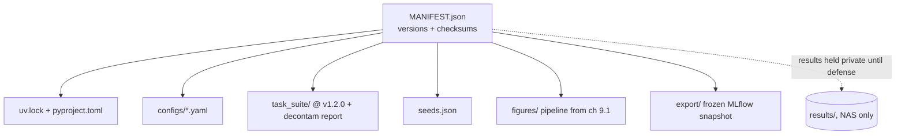

# The reproducibility package

A thesis makes a claim. A reproducibility package is the bet you're willing to make that the claim is true: here is everything you need to try to break it. If a stranger with the same GPU can't get close to my numbers from the package alone, then either the package is incomplete or the result was fragile, and I'd rather find that out before the defense than during it.

This chapter is about building that package as a first-class artifact, not a zip file I throw together the night before submission. It ships the environment locks, the configs, the task suite, the seeds, and the figure scripts. It carries a clear license split. And it gets archived twice, to the NAS for durability and to a public mirror for reach, with the thesis-specific results held back until after the defense.

```admonish read-along
Everything here is real repo structure you can build today; none of it needs a GPU. The package *references* runs that were produced on the baseline machine (MSI Aegis R2, RTX 5080 16GB, Ubuntu 24.04), but the package itself is just files: lockfiles, YAML, seeds, scripts, and manifests. Where a manifest records a measured quantity (a runtime, a checksum of a real checkpoint) I write "(measured on the baseline machine, record value, date, driver)" as a placeholder, because I won't invent measured numbers and there is no GPU where I'm assembling this.
```

## Theory

### The three levels of "reproducible"

The word does too much work, so I split it into three levels and I'm honest about which one I'm claiming.

The weakest is **repeatable**: I re-run my own code on my own machine and get the same thing. This is table stakes and it mostly comes free from pinning seeds and versions.

The middle is **reproducible**: someone else re-runs my code on their machine, ideally the same hardware, and gets statistically consistent results. This is what the package is built to deliver on a machine like mine. Exact bit-for-bit agreement across machines is usually impossible for GPU floating-point work, because kernel selection, cuDNN autotuning, and reduction order all vary with hardware and driver, so "reproducible" here means "the deltas and their intervals agree," not "every digit matches."

The strongest is **replicable**: someone re-implements the idea from the description and finds the same effect. The package can't guarantee that, but a clean methodology chapter (9.2) and an honest task suite make it more likely.

I aim the package squarely at the middle level and I say so in the README, because overclaiming reproducibility is its own kind of dishonesty.

```admonish gotcha
GPU results are not bit-reproducible across hardware, and often not even across driver versions on the same card, because nondeterministic reduction order and autotuned kernels change the last few bits of a matmul, which then compound through training. If your package promises identical numbers, the first person on a different card who gets slightly different numbers will conclude your whole result is broken. Promise *statistical* reproducibility: matching effect sizes and overlapping intervals across seeds, not identical digits. And record the one config that gets you as close as possible, pinned driver, `CUBLAS_WORKSPACE_CONFIG`, deterministic algorithms where they exist, while being upfront that determinism costs throughput (measured on the baseline machine, record value, date, driver).
```

### What actually has to ship

A package is complete when someone can go from an empty machine to my figures without asking me a question. That means five things travel together, and a missing one silently breaks the chain.

**The environment**, as lockfiles, not as "pip install these." I use uv throughout the book, so the package ships `pyproject.toml` and `uv.lock`, which pin every transitive dependency to an exact version and hash. The lock is the difference between "it worked in 2026" and "it works." I also record the things uv can't lock: the CUDA driver version, the GPU model, and the OS, because those are part of the environment even though they live below Python.

**The configs**, one per experiment, version-controlled and referenced by the runs. Every run in MLflow was launched from a config; the package ships those configs so the run can be relaunched. A config that isn't in the package is a result that can't be reproduced, full stop.

**The task suite**, at a pinned version. The thesis task suite (chapter 3.9) is the measuring instrument, and the whole result is relative to it. The package ships the suite at a tagged version with its decontamination report, so the instrument is fixed and inspectable.

**The seeds**, recorded per run, not regenerated. Seeds are data. The package records the exact seed each run used, because "seeds 0, 1, 2" is a claim about which three runs I'm reporting, and reproducing the result means reproducing those three, not three fresh ones.

**The figure scripts**, from chapter 9.1, so the package produces the actual figures in the book from the frozen export, not just raw numbers. A reproducibility package that stops at CSVs makes the reader re-derive my plots; one that ships the figure pipeline lets them regenerate the exact figures and diff them against the book.

### The manifest is the package

The physical files matter less than the manifest that ties them together. The manifest is a single file that lists every component with its version and a checksum, so the package can verify its own integrity and so a reader can tell at a glance what version of what they're holding. If the manifest and the files disagree, the package is corrupt and the verification step says so. This is the same idea as the export sidecar in chapter 9.1, scaled up to the whole package.

### What deliberately does not ship

A reproducibility package is defined as much by what it leaves out as by what it includes, and the omissions have to be principled, not accidental. Three things stay out on purpose. Large model weights stay out of the public tree because they're gigabytes, they're derivable from the configs plus the base model, and hosting them is a bandwidth problem I don't need; the NAS archive keeps them for my own re-runs, and the public tree ships a pointer (the base model's Hugging Face ID and revision hash, plus the training config) so a reader can regenerate rather than download. Raw generation logs stay out because they can contain prompts and completions that I haven't cleared for release, and because their value to a reproducer is low relative to their size. And anything with a secret in it, an API token, a tracking-server URL with credentials, a NAS mount path, never ships in either tree; the packager works on a repo that already keeps those in environment variables and out of the committed files. The rule is that the package ships what's needed to reproduce and nothing that's merely incidental to how I happened to run it.

### Verifying a reproduction, not just the package

The verifier in the lab checks that the package is internally consistent, but that is a weaker claim than "someone reproduced my result." The stronger claim needs a target to hit, so the package ships expected outputs for the parts that are safe to publish before the defense: the figure sidecar hashes from chapter 9.1, the task-suite decontamination report, and the shape and column schema of the frozen export. A reproducer runs the pipeline, regenerates the figures, and compares their sidecars against the shipped ones. The comparison is statistical, not exact (a figure regenerated on a different matplotlib patch version can differ by a pixel), so the check is on the underlying aggregated numbers the figure encodes, not on the PNG bytes. After the defense, the expected measured deltas join the shipped outputs, and the reproduction target becomes the full thing: land within the reported intervals or find the discrepancy worth reporting.



Note the dashed leaf: the results directory is in the manifest but its contents ship only to the private NAS archive until after the defense. The public mirror gets everything else.

### Licensing, deliberately split

Code and prose are different kinds of thing and they want different licenses, so I split them.

The **code**, figure scripts, config loaders, the eval and training harnesses I wrote, is MIT. I want people to use it, fork it, and build on it with the least possible friction, and MIT is the lowest-friction permissive license that still keeps my copyright notice attached.

The **prose**, the book chapters, the methodology writing, the figures as expository objects, is CC BY-NC-SA. Attribution because I want credit, NonCommercial because I don't want someone repackaging the book as a paid course without asking, and ShareAlike because if someone builds on the writing I want the derivative to stay as open as the original. That is a deliberately more restrictive choice than the code, and it reflects that the writing is the thesis of the book while the code is a tool anyone should be able to grab.

The **thesis-specific results**, the actual measured deltas, the checkpoints, the run artifacts that constitute the novel contribution, stay private until after the defense. This isn't a license, it's an embargo. The package is structured so the embargo is a matter of which directory ships where, not a matter of me remembering to delete things.

### Two archives, two jobs

Durability and reach are different goals, so I use two archives.

The **NAS archive** (the 5TB NAS on the baseline machine's network) is for durability and completeness. It holds the full package including the private results and the large checkpoints, because it's mine and it's under my control. Its job is that I never lose the ability to reproduce my own thesis. I write it as a dated, checksummed tarball, and I keep more than one.

The **public mirror** is for reach and for the reproducibility claim itself. It holds everything except the embargoed results: the code under MIT, the prose under CC BY-NC-SA, the configs, the task suite, the seeds, and the figure pipeline. Its job is that a stranger can verify the machinery even before the results go public, and that after the defense the results can be added with a single push. A public git host plus a DOI-minting archive (so the package has a citable, permanent identifier) covers both the "grab and run" and the "cite in a paper" use cases.

## Tooling

### uv as the environment spine

uv gives me two things the package needs: an exact lockfile (`uv.lock` with hashes for every transitive dependency) and a one-command re-instantiation (`uv sync` rebuilds the exact environment from the lock). Because the whole book already runs on uv, the package's environment story is just "commit the lock and the pyproject," and reproduction is "clone, `uv sync`, run." No bare pip, no hand-managed venv, no "works on my machine" list of packages to install by guesswork.

### A packager that builds the manifest and enforces the embargo

The lab's tool walks the repo, collects the five components, checksums each, writes the manifest, and splits the output into a public tree and a private tree so the embargo is enforced by code rather than by memory. It refuses to put anything from `results/` into the public tree, and it fails loudly if a component the manifest expects is missing. That failure is a feature: an incomplete package should not build silently.

## Lab

The artifact is reproducibility package v1: a packager that assembles the manifest, splits public from private, and a verifier that checks integrity. No GPU.

### Project layout the packager expects

```text title="repro/ (expected layout)"
repro/
  pyproject.toml
  uv.lock
  configs/            # one YAML per experiment
  task_suite/         # pinned suite + decontamination_report.json
  seeds.json          # {run_id: seed}
  figures/            # the chapter 9.1 pipeline
  export/             # frozen MLflow snapshot (ch 9.1)
  results/            # EMBARGOED, NAS only, never public
  LICENSE-CODE        # MIT
  LICENSE-PROSE       # CC BY-NC-SA 4.0
```

### The packager

```python title="repro/build_package.py"
"""Assemble reproducibility package v1: manifest + public/private split.

Public tree: everything except results/ (embargoed until after defense).
Private tree: the full package, for the NAS archive.
Fails if an expected component is missing. Enforces the embargo in code.

Run: uv run python build_package.py --version 1.0.0
Deps: stdlib only.
"""
from __future__ import annotations

import argparse
import hashlib
import json
import shutil
import tarfile
from datetime import datetime, timezone
from pathlib import Path

ROOT = Path(__file__).parent

# (path, required, public), public=False means NAS-only (embargoed)
COMPONENTS = [
    ("pyproject.toml", True, True),
    ("uv.lock", True, True),
    ("configs", True, True),
    ("task_suite", True, True),
    ("seeds.json", True, True),
    ("figures", True, True),
    ("export", True, True),
    ("LICENSE-CODE", True, True),
    ("LICENSE-PROSE", True, True),
    ("results", False, False),  # embargoed: private archive only
]


def sha256_of(path: Path) -> str:
    h = hashlib.sha256()
    if path.is_file():
        h.update(path.read_bytes())
    else:  # directory: hash sorted (relpath, filebytes) for stability
        for f in sorted(path.rglob("*")):
            if f.is_file():
                h.update(str(f.relative_to(path)).encode())
                h.update(f.read_bytes())
    return h.hexdigest()


def collect(version: str) -> dict:
    entries = []
    for name, required, public in COMPONENTS:
        p = ROOT / name
        if not p.exists():
            if required:
                raise SystemExit(f"MISSING required component: {name}")
            continue
        entries.append(
            {
                "component": name,
                "public": public,
                "sha256": sha256_of(p),
                "kind": "dir" if p.is_dir() else "file",
            }
        )
    return {
        "package": "evals-as-rewards-repro",
        "version": version,
        "built_at": datetime.now(timezone.utc).isoformat(),
        "reproducibility_level": "statistical (matching effect sizes + intervals, "
        "not identical GPU floating-point digits)",
        "baseline_machine": "MSI Aegis R2, RTX 5080 16GB, Ubuntu 24.04",
        "driver_version": "RECORD ON BASELINE MACHINE, driver, date",
        "license_code": "MIT",
        "license_prose": "CC BY-NC-SA 4.0",
        "embargo": "results/ private until after defense",
        "components": entries,
    }


def write_tree(manifest: dict, out: Path, public_only: bool) -> None:
    out.mkdir(parents=True, exist_ok=True)
    included = []
    for e in manifest["components"]:
        if public_only and not e["public"]:
            continue
        src = ROOT / e["component"]
        dst = out / e["component"]
        if src.is_dir():
            shutil.copytree(src, dst, dirs_exist_ok=True)
        else:
            shutil.copy2(src, dst)
        included.append(e["component"])
    # write the manifest, marking which tree this is
    m = dict(manifest, tree="public" if public_only else "private", included=included)
    (out / "MANIFEST.json").write_text(json.dumps(m, indent=2))


def tar(tree: Path, out_tar: Path) -> None:
    with tarfile.open(out_tar, "w:gz") as t:
        t.add(tree, arcname=tree.name)


def main():
    ap = argparse.ArgumentParser()
    ap.add_argument("--version", required=True)
    ap.add_argument("--out", type=Path, default=ROOT / "dist")
    a = ap.parse_args()

    manifest = collect(a.version)
    stamp = datetime.now(timezone.utc).strftime("%Y%m%d")

    pub = a.out / f"public-{a.version}"
    priv = a.out / f"nas-{a.version}"
    write_tree(manifest, pub, public_only=True)
    write_tree(manifest, priv, public_only=False)

    tar(pub, a.out / f"repro-public-{a.version}-{stamp}.tar.gz")
    tar(priv, a.out / f"repro-nas-{a.version}-{stamp}.tar.gz")

    embargoed = [e["component"] for e in manifest["components"] if not e["public"]]
    print(json.dumps({
        "version": a.version,
        "public_tarball": f"repro-public-{a.version}-{stamp}.tar.gz",
        "nas_tarball": f"repro-nas-{a.version}-{stamp}.tar.gz",
        "embargoed_from_public": embargoed,
    }, indent=2))


if __name__ == "__main__":
    main()
```

### The verifier

```python title="repro/verify_package.py"
"""Verify a built package tree against its MANIFEST.json.

Recomputes every component checksum and checks it matches the manifest.
For a public tree, also asserts no embargoed component leaked in.

Run: uv run python verify_package.py dist/public-1.0.0
"""
from __future__ import annotations

import json
import sys
from pathlib import Path

from build_package import sha256_of  # reuse the exact hashing logic


def verify(tree: Path) -> int:
    manifest = json.loads((tree / "MANIFEST.json").read_text())
    problems = []

    for e in manifest["components"]:
        if e["component"] not in manifest["included"]:
            continue
        p = tree / e["component"]
        if not p.exists():
            problems.append(f"missing: {e['component']}")
            continue
        if sha256_of(p) != e["sha256"]:
            problems.append(f"checksum mismatch: {e['component']}")

    if manifest["tree"] == "public":
        for e in manifest["components"]:
            if not e["public"] and (tree / e["component"]).exists():
                problems.append(f"EMBARGO BREACH: {e['component']} in public tree")

    if problems:
        print("FAIL")
        for p in problems:
            print(f"  - {p}")
        return 1
    print(f"OK, {manifest['package']} {manifest['version']} ({manifest['tree']} tree) verified")
    return 0


if __name__ == "__main__":
    raise SystemExit(verify(Path(sys.argv[1])))
```

### The license files

```text title="repro/LICENSE-CODE"
MIT License, applies to all code in this package (*.py, harnesses, configs-as-code).

Copyright (c) 2026 Trevor Barnes
Permission is hereby granted, free of charge, to any person obtaining a copy
of this software and associated documentation files (the "Software"), to deal
in the Software without restriction ... [standard MIT text] ...
```

```text title="repro/LICENSE-PROSE"
Creative Commons Attribution-NonCommercial-ShareAlike 4.0 International
(CC BY-NC-SA 4.0), applies to all prose, figures-as-exposition, and the book
text in this package.

Copyright (c) 2026 Trevor Barnes. You are free to share and adapt under the
terms of attribution, non-commercial use, and share-alike. Full text:
https://creativecommons.org/licenses/by-nc-sa/4.0/legalcode
```

### Build, verify, archive

```bash title="repro/run.sh"
cd repro
uv sync                                   # re-instantiate the exact env from uv.lock
uv run python build_package.py --version 1.0.0
uv run python verify_package.py dist/public-1.0.0    # must not leak results/
uv run python verify_package.py dist/nas-1.0.0

# archive to NAS (durability, full package incl. embargoed results)
rsync -a --checksum dist/repro-nas-1.0.0-*.tar.gz /mnt/nas/thesis/repro/

# publish the public mirror (reach; results added after the defense)
#   git add/commit/push the public tree to the public repo, then mint a DOI
#   from the archival host so the package is permanently citable.
```

### What you should see

`build_package.py` prints a JSON summary naming a `public` tarball and an `nas` tarball, and listing `results` under `embargoed_from_public`. Two trees appear under `dist/`: `public-1.0.0/` contains the locks, configs, task suite, seeds, figures, export, and both license files but no `results/`; `nas-1.0.0/` contains all of that plus `results/`. Each tree carries its own `MANIFEST.json` tagged `"tree": "public"` or `"tree": "private"` with a checksum per component and the reproducibility level stated as "statistical, not identical digits." Both `verify_package.py` runs print `OK ... verified`. Now the test that matters: drop a stray file into `dist/public-1.0.0/results/` and re-verify the public tree. It prints `FAIL` with `EMBARGO BREACH: results in public tree` and exits non-zero. That is the embargo enforced by code, not by memory. The package is now something I can hand to a stranger with the same GPU and say: here is the environment, the configs, the instrument, the seeds, and the scripts; `uv sync` and run; you should land on my deltas within their intervals, and if you don't, one of us has found something worth knowing.

```admonish substack-seed
"Ship the bet, not the zip file." Most 'reproducibility packages' are a folder someone assembled at 2am and never tested. This post reframes the package as a falsifiable bet, here's everything you need to try to break my result, and walks the five things that must travel together (locked env, configs, the measuring instrument, the seeds, the figure scripts) plus the honest admission that GPU work is statistically reproducible, not bit-reproducible. The spicy bit is the license split (permissive MIT for code, protective CC BY-NC-SA for prose) and enforcing a results embargo in code so a public mirror physically cannot leak the unpublished numbers.
```
