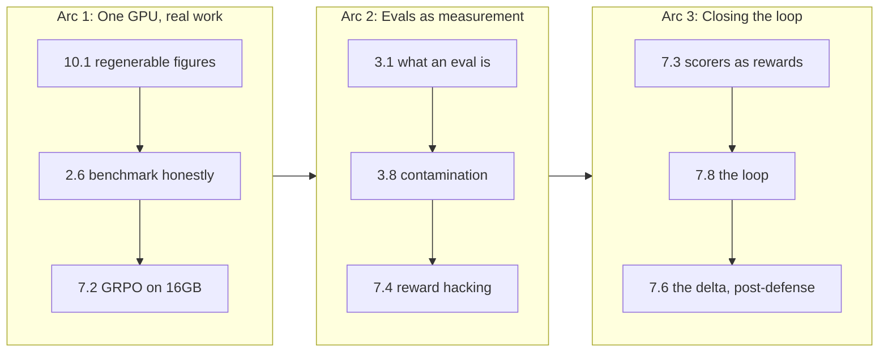

# The Substack map

The book is the reservoir. Substack is the tap. I wrote every chapter to stand as part of a whole, but I also planted a `substack-seed` in each one, because a book that only exists as a finished PDF reaches almost no one, and a public thesis that nobody reads defends nothing. The Substack series is how the ideas get out while the thesis stays private until the defense, and this chapter is about turning forty-odd seeds into a sequenced, publishable editorial calendar instead of a pile of good intentions.

The trick is that a chapter and a post are different animals. A chapter earns its place by fitting the argument; a post earns its place by standing alone and making someone want the next one. So the map isn't a one-to-one dump of chapters into posts. It's a curation: which seeds are strong enough to lead, which need a sibling chapter's material to be complete, which are too thesis-specific to publish before the defense, and what order builds an audience instead of exhausting one.

```admonish read-along
This chapter produces an editorial calendar that feeds my existing substack-pipeline workflow (the drafting-and-scheduling system I already run). Nothing here needs a GPU; it's all text and dates. The one constraint that shows up everywhere is the embargo from chapter 10.3: posts that would reveal the thesis-specific measured deltas are marked `post-defense` and scheduled after the defense date, because the results stay private until then. Any post that quotes a measured number carries the same "(measured on the baseline machine, record value, date, driver)" placeholder discipline as the rest of the book until the real number is cleared for release.
```

## Theory

### A chapter is not a post

The unit of a book is the argument; the unit of a newsletter is the hook. A chapter can open slowly because the reader has committed to the book. A post has about one sentence to justify its own existence in a crowded inbox. That difference drives the whole extraction.

Concretely, a good post has a single load-bearing idea, a concrete artifact or demo the reader can picture, and a reason to care that lands before the reader scrolls away. Most chapters contain one such idea cleanly, which is why the `substack-seed` admonitions work as post kernels. But some chapters contain three ideas (the seed picks the most standalone one and the rest wait), and some ideas are split across two chapters (the post has to pull from both). The map records which case each seed is.

### Three properties that decide a seed's fate

For each `substack-seed` I score three things, and those three decide whether it leads, supports, or waits.

**Standalone-ness.** Can a reader who has never seen the book get the whole point of this post without prerequisites? A post on "every figure must be regenerable by script" (chapter 10.1) is fully standalone: the idea, the demo, and the payoff need no prior post. A post on "GRPO on 16GB" (chapter 7.2) is not, because it assumes the reader knows what GRPO is and why 16GB is the constraint. Standalone seeds are candidates to lead the series or to be evergreen entry points; dependent seeds sit deeper in a sequence where their prerequisites already ran.

**Pull.** Does the hook create demand for the next post? Some ideas are naturally serialized (a loop that serves, evaluates, scores, and trains begs "then what happened when you closed the loop?"), and those are the spine of the series. Others are satisfying-and-done (a single sharp tool), and those are good standalone breathers between arcs.

**Embargo status.** Does the post reveal thesis-specific results that are held until after the defense? A methods post ("here's the pattern for pre-answering a committee," chapter 10.2) is publishable now because it's about structure, not results. A post that shows the actual measured reasoning delta is `post-defense`. This is a hard gate: no scheduling clever enough to justify leaking the embargoed numbers early.

Some seeds never become posts, and that's a feature. A book chapter can exist to complete an argument even when its idea is too incremental, too dependent, or too niche to hook a cold reader, and forcing every chapter into a post would dilute the series with weak entries. The map is allowed to say no. A seed that scores low on both standalone-ness and pull, and that isn't load-bearing for a later post's setup, gets marked as "book-only" and drops out of the calendar entirely. This is the editorial equivalent of the coverage check in chapter 10.2: the tool makes the decision visible rather than letting a weak post sneak in because it happened to have a seed. A shorter series of strong posts beats a complete-but-flat one, and the readers I keep are the ones who never got a dud.

```admonish gotcha
The tempting failure is to publish the book in chapter order. Chapter order is optimized for the argument, which front-loads foundations (tensors, attention, the RL problem) that make dry standalone posts and bury the hooks that would actually grow an audience. Publishing in chapter order means your first eight posts are a graduate course nobody signed up for, and you lose the readers before you reach the loop that makes the whole thing exciting. Sequence for pull and standalone-ness, not for the table of contents. Lead with the most self-contained, most surprising seed you're allowed to publish, and let the foundations arrive as needed underneath the story.
```

### Sequencing a series

Once each seed is scored, sequencing is a small optimization with a few rules. Lead with a standalone, high-pull, non-embargoed seed, because the first post has to earn the second. Group seeds into arcs of three to five posts that share a thread (an "inference on one GPU" arc, an "evals as measurement" arc, a "closing the loop" arc), because arcs give readers a reason to subscribe rather than read one post and leave. Put a foundation post only where a later post needs it, and frame the foundation as setup for the payoff that's coming, never as homework. Space the embargoed posts to land after the defense, and let them be the crescendo, because the results are the most interesting thing and they should arrive when the audience is largest. Alternate heavy arcs with a single standalone breather so the series has rhythm and I don't burn out drafting five dependent posts in a row.



### Cadence and the burnout constraint

There's a constraint that has nothing to do with the ideas and everything to do with me: I can only draft so many posts before the series stalls, and a stalled series is worse than a shorter one because it signals abandonment to the readers I just recruited. So the cadence is a real design parameter, not an afterthought. Weekly is the honest ceiling for a solo author drafting original posts on top of a day job and a thesis, and even weekly only works if the drafting cost per post is low. That is where the seed structure pays off a second time: because each `substack-seed` is already a hook plus a source chapter, the marginal cost of a post is expanding an outline I wrote months ago, not inventing from scratch. The calendar respects the ceiling by spacing arcs so that the two or three hardest posts (the dependent ones that need material from a sibling chapter) never land back to back. A heavy post gets a standalone breather after it, both for the reader's rhythm and for mine.

### Repurposing without duplicating

A post is not the terminal form of an idea; it's the first public form. The good ones get repurposed: the hook becomes a short social thread that points back at the post, the demo becomes a standalone gist, and after the defense the strongest three or four posts get stitched into a single long-form piece that doubles as the public face of the thesis. The map anticipates this by keeping the hook separate from the body, because the hook is the reusable atom. What the map deliberately does not do is let the same idea run as two full posts under different titles. Duplicated ideas train readers to skim, and a newsletter that repeats itself loses the one thing it's trying to build, which is the reader's belief that every issue is worth opening. Each seed maps to exactly one lead post; everything downstream is a pointer back to it, never a second telling.

### The calendar is the interface to the pipeline

I already run a substack-pipeline workflow that drafts and schedules posts. What that workflow wants as input is not a pile of prose but a structured calendar: an ordered list of posts, each with its source chapter, its arc, its target date, its embargo flag, and the one-line hook. The map's job is to produce exactly that structure, so the pipeline can pick it up and run. Keeping the calendar as data (not as a doc I edit by hand) means I can resequence by changing a sort key, and the pipeline always sees a consistent view. It also means the embargo gate lives in one place: the sequencer, not my memory, is what guarantees the reasoning-delta post cannot be scheduled before the defense, and if I ever hand the pipeline a hand-edited calendar the assertion in the build step still catches a leak before anything publishes.

## Tooling

### Seeds as structured records

Each `substack-seed` becomes a record: source chapter, a title, the three scores (standalone, pull, embargo), the arc it belongs to, and the hook. I keep these in one YAML file, because the seeds are authored across many chapters but scheduled as a single series, and a single file is the place where the whole series is visible at once. The scoring is a judgment call I make once per seed and then let the tool sequence. I re-score only when a chapter changes substantively, so the calendar is stable between edits and I'm not re-litigating the whole series every week.

### A sequencer that emits the calendar

The lab's tool reads the seed records, drops or defers the embargoed ones past the defense date, orders the rest by arc and by a lead-worthiness score, assigns dates on a cadence, and emits both a human-readable extraction table (chapter-to-post) and the machine-readable calendar the pipeline consumes. It refuses to schedule an embargoed post before the defense date, which is the same hard gate as everywhere else in Part X.

## Lab

The artifact is an editorial calendar that feeds the substack-pipeline workflow: a seed file plus a sequencer that emits the chapter-to-post extraction table and a dated, embargo-aware calendar. No GPU.

### The seed records

The file below is a **demo subset**: eleven representative seeds, enough to exercise the sequencer and every rule it enforces. The real book carries the forty-odd seeds referenced at the top of the chapter; the full `seeds.yaml` is the same schema with more rows, and nothing in the tool changes when it grows.

```yaml title="substack/seeds.yaml"
# One record per substack-seed in the book. Scores are 1-5 judgment calls.
# standalone: can a cold reader get it with no prior post? (5 = fully)
# pull:       does the hook demand the next post? (5 = strongly)
# embargo:    true if it reveals thesis-specific results held until defense.

defense_date: "2026-11-15"   # embargoed posts schedule strictly after this
start_date: "2026-08-04"     # series launch
cadence_days: 7              # weekly

seeds:
  - chapter: "10.1"
    title: "Your charts are lying and you can't tell"
    arc: "one-gpu-real-work"
    standalone: 5
    pull: 4
    embargo: false
    hook: "Every figure must be a pure function of a hashed export, or it drifts."

  - chapter: "2.6"
    title: "Benchmarking without lying to yourself"
    arc: "one-gpu-real-work"
    standalone: 5
    pull: 4
    embargo: false
    hook: "The tokens/sec you posted are wrong; here's the honest way to measure."

  - chapter: "7.2"
    title: "GRPO on a 16GB card"
    arc: "one-gpu-real-work"
    standalone: 3
    pull: 5
    embargo: false
    hook: "You can train a reasoning model on one consumer GPU. Here's the budget."

  - chapter: "3.1"
    title: "What an eval actually is"
    arc: "evals-as-measurement"
    standalone: 5
    pull: 4
    embargo: false
    hook: "An eval is a measuring instrument. Most people never calibrate theirs."

  - chapter: "3.8"
    title: "Is the benchmark in the training data?"
    arc: "evals-as-measurement"
    standalone: 4
    pull: 4
    embargo: false
    hook: "The null hypothesis for every benchmark score is contamination."

  - chapter: "7.4"
    title: "Reward hacking wears a lab coat"
    arc: "evals-as-measurement"
    standalone: 4
    pull: 5
    embargo: false
    hook: "Train on a scorer and the model games the scorer. Goodhart, formalized."

  - chapter: "7.3"
    title: "Turning a scorer into a reward"
    arc: "closing-the-loop"
    standalone: 3
    pull: 5
    embargo: false
    hook: "The eval that grades the model becomes the signal that trains it."

  - chapter: "7.8"
    title: "Closing the loop end to end"
    arc: "closing-the-loop"
    standalone: 3
    pull: 5
    embargo: false
    hook: "Serve, evaluate, score, train, re-evaluate, on one machine, on repeat."

  - chapter: "10.2"
    title: "How to pre-answer your thesis committee"
    arc: "closing-the-loop"
    standalone: 5
    pull: 3
    embargo: false
    hook: "Three questions every eval thesis faces, answered before they're asked."

  - chapter: "7.6"
    title: "Did the model actually get smarter?"
    arc: "closing-the-loop"
    standalone: 4
    pull: 5
    embargo: true    # reveals the measured reasoning delta, post-defense only
    hook: "The paired, effect-sized answer to the only question that matters."
```

### The sequencer

```python title="substack/build_calendar.py"
"""Turn seeds.yaml into (1) a chapter-to-post extraction table and
(2) a dated, embargo-aware editorial calendar for the substack-pipeline.

Rules enforced:
 - embargoed posts are scheduled strictly AFTER defense_date (hard gate).
 - the series leads with the most standalone, highest-pull, non-embargoed seed.
 - posts are grouped by arc, arcs ordered by their best lead score.

Run: uv run python build_calendar.py
Deps: uv add pyyaml
"""
from __future__ import annotations

import json
from datetime import date, datetime, timedelta
from pathlib import Path

import yaml

HERE = Path(__file__).parent


def lead_score(seed: dict) -> float:
    # lead-worthiness: standalone matters most for a cold reader, pull second.
    return 0.6 * seed["standalone"] + 0.4 * seed["pull"]


def main():
    cfg = yaml.safe_load((HERE / "seeds.yaml").read_text())
    defense = date.fromisoformat(cfg["defense_date"])
    start = date.fromisoformat(cfg["start_date"])
    step = timedelta(days=cfg["cadence_days"])
    seeds = cfg["seeds"]

    # order arcs by their strongest lead score; within arc by lead score
    arc_best = {}
    for s in seeds:
        arc_best[s["arc"]] = max(arc_best.get(s["arc"], 0), lead_score(s))
    arcs_in_order = sorted(arc_best, key=lambda a: -arc_best[a])

    ordered = []
    for arc in arcs_in_order:
        arc_seeds = sorted(
            (s for s in seeds if s["arc"] == arc), key=lambda s: -lead_score(s)
        )
        ordered.extend(arc_seeds)

    # force the single best non-embargoed seed to lead the whole series
    non_emb = [s for s in ordered if not s["embargo"]]
    lead = max(non_emb, key=lead_score)
    ordered.remove(lead)
    ordered.insert(0, lead)

    # assign dates; push any embargoed post to the first slot after defense
    calendar = []
    d = start
    for s in ordered:
        slot = d
        if s["embargo"]:
            # first cadence slot strictly after the defense date
            slot = d
            while slot <= defense:
                slot += step
        calendar.append(
            {
                "date": slot.isoformat(),
                "chapter": s["chapter"],
                "arc": s["arc"],
                "title": s["title"],
                "hook": s["hook"],
                "embargo": s["embargo"],
                "lead_score": round(lead_score(s), 2),
            }
        )
        d += step

    # sort final calendar by date so the pipeline sees chronological order
    calendar.sort(key=lambda p: p["date"])

    # (1) extraction table, human-readable
    lines = ["# Chapter -> post extraction table\n",
             "\n| Date | Ch | Arc | Post | Standalone hook | Embargo |",
             "\n|---|---|---|---|---|---|"]
    for p in calendar:
        emb = "post-defense" if p["embargo"] else "-"
        lines.append(
            f"\n| {p['date']} | {p['chapter']} | {p['arc']} | "
            f"{p['title']} | {p['hook']} | {emb} |"
        )
    (HERE / "extraction_table.md").write_text("".join(lines) + "\n")

    # (2) machine-readable calendar for the substack-pipeline
    (HERE / "editorial_calendar.json").write_text(
        json.dumps(
            {
                "series": "Evals as Rewards",
                "generated_at": datetime.now().isoformat(timespec="seconds"),
                "defense_date": cfg["defense_date"],
                "posts": calendar,
            },
            indent=2,
        )
    )

    # sanity gate: no embargoed post on or before the defense date
    leaks = [p for p in calendar if p["embargo"] and date.fromisoformat(p["date"]) <= defense]
    assert not leaks, f"EMBARGO LEAK in schedule: {leaks}"
    print(f"wrote extraction_table.md and editorial_calendar.json "
          f"({len(calendar)} posts, lead: {calendar[0]['title']!r})")


if __name__ == "__main__":
    main()
```

### Run it

```bash title="substack/run.sh"
cd substack
uv init --package . 2>/dev/null || true
uv add pyyaml
uv run python build_calendar.py
```

### What you should see

Two files. `extraction_table.md` is a Markdown table, one row per post, chronological, showing the date, source chapter, arc, title, standalone hook, and embargo status. `editorial_calendar.json` is the same schedule as structured data with a `posts` array, ready for the substack-pipeline workflow to consume. The series leads with the highest lead-worthiness non-embargoed seed (with the scores above, "Your charts are lying and you can't tell" from chapter 10.1, or "What an eval actually is" from 3.1, depending on the exact tie-break), arcs run in blocks, and the one embargoed post, chapter 7.6's measured reasoning delta, is scheduled after the 2026-11-15 defense date rather than in its natural arc position. Now flip `embargo: true` to `false` on that 7.6 seed and re-run: the sequencer places it in the middle of the "closing the loop" arc, before the defense, and the assertion at the bottom fires with `EMBARGO LEAK in schedule`. That failing assertion is the same hard gate that runs through all of Part X. The book decides what's true; the reproducibility package decides what ships; and this calendar decides what gets said in public, and when, without ever letting the unpublished result out the door before its time.

```admonish substack-seed
"I wrote a book, then reverse-engineered the newsletter." A meta post about turning a finished long-form work into a serialized newsletter that actually grows an audience, the opposite of publishing chapter by chapter. The method: score every idea on standalone-ness, pull, and whether it's under embargo, then sequence for hooks instead of for the table of contents, leading with your most self-contained surprise and saving the big result for when the audience is largest. The punchline is that the whole calendar is generated code with a hard gate that physically cannot schedule an embargoed result before the date it's allowed out.
```
