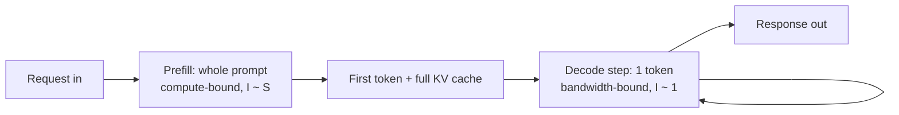

# Prefill, decode, and the roofline

Every token a reasoning model emits is paid for twice: once when it reads the prompt, and once, repeatedly, as it writes its chain of thought. Those two payments come from different accounts. Prefill spends compute; decode spends memory bandwidth. If you only remember one thing from Part II, make it that sentence, because almost every serving decision downstream (batch size, quantization format, KV dtype, how long a reasoning trace you can afford) is really a decision about which of those two accounts you are drawing from.

This chapter builds the roofline model for the baseline machine (MSI Aegis R2, RTX 5080 16GB, Blackwell, GDDR7 at ~960 GB/s) and derives a hard ceiling on decode throughput that no amount of clever code can beat. Then the lab measures both phases and plots them against that ceiling so I can see, in one figure, how much of the theoretical roof my stack actually reaches.

## Theory

### The two phases of autoregressive generation

A decoder-only transformer generates text one token at a time, but the work is not uniform across a request. Split it in two.

**Prefill** processes the entire prompt in a single forward pass. If the prompt is $S$ tokens long, prefill runs all $S$ tokens through every layer at once, as one big matrix multiply per weight matrix. It fills the KV cache for those $S$ positions and produces the logits for the first generated token. Prefill is a batched, parallel operation: lots of tokens, each weight matrix touched once, reused across all $S$ tokens.

**Decode** generates the completion, one token per forward pass. Each step feeds the single most recent token through the network, reads the KV cache for all previous positions, appends one new K and V vector per layer, and emits one token's logits. Decode is inherently sequential (token $t+1$ depends on token $t$) and, per step, it touches every weight matrix to produce exactly one token.

That structural asymmetry (many tokens per weight-read in prefill, one token per weight-read in decode) is the whole story. Let me make it quantitative.

### Arithmetic intensity and the roofline

The roofline model, borrowed from HPC, plots achievable throughput against a single number: **arithmetic intensity**, the ratio of compute done to bytes moved from memory.

$$I = \frac{\text{FLOPs}}{\text{bytes moved}} \quad \left[\frac{\text{FLOP}}{\text{byte}}\right]$$

A kernel is limited by whichever resource it exhausts first. If it does a lot of math per byte fetched, it saturates the compute units and is **compute-bound**. If it does little math per byte, it starves waiting on memory and is **memory-bandwidth-bound**. The achievable performance is:

$$P_{\text{achievable}} = \min\!\big(P_{\text{peak}},\; I \times BW\big)$$

where $P_{\text{peak}}$ is the chip's peak compute (FLOP/s) and $BW$ is its memory bandwidth (bytes/s). Plotted with $I$ on the x-axis and $P$ on the y-axis, this is two straight lines: a slanted line $I \times BW$ that rises with intensity, and a flat line $P_{\text{peak}}$ that caps it. They meet at the **ridge point**.

$$I_{\text{ridge}} = \frac{P_{\text{peak}}}{BW} \quad \left[\frac{\text{FLOP}}{\text{byte}}\right]$$

Below the ridge you are memory-bound; above it you are compute-bound. The ridge point is a property of the hardware alone, and it is the number that tells you which phase lives on which side of the roof.

```admonish derivation title="The ridge point of the RTX 5080"
The Blackwell RTX 5080 carries 16GB of GDDR7 on a 256-bit bus at 30 Gbps per pin, which the datasheet reports as a memory bandwidth of about $BW = 960\ \text{GB/s} = 9.6\times10^{11}\ \text{byte/s}$.

Peak dense BF16 tensor throughput is a datasheet figure I should stamp rather than guess; call it $P_{\text{peak}}$ and record the value from NVIDIA's spec sheet for the exact card (on the order of a few hundred TFLOP/s for BF16 with FP32 accumulate; NVIDIA also advertises ~1801 AI TOPS at FP4 with sparsity, a different number for a different datatype). Using a placeholder $P_{\text{peak}} = 4.5\times10^{14}\ \text{FLOP/s}$ purely to locate the ridge:

$$I_{\text{ridge}} = \frac{4.5\times10^{14}}{9.6\times10^{11}} \approx 469\ \frac{\text{FLOP}}{\text{byte}}$$

So the chip needs roughly **470 FLOP of work per byte read** to become compute-bound. Anything less intense, and the GDDR7 bus is the bottleneck. Re-run this with the real $P_{\text{peak}}$ from your datasheet and record the date and driver.
```

### Why prefill is compute-bound

In prefill, each weight matrix $W$ is read from memory once and multiplied against $S$ token vectors. A matmul of $W \in \mathbb{R}^{d \times d}$ against an $S \times d$ activation block does about $2 S d^2$ FLOP while reading $2 d^2$ bytes of weights (BF16). The arithmetic intensity is therefore:

$$I_{\text{prefill}} \approx \frac{2 S d^2}{2 d^2} = S \quad \left[\frac{\text{FLOP}}{\text{byte}}\right]$$

The intensity scales with the prompt length $S$. Because $I_{\text{prefill}} \approx S$, you need a prompt longer than the ridge point ($S \gtrsim 470$) to cross onto the compute roof; feed a prompt of more than ~500 tokens and $I_{\text{prefill}}$ sails past the ridge, landing you firmly on the compute-bound roof. This is why prefill throughput is quoted in the thousands of tokens per second and why a long prompt costs time roughly in proportion to its length: you are billing the compute account.

### Why decode is bandwidth-bound

In decode, batch size 1, each weight matrix is read once and multiplied against a **single** token vector. Same $2 d^2$ bytes read, but only $2 d^2$ FLOP of useful work:

$$I_{\text{decode}} \approx \frac{2 d^2}{2 d^2} = 1 \quad \left[\frac{\text{FLOP}}{\text{byte}}\right]$$

An intensity of about 1 FLOP/byte, against a ridge of ~470, means decode runs at roughly $1/470$ of peak compute. The tensor cores sit almost idle while the memory bus does all the work. Decode is memory-bound, full stop, and the only lever that matters is how many bytes you read per token.

### The decode throughput ceiling

Here is the punchline of the chapter. In decode at batch size 1, producing one token requires reading essentially the entire set of model weights once (every layer contributes to every token), plus the KV cache for the current context. If $B_{\text{read}}$ is the bytes read per generated token, then the number of tokens per second cannot exceed the bandwidth divided by that:

$$\boxed{\ \text{tok/s}_{\max} = \frac{BW}{B_{\text{read}}}\ }$$

For short contexts the KV read is small and $B_{\text{read}} \approx$ the weight bytes, so the ceiling is set almost entirely by model size and dtype.

```admonish derivation title="Decode ceilings for the serving repertoire"
Using $BW = 9.6\times10^{11}\ \text{byte/s}$ and taking $B_{\text{read}} \approx$ weight bytes (short context, batch 1), the theoretical decode ceiling for each model in the repertoire:

**Qwen3-8B, BF16.** Weights $\approx 8.2\times10^{9}\ \text{params} \times 2\ \text{byte} = 1.64\times10^{10}\ \text{byte}$.
$$\text{tok/s}_{\max} = \frac{9.6\times10^{11}}{1.64\times10^{10}} \approx 59\ \text{tok/s}$$
These BF16 weights do not actually fit on 16GB (chapter 2), so the 8B is served with FP8 weights in practice; that halves the read to ~8.2 GB and lifts its ceiling to ~117 tok/s.

**Qwen3-14B, AWQ 4-bit.** Weights $\approx 14.8\times10^{9} \times 0.56\ \text{byte} \approx 8.3\times10^{9}\ \text{byte}$ (4-bit packed plus group scales, ~4.5 effective bits/param).
$$\text{tok/s}_{\max} = \frac{9.6\times10^{11}}{8.3\times10^{9}} \approx 116\ \text{tok/s}$$

**gpt-oss-20b, MXFP4 (MoE).** Only the active experts are read per token, roughly $3.6\times10^{9}$ active params at ~4.25 bits plus attention in higher precision; call the effective read $\approx 2.5\times10^{9}\ \text{byte}$.
$$\text{tok/s}_{\max} = \frac{9.6\times10^{11}}{2.5\times10^{9}} \approx 384\ \text{tok/s}$$

These are ceilings, not predictions. Real throughput is lower because of kernel-launch overhead, imperfect memory coalescing, sampling, and the growing KV read as context lengthens. The gap between ceiling and measurement is exactly the quantity the lab plots. Record the measured values on the baseline machine with date and driver.
```

Two lessons fall out immediately. First, **quantization buys decode speed directly** by shrinking $B_{\text{read}}$: the 14B at 4-bit has a higher ceiling than the 8B at 16-bit despite having more parameters, because it reads fewer bytes per token. Second, **MoE cheats the ceiling** by reading only its active experts, which is why gpt-oss-20b can be fast in decode despite 21B total parameters. The roofline explains both without a single benchmark.

### Batching lifts the ceiling by raising intensity

The batch-size-1 ceiling is the *per-sequence* limit, and it is pessimistic on purpose. The moment you decode $N$ sequences together in one forward pass, each weight matrix is still read once from VRAM but is now multiplied against $N$ token vectors instead of one. The bytes read stay the same while the useful FLOP multiply by $N$, so decode's arithmetic intensity climbs from about 1 toward $N$:

$$I_{\text{decode}}(N) \approx N \quad \left[\frac{\text{FLOP}}{\text{byte}}\right]$$

Aggregate throughput therefore rises with batch size until either the intensity reaches the ridge point (at which decode finally becomes compute-bound, requiring a batch of a few hundred sequences that a 16GB KV pool cannot hold anyway) or the KV cache runs out of room. On this card the KV pool caps the batch long before compute does, so in practice decode stays memory-bound and the real question is how much of the weight-read cost I can amortize across the handful of sequences the pool allows. This is the precise sense in which per-sequence latency and aggregate throughput are different numbers: a single request sees the batch-1 ceiling, while the server as a whole can exceed it in total tok/s by serving several requests per weight read. Quoting one when you mean the other is the most common benchmarking error, and the benchmarking chapter is built to keep the two apart.

### The compute roof still matters, for prefill sizing

Decode lives so far below the ridge that the compute roof feels irrelevant, but it governs the other phase. Prefill's cost scales with prompt length, and because prefill is compute-bound its throughput is capped by $P_{\text{peak}}$, not bandwidth. That sets a floor on time-to-first-token for long prompts: a 16K-token prompt must push 16K tokens through the compute roof before the first output token appears, and no batching trick removes that work. For a reasoning workload where prompts carry long few-shot scaffolds, this is the quantity that decides responsiveness, and it is why the next chapters care about prefix caching (skip re-prefilling shared scaffolds) and chunked prefill (spread a long prefill so it does not freeze other streams). The roofline thus frames both ends of a request: prefill is a compute bill proportional to prompt length, decode is a bandwidth bill proportional to output length, and every serving feature downstream is an attempt to lower one bill without inflating the other.

```admonish gotcha
The ceiling assumes batch size 1 and short context. Two things erode it as you scale up. (1) As context grows, the KV cache read per token grows too, so $B_{\text{read}}$ increases and tok/s per sequence falls; that is the subject of the next chapter. (2) Batching multiple sequences amortizes the weight read across many tokens, raising decode's arithmetic intensity and total throughput, which is why continuous batching exists. Per-sequence latency and aggregate throughput are different axes; do not quote one when you mean the other.
```

## Tooling

There is no exotic tool here, and that is the point. The roofline is arithmetic, so the "tool" is a small Python module that (a) computes the theoretical ceiling from datasheet constants and a model's config, and (b) drives a real vLLM (or raw `transformers`) generation to measure prefill and decode rates separately. The measurement trick that separates the phases is **time-to-first-token** versus **inter-token latency**:

- The wall-clock time from request send to the first token back is dominated by prefill. Divide prompt length by that time to estimate prefill tok/s.
- The steady-state time between subsequent tokens is decode. Its reciprocal is decode tok/s.

I will build the full measurement harness properly in the benchmarking chapter. Here I want the minimum that lets me put a dot on the roofline and see how far under the roof I am.

```admonish under-the-hood title="Why streaming timestamps cleanly separate the phases"
The trick that isolates prefill from decode is that a streaming API hands back tokens as they are produced, so I can timestamp each one. The gap between sending the request and the first chunk is almost entirely prefill plus a little queueing, because nothing streams until the whole prompt has been processed and the first token sampled. Every subsequent gap is one decode step. So a single streamed request yields both measurements at once: divide prompt length by the first gap for a prefill-rate estimate, and take the reciprocal of the median later gap for the decode rate. The estimate is rough (the first gap includes sampling and any queue wait, and my prompt-token count is approximate until the server reports usage), but it is good enough to place a dot on the roofline, which is all this lab needs. The benchmarking chapter replaces the approximations with the server's own TTFT and TPOT histograms.
```

## Lab: measure both phases and plot against the ceiling

The artifact is a matplotlib figure, `roofline.png`, with the derived decode ceiling drawn as a horizontal line and my measured prefill and decode throughputs plotted as points. Everything is `uv`-managed and self-contained.

### Set up the project

```bash title="shell"
uv init roofline-lab
cd roofline-lab
uv add "vllm>=0.6" matplotlib numpy openai
```

### The ceiling calculator

```python title="roofline-lab/ceiling.py"
"""Derive the decode throughput ceiling from datasheet constants.

Ceiling = memory_bandwidth / bytes_read_per_token.
For short context, bytes_read_per_token ~= model weight bytes.
"""
from dataclasses import dataclass

# RTX 5080 GDDR7 datasheet: 256-bit bus, 30 Gbps/pin -> ~960 GB/s.
# Record the exact value and date from your card's spec sheet.
MEM_BANDWIDTH_BYTES_PER_S = 960e9


@dataclass
class ModelSpec:
    name: str
    params: float          # total parameter count
    bytes_per_param: float # 2.0 BF16, ~0.56 AWQ-4bit, ~0.53 MXFP4
    active_params: float | None = None  # for MoE; None => dense
    attn_bytes: float = 0.0  # MoE only: attention + router read per token,
                             # kept in higher precision than the MXFP4 experts

    def read_bytes_per_token(self) -> float:
        p = self.active_params if self.active_params is not None else self.params
        return p * self.bytes_per_param + self.attn_bytes

    def decode_ceiling_tok_s(self) -> float:
        return MEM_BANDWIDTH_BYTES_PER_S / self.read_bytes_per_token()


REPERTOIRE = [
    ModelSpec("Qwen3-8B BF16", params=8.2e9, bytes_per_param=2.0),
    ModelSpec("Qwen3-14B AWQ", params=14.8e9, bytes_per_param=0.56),
    # experts: 3.6e9 * 0.53 = 1.91e9 B; + ~0.59e9 B attention/router in higher
    # precision -> ~2.5e9 B/token, matching the ~384 tok/s derivation in the prose.
    ModelSpec("gpt-oss-20b MXFP4", params=21e9, bytes_per_param=0.53,
              active_params=3.6e9, attn_bytes=0.59e9),
]


if __name__ == "__main__":
    for m in REPERTOIRE:
        print(f"{m.name:22s}  read={m.read_bytes_per_token()/1e9:5.2f} GB/tok"
              f"  ceiling={m.decode_ceiling_tok_s():6.1f} tok/s")
```

Run it to print the ceilings before touching the GPU:

```bash title="shell"
uv run python ceiling.py
```

### The two-phase measurement

This script sends one request to a running vLLM OpenAI-compatible server with streaming enabled, records the timestamp of every chunk, and splits prefill from decode. Start the server in another terminal first (the ops chapter justifies every flag). Qwen3-8B does not fit in full BF16 on this 16GB card (chapter 2 works the budget), so the lab serves it with FP8 weights, which halves the weight read and leaves a small but usable KV pool:

```bash title="shell"
uv run vllm serve Qwen/Qwen3-8B --quantization fp8 \
    --max-model-len 8192 --gpu-memory-utilization 0.92
```

```python title="roofline-lab/measure.py"
"""Measure prefill vs decode tok/s against a streaming vLLM server."""
import time
import argparse
from openai import OpenAI

PROMPT = (
    "Explain, step by step, why decode is memory-bandwidth-bound while "
    "prefill is compute-bound on a modern GPU. Be thorough.\n"
) * 20  # ~500+ tokens so prefill sits above the ~470 ridge and is compute-bound


def measure(model: str, base_url: str, max_tokens: int = 256):
    client = OpenAI(base_url=base_url, api_key="EMPTY")
    # Rough prompt-token estimate; the server reports usage for the real count.
    approx_prompt_tokens = len(PROMPT.split())

    t_send = time.perf_counter()
    t_first = None
    chunk_times = []
    stream = client.chat.completions.create(
        model=model,
        messages=[{"role": "user", "content": PROMPT}],
        max_tokens=max_tokens,
        temperature=0.0,
        stream=True,
    )
    for chunk in stream:
        if not chunk.choices or chunk.choices[0].delta.content is None:
            continue
        now = time.perf_counter()
        if t_first is None:
            t_first = now
        chunk_times.append(now)

    ttft = t_first - t_send                      # prefill-dominated
    decode_span = chunk_times[-1] - t_first       # steady-state decode
    n_decode = len(chunk_times) - 1

    prefill_tok_s = approx_prompt_tokens / ttft
    decode_tok_s = n_decode / decode_span if decode_span > 0 else float("nan")

    print(f"TTFT               : {ttft*1000:8.1f} ms")
    print(f"prefill tok/s (est): {prefill_tok_s:8.1f}  (prompt~{approx_prompt_tokens} tok)")
    print(f"decode  tok/s      : {decode_tok_s:8.1f}  ({n_decode} tokens)")
    return prefill_tok_s, decode_tok_s


if __name__ == "__main__":
    ap = argparse.ArgumentParser()
    ap.add_argument("--model", default="Qwen/Qwen3-8B")
    ap.add_argument("--base-url", default="http://localhost:8000/v1")
    args = ap.parse_args()
    measure(args.model, args.base_url)
```

### The plot

```python title="roofline-lab/plot.py"
"""Plot measured prefill/decode throughput against the derived ceiling."""
import argparse
import matplotlib.pyplot as plt
from ceiling import ModelSpec


def main(model_name, params, bytes_per_param, prefill_tok_s, decode_tok_s,
         out="roofline.png", active_params=None):
    spec = ModelSpec(model_name, params, bytes_per_param, active_params)
    ceiling = spec.decode_ceiling_tok_s()

    fig, ax = plt.subplots(figsize=(7, 4.5))
    ax.axhline(ceiling, color="crimson", ls="--", lw=2,
               label=f"decode ceiling = BW / bytes_read = {ceiling:.0f} tok/s")
    ax.bar(["prefill (est)", "decode (measured)"],
           [prefill_tok_s, decode_tok_s],
           color=["#4c78a8", "#59a14f"], width=0.55)
    ax.set_ylabel("tokens / second")
    ax.set_title(f"{model_name}: measured throughput vs roofline ceiling")
    ax.set_yscale("log")
    ax.set_ylim(bottom=1)  # log scale has no zero; set a positive floor for the bars
    for i, v in enumerate([prefill_tok_s, decode_tok_s]):
        ax.text(i, v, f"{v:.0f}", ha="center", va="bottom")
    ax.legend(loc="upper right", fontsize=8)
    fig.tight_layout()
    fig.savefig(out, dpi=150)
    print(f"wrote {out}")


if __name__ == "__main__":
    ap = argparse.ArgumentParser()
    ap.add_argument("--model", default="Qwen3-8B BF16")
    ap.add_argument("--params", type=float, default=8.2e9)
    ap.add_argument("--bpp", type=float, default=2.0)
    ap.add_argument("--prefill", type=float, required=True)
    ap.add_argument("--decode", type=float, required=True)
    args = ap.parse_args()
    main(args.model, args.params, args.bpp, args.prefill, args.decode)
```

Wire it together: measure, then plug the two numbers into the plot.

```bash title="shell"
uv run python measure.py --model Qwen/Qwen3-8B
# read off prefill/decode tok/s, then (FP8 weights => 1 byte/param):
uv run python plot.py --bpp 1.0 --prefill 2100 --decode 95   # example placeholders
```

### What you should see

`roofline.png` lands on disk with a red dashed line at the derived ceiling (about 117 tok/s for Qwen3-8B served with FP8 weights, half the read of the BF16 arithmetic above) and two bars. The prefill bar should tower far above the ceiling line, on the order of thousands of tok/s, because prefill lives on the compute roof and the ceiling shown is the *decode* ceiling, not the compute one. The decode bar should sit **just under** the red line: close enough to confirm the model is memory-bound as predicted, with a visible gap that represents kernel overhead, sampling cost, and the KV read that my short-context approximation ignored. If the decode bar were to *exceed* the ceiling, I would have a bug in my byte accounting or my bandwidth constant, because you cannot read weights faster than the bus allows. On the baseline machine, record the exact prefill and decode tok/s, the date, and the driver version alongside the figure; those become the first row of the inference baseline that Part II carries forward.



```admonish substack-seed
"Your GPU is barely working when it writes." The counterintuitive hook: a 16GB gaming card renders a chain-of-thought at maybe fifty tokens a second not because it is out of math, but because its tensor cores sit ~99% idle waiting on the memory bus. Decode reads the entire model once per token and does almost no arithmetic with it, so the only number that sets your reasoning-model speed is memory bandwidth divided by model size. One equation, tok/s = bandwidth / bytes-per-token, predicts why 4-bit quantization makes a bigger model faster than a smaller 16-bit one, and why mixture-of-experts feels like a magic trick. A short post that turns the roofline from an HPC curiosity into the single mental model that governs every serving choice you will ever make.
```
