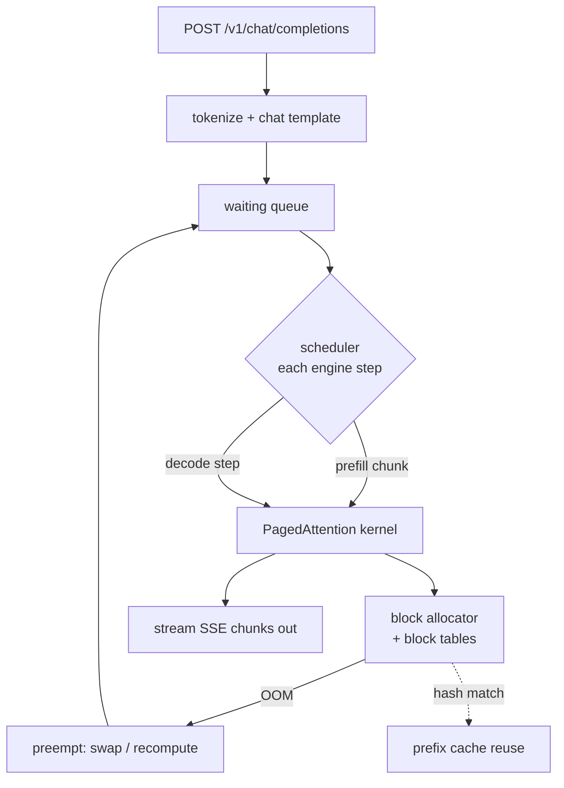

# vLLM internals

By now the arithmetic is settled: decode is bandwidth-bound, the KV cache is the memory tyrant, and quantization is the lever. vLLM is the piece of software that turns those facts into a serving engine that actually reaches a large fraction of the roofline. It does so through a handful of ideas that are worth understanding in detail, because every operational flag in the next chapter is an exposed control on one of these mechanisms. This chapter is deliberately under-the-hood-heavy: I want to know what PagedAttention does at the block level, how the scheduler decides what runs each step, why prefix caching and chunked prefill exist, and what the OpenAI-compatible server is actually doing underneath a familiar API.

## Theory

### The problem vLLM was built to kill: KV fragmentation

Before PagedAttention, serving engines allocated each sequence's KV cache as one contiguous block sized to the maximum possible length. If you advertised a 32K context, every admitted request reserved 32K worth of cache up front, even a request that would emit forty tokens. The result was catastrophic **internal fragmentation**: most of the reserved cache sat empty, and the engine ran out of memory long before it ran out of useful capacity. On a 16GB card, where the KV pool is only a few GiB after weights, this waste is fatal; it is the difference between four concurrent sequences and one.

The fix, PagedAttention, borrows the oldest trick in operating systems: **paging**. Do not allocate contiguous memory sized to the worst case. Allocate small fixed-size blocks on demand, and keep a table that maps a sequence's logical positions to whatever physical blocks happen to be free.

### PagedAttention: blocks and block tables

```admonish under-the-hood title="How PagedAttention lays out the cache"
vLLM carves the KV pool into fixed-size **blocks**, each holding the keys and values for a fixed number of tokens (the block size, 16 tokens by default). A block's physical size follows the KV formula from chapter 2: for one block, $16 \times B_{\text{tok}}$. For Qwen3-8B BF16 that is $16 \times 144\ \text{KiB} = 2.25\ \text{MiB}$ per block.

Each sequence owns a **block table**: an array mapping its logical block index (position $0..15$ live in logical block 0, $16..31$ in logical block 1, and so on) to a physical block ID somewhere in the pool. The blocks a sequence uses need not be contiguous in physical memory. When a sequence generates its 17th token and overflows logical block 0, the allocator hands it any free physical block and appends the mapping to its table. When the sequence finishes, its physical blocks return to the free list for immediate reuse.

The attention kernel is written to follow the block table: to compute attention at the current position it gathers K and V from the scattered physical blocks by walking the table, rather than assuming one contiguous span. This indirection is the entire cost of paging, and it is cheap because the gather is coalesced within each block.
```

Two consequences fall out, and both are large. First, **internal fragmentation nearly vanishes**: a sequence uses only as many blocks as it has tokens, rounded up to the block size, so waste is at most one partial block (under 16 tokens) per sequence instead of tens of thousands. Second, **memory is shared trivially** because blocks are the unit of ownership, which sets up prefix caching below.

```admonish under-the-hood title="Copy-on-write for parallel sampling"
When one prompt is sampled multiple ways (beam search, or $n>1$ completions), the prefixes are identical, so their KV blocks are identical. vLLM lets the sequences *share* the same physical blocks for the common prefix by pointing multiple block tables at the same physical IDs, with a reference count. Only when two sequences diverge (different sampled tokens) does the shared block get copied so each can append its own continuation, exactly copy-on-write from OS memory management. This is why generating four samples of a prompt costs far less than four times the prefix memory.
```

### Continuous batching and the scheduler

A naive batch runs to completion together: you gather $N$ requests, run them all until the *slowest* finishes, then start the next batch. Because completions have wildly different lengths, most of the batch sits idle waiting on the longest laggard, and new requests wait for the whole batch to drain. **Continuous batching** (also called iteration-level scheduling) fixes this by making the batch mutable *every decode step*.

```admonish under-the-hood title="What the scheduler does each engine step"
vLLM's engine runs a loop. Each iteration ("engine step") the scheduler decides which sequences to run for exactly one forward pass, subject to the KV budget:

1. It maintains three queues: **waiting** (admitted, not yet prefilled), **running** (actively decoding), and **swapped/preempted** (evicted to free memory).
2. At each step it tries to fill the batch. Running sequences that still have KV room continue decoding. If there is spare capacity, it pulls waiting sequences in and schedules their prefill.
3. Every admission checks the block allocator: can I allocate the blocks this sequence needs this step? If the pool is full, the sequence waits.
4. If a running sequence needs a new block and none is free, the scheduler **preempts**: it evicts the lowest-priority sequence, either by swapping its blocks to CPU or by recomputing them later, freeing physical blocks for the winner. The preempted sequence returns to the queue and resumes when room appears.
5. Finished sequences (hit EOS or max tokens) release their blocks immediately, and the freed blocks are available on the very next step.

The effect is that a completed short request leaves the batch the instant it finishes and a waiting request takes its slot the same step, so the GPU stays saturated instead of idling on the longest laggard. This is the mechanism that turns decode's low per-sequence intensity into high aggregate throughput: batching many sequences amortizes each weight read across many tokens, exactly the intensity boost the roofline chapter promised.
```

The scheduler also decides *policy*, not just mechanism. By default vLLM schedules first-come-first-served, but it can prioritize by other criteria, and the admission order interacts with prefix caching (batching requests that share a prefix together maximizes cache reuse) and with chunked prefill (deciding how much of the per-step token budget goes to new prefill versus ongoing decode). These are the knobs the operations chapter exposes; the point here is that a single tunable loop, run once per forward pass, is what implements continuous batching, preemption, prefix reuse, and chunked prefill all at once. It is not four separate features bolted together but four consequences of the same iteration-level scheduling decision, which is why understanding the loop is worth more than memorizing the flags.

```admonish gotcha
Preemption is not free and it is a signal. When you see preemption in the logs, the engine is thrashing: it admitted more work than the KV pool can hold and is now paying to swap or recompute. A little is fine under bursty load; a lot means `--max-num-seqs` or `--max-model-len` is set too high for the pool, and you are better off admitting fewer sequences than churning them. The KV arithmetic from chapter 2 is how you size those flags so preemption stays rare.
```

### Prefix caching

Many requests share a prefix: a long system prompt, a few-shot preamble, a common instruction header. Prefilling that shared prefix afresh for every request is wasted compute. Because PagedAttention already stores the cache in shareable blocks, vLLM can **hash the tokens of each block and reuse blocks whose content matches** across requests. The second request that arrives with the same system prompt finds its prefix blocks already populated, skips their prefill entirely, and starts generating almost immediately.

```admonish under-the-hood title="Automatic prefix caching (APC)"
With `--enable-prefix-caching`, vLLM hashes the token contents of each completed KV block and keeps a map from hash to physical block. On a new request it walks the prompt block by block; for each block whose hash is already resident, it points the new sequence's block table at the existing physical block (ref-counted, copy-on-write) instead of recomputing. The prefill then only runs on the *suffix* that is not already cached. For a workload with a shared 1,000-token system prompt, this converts a 1,000-token prefill into a near-free table lookup on every request after the first. Cached blocks are evicted LRU when the pool is pressured, so the feature degrades gracefully rather than causing OOM.
```

For the thesis eval loop, where thousands of prompts share the same instruction scaffold, prefix caching is a substantial free win and it is on by default in recent vLLM.

```admonish gotcha
Prefix caching keys on exact token-block content, so it only hits when the shared prefix is byte-identical after tokenization. A system prompt that varies by a timestamp, a per-request user id, or even trailing whitespace breaks the match and silently reverts to full prefill. When I want the win, I keep the shared scaffold fixed and push the variable parts to the end of the prompt, where they become a cheap suffix instead of poisoning the cacheable prefix. This is a place where a tiny prompt-engineering choice has a large systems consequence.
```

### Chunked prefill

A long prefill is a big compute burst that monopolizes the GPU for one iteration, and while it runs, the sequences that are decoding get no forward progress. Their inter-token latency spikes. **Chunked prefill** slices a long prompt's prefill into fixed-size token chunks and interleaves those chunks with ongoing decode steps in the same batch.

```admonish under-the-hood title="Why chunked prefill smooths latency"
Recall the roofline: prefill is compute-bound (intensity $\sim S$) and decode is bandwidth-bound (intensity $\sim 1$). Running them in the *same* batch is complementary: the prefill chunk keeps the tensor cores busy while the decode tokens keep the memory bus busy, so the two phases fill each other's idle resource. vLLM caps the tokens processed per step (`--max-num-batched-tokens`); a long prompt is admitted a chunk at a time under that cap, and each step also carries the decode tokens of running sequences. The result is that a single 16K-token prompt no longer freezes every other user's stream for one long iteration; its cost is spread across many steps, flattening the tail of inter-token latency at a small cost to the long prompt's own time-to-first-token. This is a latency-fairness knob, and `--max-num-batched-tokens` is where you set the chunk budget.
```

### The OpenAI-compatible server surface

All of this hides behind an HTTP server that speaks the OpenAI API: `POST /v1/chat/completions`, `POST /v1/completions`, `GET /v1/models`, plus streaming via server-sent events. This is not cosmetic; it is the single most important operational decision in the whole stack, because it means every client, eval harness, and load tool that targets OpenAI works against my local server with only a base-URL change. The eval frameworks in Part III (Inspect, lm-evaluation-harness) speak OpenAI; the training loops in later parts sample from an OpenAI endpoint; the benchmark tools point at one. By making the local server API-compatible, vLLM lets me swap "a frontier API" for "my 16GB card" everywhere without rewriting a line of client code, which is precisely what makes a one-GPU thesis tractable. The compatibility is not perfect (some sampling parameters and response fields differ, and the chat template is the model's, not OpenAI's), so the read-along habit is to check the served model's template renders as expected before trusting eval scores. Under the endpoint, a request becomes: tokenize, apply the model's chat template, admit into the waiting queue, get scheduled through the loop above, and stream tokens back as SSE chunks as decode produces them. The `/metrics` endpoint (Prometheus format) exposes the internals I actually care about: running/waiting/swapped counts, KV cache usage fraction, time-to-first-token and time-per-output-token histograms, and preemption totals. Those metrics are the honest window into whether the scheduler is happy, and the benchmarking chapter reads them directly.



## Tooling

The tool for reading these internals is the server's own logging plus `/metrics`. vLLM logs a periodic throughput line summarizing the scheduler state, and with higher log verbosity it narrates admission, preemption, and prefix-cache hits. The lab below runs a controlled load and reads those lines so each field stops being noise and becomes a diagnostic. Everything is `uv`-run.

## Lab: read the scheduler logs under a controlled load

The artifact is `scheduler_annotated.md`: a captured slice of vLLM's log during a two-phase load test, with each field annotated in my own words. Producing it forces me to map every log number back to a mechanism above.

### Set up

```bash title="shell"
uv init vllm-internals-lab && cd vllm-internals-lab
uv add "vllm>=0.6" openai requests
```

### Start a server with informative logging

```bash title="shell"
VLLM_LOGGING_LEVEL=INFO uv run vllm serve Qwen/Qwen3-8B \
    --dtype bfloat16 --max-model-len 8192 \
    --max-num-seqs 16 --max-num-batched-tokens 2048 \
    --enable-prefix-caching \
    --gpu-memory-utilization 0.92 2>&1 | tee serve.log
```

### Generate a controlled two-phase load

The load is designed to exercise the scheduler: a burst of short requests sharing a long system prompt (to trigger prefix caching), then a couple of very long prompts concurrent with short ones (to trigger chunked prefill and possibly preemption).

```python title="vllm-internals-lab/load.py"
"""Drive a two-phase load: shared-prefix burst, then mixed long/short."""
import asyncio, time
from openai import AsyncOpenAI

client = AsyncOpenAI(base_url="http://localhost:8000/v1", api_key="EMPTY")
SYS = "You are a careful reasoning assistant. " * 60  # ~long shared prefix

async def ask(user, max_tokens=128):
    r = await client.chat.completions.create(
        model="Qwen/Qwen3-8B",
        messages=[{"role": "system", "content": SYS},
                  {"role": "user", "content": user}],
        max_tokens=max_tokens, temperature=0.0)
    return r.usage

async def main():
    # Phase 1: 12 short requests, identical system prompt -> prefix cache hits
    await asyncio.gather(*[ask(f"Add {i} and {i+1}.") for i in range(12)])
    await asyncio.sleep(1)
    # Phase 2: two long prompts concurrent with short ones -> chunked prefill
    long_user = "Summarize the following. " + ("data point. " * 1500)
    await asyncio.gather(
        ask(long_user, max_tokens=256), ask(long_user, max_tokens=256),
        *[ask(f"What is {i} squared?") for i in range(8)])

if __name__ == "__main__":
    asyncio.run(main())
```

```bash title="shell"
uv run python load.py
```

### Annotate the log

vLLM prints periodic lines shaped roughly like:

```text title="serve.log (representative shape; capture your own)"
Avg prompt throughput: 5120.0 tokens/s, Avg generation throughput: 430.0 tokens/s,
Running: 10 reqs, Swapped: 0 reqs, Waiting: 2 reqs,
GPU KV cache usage: 63.5%, Prefix cache hit rate: 41.2%
```

Write the annotation file that decodes each field against the mechanisms:

```markdown title="vllm-internals-lab/scheduler_annotated.md"
# vLLM scheduler log, annotated (baseline machine, Qwen3-8B BF16)

Captured: RECORD DATE / DRIVER / vLLM VERSION

- **Avg prompt throughput (tokens/s)**: prefill rate. High because prefill is
  compute-bound (roofline ch.1, intensity ~ S). Spikes during Phase 2's long prompts.
- **Avg generation throughput (tokens/s)**: aggregate DECODE rate across all running
  sequences. Bandwidth-bound per sequence, but summed over `Running` count; this is
  where continuous batching turns low per-seq intensity into high total tok/s.
- **Running**: sequences decoding this step. Bounded by `--max-num-seqs` (16) AND by
  the KV pool. If this pins below 16, the KV pool (ch.2) is the limit, not the flag.
- **Swapped**: sequences preempted to CPU. 0 = healthy. Nonzero = admitted more than
  the pool holds; the scheduler is thrashing (see the preemption gotcha).
- **Waiting**: admitted-but-not-yet-running requests. Transient during bursts; chronic
  = under-provisioned for the load.
- **GPU KV cache usage (%)**: fraction of the KV pool in use. This is
  N_seq * ctx * B_tok / M_kv from ch.2, live. Near 100% precedes preemption.
- **Prefix cache hit rate (%)**: fraction of prompt blocks served from the prefix
  cache instead of recomputed. ~0% in Phase 1's first request, then jumps once the
  shared system prompt is resident. This is the free win of --enable-prefix-caching.
```

### What you should see

In Phase 1, the first request shows a near-zero prefix cache hit rate, then every subsequent request with the same system prompt shows the hit rate climbing toward the fraction of the prompt that is shared prefix, and their prompt throughput effectively stops counting those cached tokens (the prefill is skipped). In Phase 2, when the two long prompts arrive, prompt throughput spikes as chunked prefill feeds those prompts in over several steps while the short requests keep decoding, so generation throughput does not collapse to zero the way it would if the long prefill monopolized a whole iteration. `Running` should sit at or near my `--max-num-seqs` when demand exceeds it, and `GPU KV cache usage` should rise under the Phase 2 burst; if it hits ~100% and `Swapped` goes nonzero, I have watched a live preemption and my flags are one notch too aggressive for the pool. The annotated markdown is the deliverable: every field mapped to a mechanism from chapters 1 and 2, which is the point of opening the hood at all. Record the vLLM version, date, and driver at the top of the file, because these log formats drift between releases.

```admonish substack-seed
"vLLM is an operating system for your GPU's memory." The features that make vLLM fast are not deep-learning tricks, they are operating-systems tricks wearing an ML costume. PagedAttention is virtual memory: fixed-size pages, a page table per sequence, and the same win (no contiguous worst-case allocation, so fragmentation dies). Prefix caching is deduplication with copy-on-write. Continuous batching is a preemptive scheduler that never lets the core idle on the slowest job. Chunked prefill is time-slicing a heavy task so interactive ones stay responsive. This post reframes an inference engine as the OS-textbook chapter it secretly is, and argues that once you see the mapping, every serving flag stops being cargo-cult and starts being a knob on a mechanism you already understand.
```
