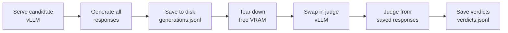

# Judge models

A verifier is a function that checks an answer against ground truth. A judge is a model you ask to render an opinion. The whole thrust of this book is to prefer the verifier every time you can get one, because a verifier is cheap, deterministic, and has no ego. But there is always a residue: responses where partial credit matters, where the rubric asks about reasoning quality and not just the final token, where "is this a good explanation" has no closed form. For that residue you reach for a judge, and the moment you do, you have added a second model whose biases now sit between you and the truth. This chapter is about measuring those biases before you trust the judge, and about picking the one judge this book will use as its default, under a rule I write down before I look at any data.

## Theory

### What a judge is for, and what it is not for

A judge model scores or ranks responses by being prompted to. In the eval literature this is "LLM-as-a-judge," and it comes in two shapes. In **absolute** (pointwise) scoring you hand the judge one response and a rubric and ask for a grade, say an integer from 1 to 5 or a pass/fail. In **pairwise** scoring you hand the judge two responses to the same prompt and ask which is better, or whether they tie. Both are useful; both are biased; and the biases differ by shape, which is the first thing to internalize.

The reason to keep a judge on a short leash is that it is not measuring truth, it is producing a correlated proxy for truth, and the correlation is exactly the thing you have to establish empirically rather than assume. In the loop that this book is built around (serve, evaluate, score, train, re-evaluate), a judge lives in the score arrow. If the judge is biased and you train against its scores, you do not get a better model, you get a model that is better at pleasing the judge's bias. That failure mode (reward hacking a miscalibrated judge) is the single most expensive mistake available in this part of the pipeline, and it is why I spend a whole chapter calibrating before I let a judge anywhere near a reward.

### The four biases that matter

Judges fail in structured, measurable ways. Four biases are worth naming because you can quantify each one.

**Position bias** shows up in pairwise judging: the judge prefers whichever response is presented first (or, for some models, second) regardless of content. You detect it by asking the judge the same pair twice with the order swapped and checking how often the two verdicts agree. A perfectly position-neutral judge is swap-consistent 100% of the time (modulo genuine ties); a coin-flip judge that only reads position is swap-consistent 0% of the time on discordant pairs.

**Verbosity bias** is the tendency to prefer the longer response, or the higher-scoring-because-longer response, independent of quality. You detect it by regressing the judge's verdict on the length difference between the two responses and looking at the slope. If longer reliably wins after you control for gold-labeled quality, you have verbosity bias.

**Self-preference** (self-enhancement) is the tendency of a judge to rate outputs from its own model family higher than a neutral grader would. This is why using a model to judge its own generations is a methodological smell: the judge and the candidate share failure modes and stylistic priors, so the judge rates its own family's mistakes as features. In this book the judge is always a different model from the one under test, and I will re-state that rule whenever it is at risk.

**Sycophancy / formatting bias** is a grab-bag: the judge rewards confident tone, clean markdown, an authoritative preamble, or the mere presence of a "Final answer:" line, none of which is correctness. On verifiable tasks this is the most dangerous because it is the easiest for a trained policy to exploit.

### Pairwise versus absolute

Pairwise judging is generally more reliable than absolute grading, for the same reason ranking is easier than rating: the judge only has to decide a direction, not calibrate an internal scale it does not really have. Absolute grades drift (the model's notion of "a 4" today is not its notion of "a 4" next week), they clump (everything gets a 3 or a 4), and they are not comparable across judges. Pairwise verdicts sidestep all of that but cost you two things: they are $O(n^2)$ if you compare everything against everything (in practice you compare against a fixed baseline or use a tournament), and they expose you fully to position bias, which absolute grading does not have. The engineering answer is to use pairwise-against-a-fixed-reference with mandatory order-swapping, which buys pairwise's reliability while letting you measure and neutralize position bias. That is the design I calibrate below.

### Rubric design

A judge is only as good as the instruction you give it, and most judge failures I have seen are rubric failures wearing a judge costume. Three rules earn their keep. First, **decompose the criterion**: instead of "rate the answer 1 to 5," ask for a verdict on each of a small number of named, anchored sub-criteria (correctness of the final result, validity of each reasoning step, absence of unsupported claims) and combine them yourself in code. This keeps the aggregation transparent and out of the judge's head. Second, **anchor the scale** with concrete descriptions of what each level means, because an unanchored scale is where drift lives. Third, decide deliberately about **chain-of-thought ordering**: asking the judge to reason before it emits a verdict (reason-then-verdict) tends to reduce some biases and improve agreement, at the cost of more tokens; asking for the verdict first is cheaper but more bias-prone. I default to reason-then-verdict with a constrained final line the parser can grab, and I hold the token budget fixed so the cost of that choice is bounded and, crucially, *matched* across the judges I am comparing.

### Calibrating against gold labels

Calibration means: get a set of items a human has labeled (the gold set), have each candidate judge label the same items, and measure how well the judge agrees with the human, chance-corrected. Raw agreement (fraction of items where judge and gold match) is the headline number but it is inflated when one class dominates, so the honest statistic is **Cohen's kappa**, which subtracts the agreement you would expect from two raters guessing at the observed marginal rates.

```admonish derivation
**Cohen's kappa.** Let two raters (here: the judge and the gold human) each assign every item to one of $K$ categories. Let $p_o$ be the observed agreement, the fraction of items on which they assigned the same category:

$$ p_o = \frac{1}{N}\sum_{i=1}^{N} \mathbb{1}\{\text{judge}_i = \text{gold}_i\}. \tag{6.1}$$

Let $p_{J}(k)$ and $p_{G}(k)$ be the marginal rates at which the judge and the gold labeler use category $k$. If the two raters were independent and used those same marginals, the agreement expected by chance is

$$ p_e = \sum_{k=1}^{K} p_{J}(k)\, p_{G}(k). \tag{6.2}$$

Cohen's kappa is the observed agreement in excess of chance, normalized by the maximum possible excess:

$$ \kappa = \frac{p_o - p_e}{1 - p_e}. \tag{6.3}$$

$\kappa = 1$ is perfect agreement, $\kappa = 0$ is exactly chance, and $\kappa < 0$ is worse than chance. The intuition for the denominator is that $1 - p_e$ is the room left above chance; dividing by it puts judges with different marginal habits on a common scale. A large-sample standard error, useful for putting a confidence interval on kappa itself, is

$$ \widehat{\mathrm{SE}}(\kappa) = \sqrt{\frac{p_o(1-p_o)}{N\,(1-p_e)^2}}, \tag{6.4}$$

which we will improve on in the next chapter by bootstrapping over items instead of trusting the asymptotic formula.
```

For a three-way pairwise verdict (A wins / tie / B wins) kappa is computed over those three categories. For an ordinal absolute grade you would prefer a weighted kappa or Spearman correlation so that "off by one" is penalized less than "off by three," but the three-category pairwise case is where I do the actual decision, so unweighted kappa is the right tool.

### The pre-registered decision rule

Here is the part that makes this a thesis chapter and not a blog post. I am going to choose between two local judges, the provisional default **Qwen3-14B-AWQ** and the challenger **gpt-oss-20b (MXFP4)**, and I am writing the decision rule *now*, before running anything, so that I cannot rationalize my way to a favorite after seeing the numbers. Pre-registration is the cheapest defense against the garden of forking paths there is, and it costs me nothing but the discipline to write the rule down and follow it.

```admonish note title="Pre-registered judge selection criterion (locked before data)"
On a hand-labeled gold set of pairwise comparisons over Space Domain Awareness (SDA)-flavored verifiable-reasoning responses, at a **matched judge token budget** of 512 completion tokens and identical reason-then-verdict rubric, select the default judge by:

1. **Primary:** highest Cohen's kappa (Eq. 6.3) with the gold labels. If the 95% bootstrap confidence intervals (Chapter 3.7) for the two kappas overlap, treat it as a tie on the primary criterion and go to the tie-breaker.
2. **Tie-breaker:** lowest bias, scored as the sum of positional inconsistency (fraction of swapped pairs whose verdict flips) and verbosity slope magnitude (absolute standardized coefficient of length-difference on verdict).

The judge selected under this rule becomes the book's default judge and reward grader. The decision is made in this chapter and not revisited without a documented reason.
```

## Tooling

### Generate-then-judge on one card: serve, save, swap, judge

You cannot comfortably hold a 14B candidate and a 20B judge in 16GB of VRAM at the same time, and you should not want to, because the fair, reproducible pattern keeps the two phases separate anyway. The discipline is a four-beat sequence I call **serve, save, swap, judge**.



The load-bearing idea is that generation and judging never run concurrently. You serve the candidate, generate every response you will ever need, and write them to `generations.jsonl` on the NVMe working tier. Then you free the GPU (in practice: shut down the vLLM process; its VRAM is reclaimed when the process exits), start a second vLLM serving the judge, and stream the saved responses through it. This is the same "never re-generate what you can re-score" principle that Chapter 3.10 turns into an operating discipline: once `generations.jsonl` exists, re-judging with a different judge or a different rubric is cheap and never touches the candidate model again.

Both candidate judges fit alone, which is all we need. Here is the arithmetic.

```admonish note title="Judge VRAM budget (weights only, derived)"
**Qwen3-14B-AWQ.** Qwen3-14B has on the order of $1.48 \times 10^{10}$ parameters. AWQ stores weights at 4 bits each, so weight memory is about $1.48\times10^{10} \times 4\,\text{bits} \div 8 = 7.4\ \text{GB}$. Add KV cache and activation working set (a few GB at modest context) and it lives comfortably under the 16 GB ceiling.

**gpt-oss-20b (MXFP4).** About $2.1 \times 10^{10}$ parameters stored at roughly 4.25 bits each (MXFP4 with block scales) gives $2.1\times10^{10} \times 4.25 \div 8 \approx 11.2\ \text{GB}$ of weights. Also fits alone, with less headroom for KV cache, which is one more reason to cap the judge's completion budget.

Neither fits *alongside* a 14B candidate, which is exactly why the pattern is sequential. Actual loaded footprints: (measured on the baseline machine -- record value, date, driver).
```

The matched 512-token completion cap does double duty: it bounds the judge's memory footprint and it holds the verbosity and cost of the two judges equal, which is a precondition of the pre-registered rule.

### When an API judge is admissible

Everywhere else in this book the answer to "can I use a hosted API" is no, because the loop has to close on my own machine and an API model is unpinnable and undated. Judges get one narrow exception, and it comes with two conditions that must both hold. First, **open data only**: I will only send an item to a third-party API if that item is already public (a released benchmark), never any private thesis data, because sending data to an API is a disclosure and a governance decision, not a convenience. Second, **cross-check only, never the spine**: an API judge may serve as an external sanity check on a local judge's calibration, but it may never be the tracked grader whose scores drive training, because it drifts silently, it retires versions, and it cannot be reproduced next year. If both conditions hold, an API judge is a legitimate second opinion. If either fails, it is inadmissible. For the thesis default, the judge is local, full stop.

```admonish read-along
[RLHF] treats LLM-as-a-judge and reward modeling as two views of the same object, which is the framing this book runs on: a calibrated judge is a reward model you have not yet differentiated through. Read its judging chapter alongside this one for the reward-modeling perspective on the same biases. **[AIE]** ch. 3 has a practical AI-as-judge treatment, including the same position and verbosity biases measured here, from the production side.
```

## Lab

We will run a judge calibration study against a hand-labeled gold set and emit a **judge reliability report**, then apply the pre-registered rule to pick the default judge. No candidate generation happens here; assume `generations.jsonl` already exists from a prior serve-and-save (Chapter 3.4's scorers produced the responses). The two candidate judges are served one at a time via vLLM's OpenAI-compatible endpoint.

### Project setup

```bash title="setup.sh"
uv init judge-cal && cd judge-cal
uv add "openai>=1.40" "numpy>=1.26" "pydantic>=2.7"
# vLLM is run as a separate server process, not imported here.
# Serve one judge at a time, e.g.:
#   uv run vllm serve Qwen/Qwen3-14B-AWQ --max-model-len 8192 --port 8000
# then later:
#   uv run vllm serve openai/gpt-oss-20b --port 8000
```

### The gold set

The gold set is the whole ballgame. Each row is one pairwise comparison over a single prompt: two candidate responses (`a` and `b`) and a human verdict in `{A, tie, B}`. Hand-label these yourself; a few dozen well-chosen, genuinely-discordant items beat hundreds of easy ones. I show a tiny illustrative slice; a real study wants on the order of 100+ items so the kappa CI in Chapter 3.7 is tight enough to resolve the two judges.

```jsonl title="data/gold.jsonl"
{"id": "sda-014", "prompt": "Given the table, which region had the largest year-over-year revenue drop? Show your reasoning.", "a": "North fell from 812 to 640, a drop of 172. West fell from 900 to 705, a drop of 195. West had the largest drop.", "b": "The answer is West because it looks lowest on the chart.", "gold": "A", "len_a": 172, "len_b": 63}
{"id": "sda-027", "prompt": "Is the schema below in third normal form? Justify.", "a": "No. The column city depends on zip, which is a non-key attribute, so there is a transitive dependency violating 3NF.", "b": "No, it is not in 3NF. There is a transitive dependency: zip determines city, and zip is not a key, so city transitively depends on the primary key. Decompose to fix it.", "gold": "B", "len_a": 132, "len_b": 205}
{"id": "sda-031", "prompt": "How many records survive the filter WHERE amount > 100 AND status = 'paid'?", "a": "Counting rows matching both conditions: 3.", "b": "There are 3 matching rows.", "gold": "tie", "len_a": 41, "len_b": 26}
```

### The judge call

```python title="judgecal/judge.py"
"""Run one served judge over the gold pairs, both orders, matched budget."""
import json, re
from pathlib import Path
from openai import OpenAI

JUDGE_TOKENS = 512  # matched budget across judges (pre-registered)

RUBRIC = """You are comparing two responses to the same task. Judge only which
response reasons more correctly to a verifiable answer. Length and confidence are
NOT quality. Reason step by step, then end with exactly one line:
VERDICT: A   or   VERDICT: B   or   VERDICT: tie
Response A:
{a}
Response B:
{b}
Task:
{prompt}
"""

VERDICT_RE = re.compile(r"VERDICT:\s*(A|B|tie)", re.IGNORECASE)

def parse(text: str) -> str:
    m = VERDICT_RE.search(text or "")
    if not m:
        return "unparsed"
    v = m.group(1).lower()
    return {"a": "A", "b": "B", "tie": "tie"}[v]

def judge_pair(client, model, prompt, first, second):
    msg = RUBRIC.format(prompt=prompt, a=first, b=second)
    resp = client.chat.completions.create(
        model=model,
        messages=[{"role": "user", "content": msg}],
        temperature=0.0,          # judging is deterministic-as-possible
        max_tokens=JUDGE_TOKENS,
    )
    return parse(resp.choices[0].message.content)

def run(model_name: str, base_url="http://localhost:8000/v1"):
    client = OpenAI(base_url=base_url, api_key="EMPTY")
    out = []
    for line in Path("data/gold.jsonl").read_text().splitlines():
        r = json.loads(line)
        # Original order: A=a, B=b. Swapped order: A=b, B=a.
        v_orig = judge_pair(client, model_name, r["prompt"], r["a"], r["b"])
        v_swap = judge_pair(client, model_name, r["prompt"], r["b"], r["a"])
        # Map the swapped verdict back to the a/b frame.
        v_swap_mapped = {"A": "B", "B": "A", "tie": "tie",
                         "unparsed": "unparsed"}[v_swap]
        out.append({**r, "v_orig": v_orig, "v_swap": v_swap_mapped})
    dest = Path(f"runs/verdicts_{model_name.replace('/', '_')}.jsonl")
    dest.parent.mkdir(exist_ok=True)
    dest.write_text("\n".join(json.dumps(o) for o in out))
    print(f"wrote {dest} ({len(out)} pairs, both orders)")

if __name__ == "__main__":
    import sys
    run(sys.argv[1])  # e.g. Qwen/Qwen3-14B-AWQ  or  openai/gpt-oss-20b
```

Note the `temperature=0.0`: a judge should be as deterministic as the serving stack allows, so that its verdicts are a property of the rubric and not of the seed. Run it once per judge, each time against a freshly served endpoint:

```bash title="run.sh"
# Serve judge 1, judge, tear down; then judge 2. Serve/save/swap/judge.
uv run vllm serve Qwen/Qwen3-14B-AWQ --port 8000 &   # then wait for ready
uv run python -m judgecal.judge Qwen/Qwen3-14B-AWQ
# stop the server (frees VRAM), then:
uv run vllm serve openai/gpt-oss-20b --port 8000 &
uv run python -m judgecal.judge openai/gpt-oss-20b
```

### The reliability report

```python title="judgecal/report.py"
"""Score each judge's verdicts against gold: kappa, position bias, verbosity."""
import json, sys
from pathlib import Path
import numpy as np

CATS = ["A", "tie", "B"]

def load(model_name):
    p = Path(f"runs/verdicts_{model_name.replace('/', '_')}.jsonl")
    return [json.loads(l) for l in p.read_text().splitlines()]

def cohens_kappa(judge, gold):
    """Eqs. 6.1-6.3 over the three pairwise categories."""
    N = len(judge)
    po = np.mean([j == g for j, g in zip(judge, gold)])
    pe = 0.0
    for k in CATS:
        pj = np.mean([j == k for j in judge])
        pg = np.mean([g == k for g in gold])
        pe += pj * pg
    return (po - pe) / (1 - pe) if pe < 1 else 1.0, po, pe

def positional_inconsistency(rows):
    """Fraction of pairs whose verdict flips when the order is swapped.
    A position-neutral judge gives v_orig == v_swap (already mapped to a/b)."""
    flips = [r["v_orig"] != r["v_swap"] for r in rows]
    return float(np.mean(flips))

def verbosity_slope(rows):
    """Standardized slope of (verdict favors longer) on length difference.
    Encode verdict as +1 if it favors A, -1 if B, 0 if tie. To isolate length
    from POSITION, average the signed verdict over both presentation orders
    (v_orig and the swapped v_swap, both already mapped to a/b content): the
    position-dependent component cancels and only the content/length preference
    survives. Regressing v_orig alone would leak position bias into the slope.
    A positive slope means 'longer tends to win' independent of where it sat."""
    def signed(v):
        return {"A": 1.0, "B": -1.0, "tie": 0.0}.get(v, 0.0)
    y = np.array([0.5 * (signed(r["v_orig"]) + signed(r["v_swap"]))
                  for r in rows])
    dl = np.array([r["len_a"] - r["len_b"] for r in rows], dtype=float)
    if dl.std() == 0:
        return 0.0
    dz = (dl - dl.mean()) / dl.std()
    # slope of y on dz via least squares; y is not standardized on purpose.
    return float((dz @ (y - y.mean())) / (dz @ dz))

def report(model_name):
    rows = load(model_name)
    judge = [r["v_orig"] for r in rows]
    gold = [r["gold"] for r in rows]
    kappa, po, pe = cohens_kappa(judge, gold)
    pos = positional_inconsistency(rows)
    verb = verbosity_slope(rows)
    unparsed = float(np.mean([r["v_orig"] == "unparsed" for r in rows]))
    return {
        "judge": model_name,
        "n_items": len(rows),
        "raw_agreement": round(po, 4),
        "cohens_kappa": round(kappa, 4),
        "positional_inconsistency": round(pos, 4),
        "verbosity_slope_abs": round(abs(verb), 4),
        "bias_score": round(pos + abs(verb), 4),
        "unparsed_rate": round(unparsed, 4),
        "token_budget": 512,
        "note": "kappa CI via evalstats bootstrap (Ch 3.7); "
                "measured on the baseline machine -- record date, driver",
    }

def decide(reports):
    """Apply the pre-registered rule: primary kappa, tie-break bias_score."""
    a, b = reports
    # Tie iff kappa CIs overlap; here we approximate with a small margin and
    # defer the real overlap test to evalstats.bootstrap in Ch 3.7.
    if abs(a["cohens_kappa"] - b["cohens_kappa"]) > 0.05:
        winner = a if a["cohens_kappa"] > b["cohens_kappa"] else b
        reason = "higher kappa (primary)"
    else:
        winner = a if a["bias_score"] < b["bias_score"] else b
        reason = "kappa tie -> lower bias_score (tie-breaker)"
    return {"default_judge": winner["judge"], "reason": reason}

if __name__ == "__main__":
    models = ["Qwen/Qwen3-14B-AWQ", "openai/gpt-oss-20b"]
    reports = [report(m) for m in models]
    out = {"reports": reports, "decision": decide(reports)}
    Path("runs/judge_reliability_report.json").write_text(
        json.dumps(out, indent=2))
    print(json.dumps(out, indent=2))
```

```admonish gotcha
The `decide` function above uses a crude 0.05 margin as a stand-in for "do the kappa confidence intervals overlap." That is a placeholder. The pre-registered rule says the tie is decided by *bootstrap* CIs, and the honest version calls `evalstats.bootstrap` from the next chapter to put a real 95% interval on each kappa and checks overlap. Do not ship the margin hack as the final decision; wire in the bootstrap once Chapter 3.7's module exists. This is deliberately left as the seam between the two chapters.
```

### The artifact and what you should see

The artifact is `runs/judge_reliability_report.json`: for each candidate judge, its raw agreement, Cohen's kappa against gold, positional inconsistency, verbosity slope, unparsed rate, and the matched token budget, plus a `decision` block naming the default judge and the criterion that selected it. Running the report on a real gold set, you should see kappa values that are clearly above chance (a usable judge lands well north of $\kappa = 0.4$; below that it is barely better than guessing and you should fix the rubric before trusting it), positional inconsistency small (a good judge flips on well under 15% of swapped pairs), and a verbosity slope near zero. The two candidates will separate on one of these axes: if one has a decisively higher kappa (non-overlapping CIs), it wins on the primary criterion; if the kappas are statistically indistinguishable, the tie-breaker picks the less biased judge. Either way the JSON records *which rule fired*, so the choice of default judge is auditable rather than a matter of taste. The actual kappa and bias numbers for Qwen3-14B-AWQ versus gpt-oss-20b are (measured on the baseline machine -- record value, date, driver), and the resulting default judge is whichever the recorded numbers select under the locked rule above.

```admonish substack-seed
LLM-as-a-judge is usually sold as "just ask a big model which answer is better." The uncomfortable truth is that a judge is a second model with its own biases (it prefers the first option, the longer option, and its own family's writing), and if you train against an uncalibrated judge you get a model that games the judge, not a better model. The fix is boring and powerful: hand-label a small gold set, measure the judge's chance-corrected agreement (Cohen's kappa) and its position and verbosity biases, and *pre-register* the rule that picks your judge before you look at the scores. Pick the judge like you would pick a lab instrument: calibrate it against a known standard first, then trust the readings.
```
