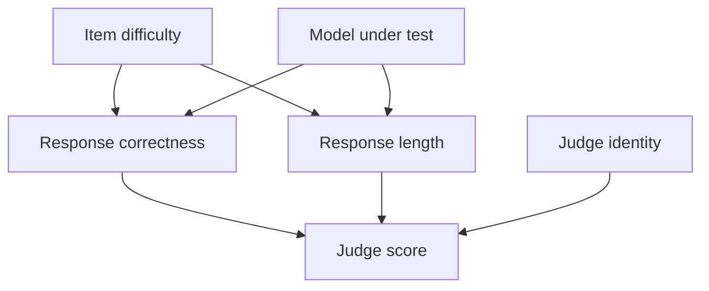

# DAGs and d-separation

**Goal.** Learn to draw a benchmark pipeline as a directed acyclic graph and read off, mechanically, every conditional independence the graph implies, so that later chapters can argue about confounding on a picture instead of on vibes.

**Covers.** Causal graphical models; paths, chains, forks, and colliders; d-separation and the conditional independences it licenses; the Markov factorization that connects a graph to a probability distribution.

## Theory

### A graph is a compressed set of assumptions

A causal DAG is the cheapest honest way I know to write down what I believe about a system. Each node is a variable I could in principle measure (the model under test, the prompt template, the response length, the judge, the score). Each directed edge $A \to B$ is a claim that $A$ is a direct cause of $B$, meaning that if I could hold everything else fixed and wiggle $A$, then $B$ would tend to move. The absence of an edge is the stronger claim: it asserts there is no direct causal path, and it is the missing edges, not the present ones, that do the real work, because they are what let me deduce that certain things must be independent.

"Directed" means every edge has an arrowhead: causation points one way. "Acyclic" means you cannot follow arrows and return to where you started: no variable is its own ancestor. That rules out feedback within a single graph, which sounds restrictive until you notice that the loop of this whole book (serve, evaluate, score, train) is unrolled in time. The model at iteration $t+1$ is a different node from the model at iteration $t$, so the cycle in Figure 0.1 becomes a perfectly legal DAG once I stop collapsing time onto itself. I will lean on that trick constantly.

### The three atoms: chain, fork, collider

Every path through a DAG, however long, is built from three local structures, and the entire theory of when information flows is just the behavior of these three atoms. Get them right and d-separation is bookkeeping.

A **chain** is $A \to B \to C$: $A$ causes $B$ causes $C$. Here $B$ is a mediator. Information flows from $A$ to $C$ along the chain, so $A$ and $C$ are marginally dependent. But if I condition on $B$, I block the flow: once I know $B$, learning $A$ tells me nothing more about $C$. Conditioning on a mediator closes the path.

A **fork** is $A \leftarrow B \to C$: a common cause $B$ drives both $A$ and $C$. This is confounding in its purest form. $A$ and $C$ are marginally dependent (they share a cause, so they move together) even though neither causes the other. Conditioning on $B$ blocks the path: within a stratum of fixed $B$, $A$ and $C$ are independent. Conditioning on a common cause closes the path.

A **collider** is $A \to B \leftarrow C$: two causes collide at a common effect $B$. This one is the trap, because it behaves backwards. $A$ and $C$ are marginally independent (they have no shared cause and neither causes the other), so the path is closed by default. But conditioning on the collider $B$, or on any descendant of $B$, opens the path and makes $A$ and $C$ dependent. This is selection bias and collider bias, and it is the single most counterintuitive fact in the subject: controlling for the wrong variable can manufacture an association that was not there. Chapter 4.3 is largely about the ways eval pipelines condition on colliders without realizing it (filtering runs by "completed successfully" is the canonical case).

```admonish gotcha title="Conditioning is not always cleaning"
The reflex from regression is "control for more stuff, get a cleaner estimate." Colliders break that reflex. Conditioning on a mediator or a common cause removes bias; conditioning on a collider or its descendant creates it. There is no way to know which is which from the data alone. You need the graph. This is precisely why I refuse to pick an adjustment set by throwing every available covariate into a regression, and it is the reason the backdoor criterion in chapter 4.4 exists.
```

### d-separation, stated as a rule

d-separation ("directional separation") is the algorithm that turns the three atoms into a global verdict: given the graph, which variables are guaranteed independent given which others. The definition is built on the idea of a **blocked path**.

```admonish derivation title="The d-separation rules"
Take two nodes $X$ and $Y$ and a (possibly empty) conditioning set $Z$ of other nodes. Consider any undirected path $\pi$ between $X$ and $Y$ (a sequence of edges, ignoring arrow direction, that connects them). Walk along $\pi$ and inspect each intermediate node $m$ where two consecutive edges meet. The path $\pi$ is **blocked** by $Z$ if at least one of these holds:

1. $m$ is a **chain** ($\cdots \to m \to \cdots$) or a **fork** ($\cdots \leftarrow m \to \cdots$) on $\pi$, and $m \in Z$. (Conditioning on a mediator or common cause closes the path.)
2. $m$ is a **collider** ($\cdots \to m \leftarrow \cdots$) on $\pi$, and neither $m$ nor any descendant of $m$ is in $Z$. (A collider is closed unless you condition on it or its descendant.)

If **every** path between $X$ and $Y$ is blocked by $Z$, then $X$ and $Y$ are **d-separated** given $Z$, written

$$
X \perp_d Y \mid Z. \tag{2.1}
$$

If even one path is left unblocked (a path is unblocked, or "open," exactly when it is not blocked, i.e. every non-collider on it is outside $Z$ and every collider on it is in $Z$ or has a descendant in $Z$), then $X$ and $Y$ are d-connected given $Z$.

The payoff is the theorem that makes graphs useful: d-separation in the graph implies conditional independence in every distribution the graph is compatible with,

$$
X \perp_d Y \mid Z \;\Longrightarrow\; X \perp\!\!\!\perp Y \mid Z \quad\text{in } P. \tag{2.2}
$$

The converse holds for almost all distributions compatible with the graph (the "faithful" ones), which is why I can read testable independence claims straight off a drawing.
```

The reason (2.2) is not circular is the Markov condition, which is the bridge from a graph to a probability distribution. It says a distribution $P$ is Markov relative to a DAG $G$ when every variable is independent of its non-descendants given its parents. That local statement has a global consequence, and the global consequence is the factorization I actually compute with.

```admonish derivation title="The Markov factorization"
Let $G$ be a DAG over variables $V = \{X_1, \dots, X_n\}$ with $\operatorname{Pa}(X_i)$ the parents of $X_i$ in $G$. The Markov condition (each node independent of its non-descendants given its parents) is equivalent to the statement that the joint distribution factorizes along the graph:

$$
P(X_1, \dots, X_n) = \prod_{i=1}^{n} P\!\left(X_i \mid \operatorname{Pa}(X_i)\right). \tag{2.3}
$$

Sketch of why. Take any topological order of $G$ (possible because $G$ is acyclic), so that every parent precedes its child. The chain rule of probability, which holds for any distribution, gives

$$
P(X_1, \dots, X_n) = \prod_{i=1}^{n} P\!\left(X_i \mid X_1, \dots, X_{i-1}\right). \tag{2.4}
$$

Under a topological order, $\{X_1, \dots, X_{i-1}\}$ contains all of $X_i$'s parents and none of its descendants, so it is a set of non-descendants that includes $\operatorname{Pa}(X_i)$. The Markov condition says $X_i$ is independent of those non-descendants once I condition on its parents, so each factor collapses:

$$
P\!\left(X_i \mid X_1, \dots, X_{i-1}\right) = P\!\left(X_i \mid \operatorname{Pa}(X_i)\right). \tag{2.5}
$$

Substituting (2.5) into (2.4) gives (2.3). d-separation is then provably the complete graphical criterion for the conditional independences entailed by (2.3): any independence that (2.1) declares is forced by the factorization, and no others are forced in general.
```

Equation (2.3) is why a DAG is a modeling win and not just a diagram. A joint over $n$ binary variables has $2^n - 1$ free parameters; the factorized form needs only $\sum_i 2^{|\operatorname{Pa}(X_i)|}$, which for a sparse graph is dramatically smaller. The missing edges buy me both statistical power and testable predictions. Every independence I can enumerate from the graph is a claim I can, in principle, falsify against logged data, which is exactly what makes chapter 4.3's reanalysis of the judge data a real check and not a rationalization.

### Backdoor paths, foreshadowed

One piece of vocabulary from the factorization is worth naming now because chapter 4.4 will build its whole identification argument on it: the **backdoor path**. When I ask about the effect of some treatment $X$ on an outcome $Y$, the paths between them split into two kinds. Directed paths that leave $X$ through an outgoing arrow ($X \to \cdots \to Y$) are the causal paths, the ones I want to measure. Paths that enter $X$ through an incoming arrow ($X \leftarrow \cdots Y$) are backdoor paths, and they are non-causal by construction, because they connect $X$ to $Y$ through $X$'s own causes rather than its effects. Confounding is exactly an open backdoor path. The fork $X \leftarrow Z \to Y$ is the simplest backdoor path there is, and d-separation tells me it is open when $Z$ is unconditioned and blocked when $Z$ is conditioned on. So the entire program of adjusting for confounders is, in graph language, "find a conditioning set that blocks every backdoor path without opening a collider," which is a d-separation problem and nothing more. I mention it here so that when the backdoor criterion arrives in chapter 4.4 it reads as an application of the rules I already have, not a new idea.

### An honest word about faithfulness

The theorem in (2.2) runs one direction cleanly: d-separation in the graph forces conditional independence in the distribution. The converse, reading structure off observed independences, needs an extra assumption called faithfulness, which says the distribution has no independences except the ones the graph forces. Faithfulness can fail when two causal paths cancel exactly: imagine a direct positive effect and an indirect negative effect of equal magnitude, so that $X$ and $Y$ look marginally independent even though the graph connects them. Such exact cancellations are measure-zero in a sense (a knife-edge tuning of the parameters), which is why faithfulness is usually a safe default, but "usually safe" is not "always true," and in a trained system where an optimizer might drive parameters toward exactly such a balance I keep it in mind. The practical upshot is modest: I trust the forward direction of (2.2) completely and treat the reverse direction, inferring absent edges from observed independences, as evidence rather than proof. When chapter 4.3 tests a graph-implied independence against the judge data and it holds, that is a passed check, not a certificate; when it fails, that is a genuine refutation, because the forward direction has no escape hatch. Falsification is sharp here even when confirmation is soft, which is the usual and healthy state of an empirical science.

```admonish read-along title="Go deeper: [CAI] Part 2"
Ness devotes [CAI] Part 2 to graphical models: the Markov condition, the factorization (2.3), and d-separation with worked examples. Read it alongside this chapter. Where I give the rule as a two-clause test, Ness walks the intuition for each of the three atoms and shows the collider case slowly, which is the one worth slowing down for. Part 2 is also where the language of "backdoor path" first appears, which I pick up and formalize in chapter 4.4.
```

## Tooling

I could enumerate d-separations by hand for a five-node graph, but I make sign errors on colliders, so I let a library do the bookkeeping and I check its verdicts against my intuition. The tool is `networkx`, which represents a DAG as a `DiGraph` and ships an exact d-separation routine. In recent versions the function is `nx.is_d_separator(G, x, y, z)` for a single query and `nx.d_separated` is the older name; I use the current one and pin the version so the lab is reproducible.

The mental model for the tool is a two-step loop. First I encode my assumptions as edges, which is the honest and hard part, because the graph is where my beliefs become explicit and falsifiable. Second, I ask the library to enumerate, for every pair of non-adjacent nodes, the smallest conditioning sets that d-separate them. Each verdict it returns is a conditional independence I have committed to, and therefore a prediction I can test against real logs. If a predicted independence fails in the data, my graph is wrong, and that is the graph earning its keep.

One subtlety worth flagging: `networkx` answers d-separation queries but does not, on its own, decide which independences are the "interesting" ones. There are exponentially many conditioning sets, so I restrict attention to the marginal case ($Z = \varnothing$) and the single-node conditioning case, which together surface the chains, forks, and colliders that matter for reading a pipeline. That is enough to make the structure legible without drowning in subsets.

## Lab

I encode a realistic benchmark-scoring pipeline as a DAG, draw it in mermaid, then have `networkx` enumerate the implied independencies and write them to disk. The pipeline is the middle of the book's loop: a model produces a response to a prompt, the response has properties (length), and a judge maps the response to a score. Difficulty of the item is a common cause of both correctness and length. This is small enough to reason about and rich enough to contain a fork, a chain, and a collider.

Here is the graph as I believe it, drawn first so the code has something to match.



Read it as a set of assumptions. Difficulty $D$ and model $M$ both cause correctness $C$ and length $L$ (harder items and weaker models both lower correctness and, empirically, change length). The judge score $S$ is caused by the true correctness $C$, by the length $L$ (the verbosity bias I want to catch), and by which judge $J$ ran. Crucially, $S$ is a collider on the path $C \to S \leftarrow L$, which is going to matter enormously in chapter 4.3.

```python
# file: labs/p4-02-dags/enumerate_independencies.py
# /// script
# requires-python = ">=3.11"
# dependencies = ["networkx>=3.3"]
# ///
"""Encode the benchmark-scoring pipeline as a DAG and enumerate the
conditional independencies it implies, via d-separation.

Nodes:
  D = item difficulty        M = model under test
  C = response correctness    L = response length
  J = judge identity          S = judge score
"""
from __future__ import annotations
import json
import itertools
from pathlib import Path
import networkx as nx

def build_graph() -> nx.DiGraph:
    g = nx.DiGraph()
    g.add_edges_from([
        ("D", "C"), ("D", "L"),
        ("M", "C"), ("M", "L"),
        ("C", "S"), ("L", "S"), ("J", "S"),
    ])
    assert nx.is_directed_acyclic_graph(g), "graph must be a DAG"
    return g

def dsep(g: nx.DiGraph, x: str, y: str, z: set[str]) -> bool:
    # networkx>=3.3 exposes is_d_separator; fall back to d_separated if older
    try:
        return nx.is_d_separator(g, {x}, {y}, set(z))
    except AttributeError:  # pragma: no cover
        return nx.d_separated(g, {x}, {y}, set(z))

def enumerate_cis(g: nx.DiGraph):
    nodes = list(g.nodes)
    findings = []
    for x, y in itertools.combinations(nodes, 2):
        if g.has_edge(x, y) or g.has_edge(y, x):
            continue  # adjacent nodes are never d-separated
        others = [n for n in nodes if n not in (x, y)]
        # marginal independence
        if dsep(g, x, y, set()):
            findings.append({"x": x, "y": y, "given": [], "kind": "marginal"})
        # single-node conditioning: report the smallest sets that separate,
        # and flag when conditioning OPENS a path (collider signature)
        for z in others:
            sep_marg = dsep(g, x, y, set())
            sep_cond = dsep(g, x, y, {z})
            if sep_cond and not sep_marg:
                findings.append({"x": x, "y": y, "given": [z],
                                 "kind": "closed-by-conditioning"})
            if sep_marg and not sep_cond:
                findings.append({"x": x, "y": y, "given": [z],
                                 "kind": "OPENED-by-conditioning (collider!)"})
    return findings

def main() -> None:
    g = build_graph()
    findings = enumerate_cis(g)
    out_dir = Path("labs/p4-02-dags")
    out_dir.mkdir(parents=True, exist_ok=True)
    art = out_dir / "implied_independencies.json"
    art.write_text(json.dumps(findings, indent=2))
    for f in findings:
        given = "{}" if not f["given"] else "{" + ",".join(f["given"]) + "}"
        print(f"{f['x']} _||_ {f['y']} | {given:8s}  [{f['kind']}]")
    print(f"\n{len(findings)} findings; artifact: {art.resolve()}")

if __name__ == "__main__":
    main()
```

Run it:

```bash
uv run labs/p4-02-dags/enumerate_independencies.py
```

The artifact is `labs/p4-02-dags/implied_independencies.json`, a list of the conditional independencies the graph commits me to, each tagged by kind. The entries that matter most are the marginal independencies and the dependencies that appear only after I condition on a collider (the collider opening): a pair that is independent in the full population but becomes correlated the moment I stratify on their common effect. Those `OPENED-by-conditioning` lines are the whole moral of the chapter rendered as data. (The enumerator conditions on one node at a time, so it surfaces these collider-openings directly; closing the fork between $C$ and $L$ is a different move, because that pair has two common causes, $D$ and $M$, and only conditioning on both together separates them.)

**What you should see.** A handful of independence lines, and among them two that should make you sit up. First, `M _||_ D | {}`: the model under test and item difficulty are marginally independent, which is correct, because I chose the model and the dataset chose the difficulty, and nothing connects them upstream. Second, and this is the one to stare at, a line flagging that $M$ and $D$ become d-connected when you condition on the judge score $S$, tagged `OPENED-by-conditioning (collider!)`. That is the collider $C \to S \leftarrow L$ firing: score is a common effect of correctness and length, and the model $M$ and the difficulty $D$ each sit upstream of correctness and length, so conditioning on the score opens the path $M \to C \to S \leftarrow L \leftarrow D$ and manufactures a correlation between model and difficulty that does not exist in the full population. Slicing your analysis by score (say, looking only at high-scoring responses) is exactly that conditioning. If you see that line, the tool has just reproduced, on your own graph, the exact kind of selection bias that chapter 4.3 will find lurking in the judge-calibration data. If you do not see it, check that your edges match the mermaid diagram; a missing $L \to S$ edge will silently delete the collider and hide the whole phenomenon.

```admonish substack-seed
"Control for more variables" is the most dangerous good advice in data analysis. Sometimes adding a control cleans your estimate; sometimes it invents a correlation out of thin air. The difference is a piece of graph structure called a collider, and once you can spot one you cannot unsee them: filtering to "successful runs," analyzing only "high-scoring" responses, comparing models "among the ones that finished," each of these silently conditions on a common effect and can flip the sign of what you find. This post teaches the three atoms of causal graphs (chain, fork, collider) with one running example, a benchmark-scoring pipeline, and shows a five-line program that reads every implied independence off the diagram and flags exactly where conditioning helps and where it hurts. You leave able to draw your own pipeline and know, before you touch the data, which "controls" are cleaning and which are contaminating.
```
