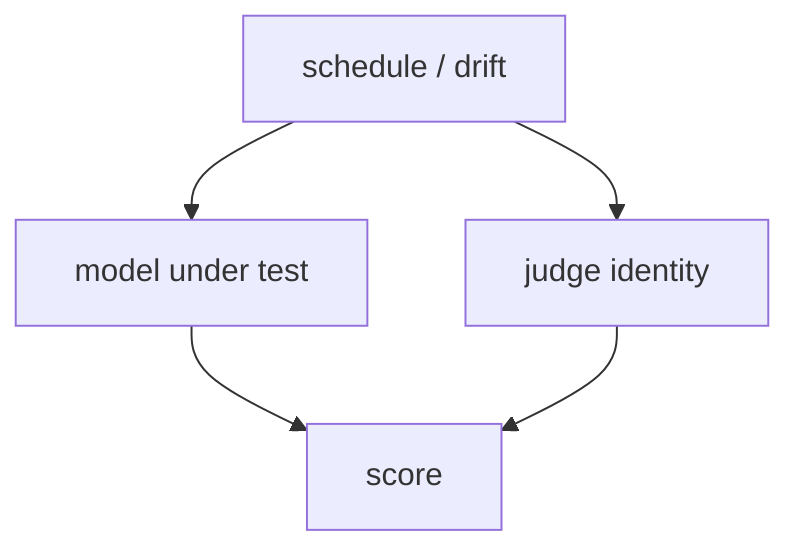
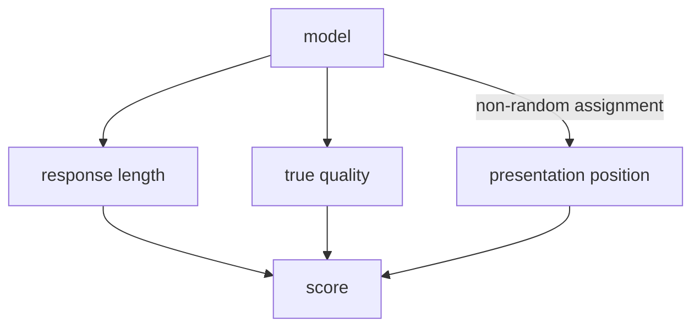
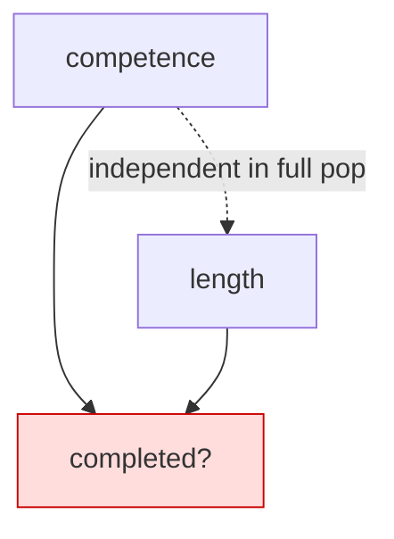
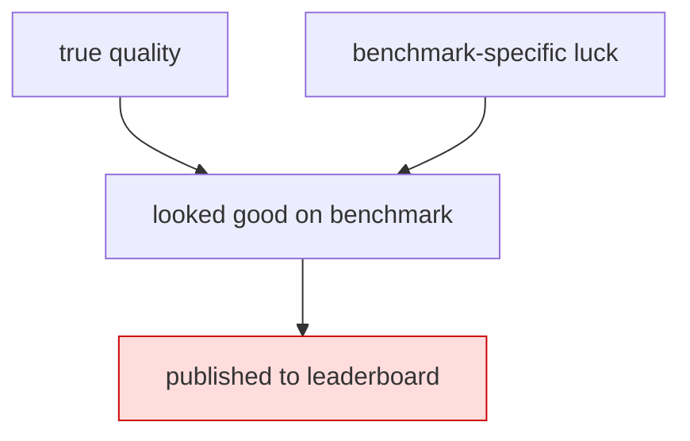

# Confounding, colliders, and selection in eval pipelines

**Goal.** Take the three graph atoms from chapter 4.2 and use them to name, precisely, the ways an eval pipeline lies: confounding, mediation dressed as confounding, survivorship, and collider bias from filtering. Then reanalyze the judge-calibration data from chapter 3.6 through an explicit DAG.

**Covers.** Judge identity as a confounder of model comparisons; verbosity as a mediator and position as a nuisance channel made non-ignorable by non-random assignment; leaderboard survivorship; collider bias when filtering runs by "completed successfully."

## Theory

### The same picture, now with eval variables on it

Chapter 4.2 gave me chain, fork, and collider in the abstract. The whole value of Part IV is that eval pipelines are dense with all three, usually unlabeled, and the bias each one produces has a different fix. If I mislabel which structure I am looking at, I apply the wrong correction and make things worse. So this chapter is a taxonomy: for each bias, the graph that generates it, the direction it pushes my estimate, and the mitigation that actually removes it.

The outcome I care about throughout is a model comparison. I want the causal effect of swapping model $A$ for model $B$ on some score $S$. Everything that corrupts that comparison does so by opening a non-causal path between "which model" and "the score," or by closing a path I needed open. Let me take the four big offenders one at a time.

### Judge identity is a confounder (a fork)

Suppose I evaluate model $A$ with judge $J_1$ on Monday and model $B$ with judge $J_2$ on Tuesday, because I upgraded the judge in between. Now which-model and which-judge are entangled. If $J_2$ is a more generous grader, model $B$ looks better whether or not it is better. The graph is a fork: some scheduling variable, or just my own inconsistency, is a common cause of both the model I evaluated and the judge that scored it, and both feed the score.

$$
\text{Model} \leftarrow (\text{schedule}) \rightarrow \text{Judge} \rightarrow \text{Score}. \tag{3.1}
$$

Strictly, the confounder is that common cause, the schedule or my own inconsistency, not the judge itself; the judge sits on the backdoor path $\text{Model} \leftarrow \text{schedule} \rightarrow \text{Judge} \rightarrow \text{Score}$, and freezing the judge to one revision blocks that path by making the $\text{Judge} \rightarrow \text{Score}$ contribution identical across models. More commonly the entanglement runs through the judge's own behavior: I use a single judge but its behavior drifts, or I use its own family of models to grade its own family, injecting self-preference. In every version the fix is the same as any fork: block the backdoor by holding the shared cause fixed. Use one frozen judge, pinned to a revision and a decoding seed, across every model in the comparison, so that the judge cannot vary with the model. When I cannot freeze it (an API judge that silently updates), the confounder is unmeasured and I am in the territory of chapter 4.5's sensitivity analysis. Judge identity is the confounder I worry about most because it is the easiest to introduce by accident and the hardest to detect after the fact.

### Verbosity and position: mediator or nuisance channel, and it matters

Response length is the variable that trips everyone, because whether it is a confounder or a mediator depends entirely on the causal question, and the two roles demand opposite handling.

Case one: I ask whether model $B$ genuinely reasons better than model $A$. Model influences length, length influences the judge's score (verbosity bias), and model also influences true quality, which influences score. Here length is a **mediator** of one of the paths from model to score:

$$
\text{Model} \to \text{Length} \to \text{Score}, \qquad \text{Model} \to \text{Quality} \to \text{Score}. \tag{3.2}
$$

If my question is "is $B$ actually better," the length path is a nuisance channel: $B$ might score higher purely because it rambles more, not because it reasons better. I might want to block it (condition on length) to isolate the quality path. But if my question is "does $B$ produce higher-rated outputs in deployment, by whatever means," then length is part of the effect and I must not block it, because conditioning on a mediator throws away a real part of the causal effect I asked about. Same variable, opposite treatment, and the graph plus the question is the only thing that tells them apart.

Case two: position bias in pairwise judging. Presentation order is a nuisance cause of the score in its own right (a judge favors whichever answer it reads first), and on its own it confounds nothing, because a randomized order is independent of which model I am testing. What makes it dangerous is non-random assignment. When a judge scores $A$ versus $B$ and I always present $A$ first, order is fixed by which model I labeled "first," so the structure is $\text{Model} \to \text{position} \to \text{Score}$: a **spurious channel** that leaks position bias into the comparison as if it were quality. The fix is not conditioning; it is randomization. Swap positions across items so that order is independent of model, which severs the $\text{Model} \to \text{position}$ edge by design and kills the leak. Position bias is a nuisance channel you defeat with a coin flip, verbosity is a mediator you defeat (or preserve) with a decision about your estimand, and calling them both "judge bias" and reaching for the same fix is how people get it wrong.

### Leaderboard survivorship (selection on a descendant)

Public leaderboards show me the models that were submitted, and models get submitted when they clear some internal bar. That bar is a selection variable, and selecting on it distorts the comparison. If teams only publish models that beat their previous best on the benchmark, the leaderboard is conditioned on "looked good on this benchmark," which is a descendant of both true quality and benchmark-specific luck. Conditioning on it opens a collider path between quality and luck, so the visible models are the ones that got lucky on this benchmark given their quality. The measured gaps are inflated by survivorship, and the effect is strongest exactly where it hurts, at the top of the board where the selection is most aggressive.

The mitigation is discipline about the sampling frame. My own comparisons must include every run I launched, not just the ones I liked, which is why chapter 7.7's run matrix is pre-registered and every seed is reported whether or not it "worked." Survivorship is the reason a pre-registered denominator is worth more than a impressive-looking numerator.

### Collider bias from "completed successfully" (the one that bites)

This is the bias I most want burned into my reflexes, because it looks like good hygiene and is poison. When I aggregate an eval, it is natural to drop runs that crashed, timed out, or failed to parse, and analyze only the ones that "completed successfully." Completion is a common effect of many things: the model's competence, the item's difficulty, the length of the generation, the flakiness of the sandbox. It is a collider. Filtering to completed runs conditions on that collider, and per chapter 4.2 that opens spurious paths among all of completion's causes.

Concretely, suppose competent responses and short responses are both more likely to complete (long generations time out; incompetent ones loop). Among completed runs only, competence and shortness become negatively correlated even if they are independent in the full population, because a long completed run has to be competent to have survived. Now if my score rewards shortness at all, I read off a spurious competence-shortness relationship that is entirely an artifact of the filter. The fix is to make completion a measured outcome, not a filter: report the completion rate as its own number, and either analyze all launched runs (scoring failures as failures) or model the selection explicitly. Silently dropping failures is conditioning on a collider, full stop.

```admonish gotcha title="Every dropna() is a causal decision"
The line `df = df[df.status == "ok"]` is not data cleaning. It is conditioning on a variable, and if that variable is a common effect of things you care about, you have just opened a collider path and biased everything downstream. Before you filter any eval log, ask: is the thing I am filtering on caused by two or more variables in my analysis? If yes, filtering can manufacture correlations. The honest move is almost always to keep the rows and score the failures, not to delete them.
```

### The direction of bias, not just its presence

Naming a bias is half the job; knowing which way it pushes is the other half, because a committee will ask "and does that make your effect look bigger or smaller than it is?" and "I do not know" is not an answer. The graph often tells me the sign for free. A confounder that raises both treatment and outcome (a generous judge routed preferentially to the model I favor) biases the comparison in favor of that model, so my measured advantage is inflated and the true effect is smaller than reported. A mediator I fail to block leaves part of the effect in, so blocking it can only shrink the estimate toward the direct-path effect; whether that is the number I want depends on my estimand. Collider bias is the treacherous one because its sign depends on the signs of the two edges into the collider: if both causes push completion up, conditioning on completion induces a negative correlation between them, and if they push in opposite directions it induces a positive one. So I cannot state the direction of collider bias without stating the mechanism, which is one more reason to draw the graph with signed intentions in mind even when the formal DAG carries no signs. Reporting a bias with its direction turns "my estimate might be wrong" into "my estimate is an upper bound on the true effect," and the second sentence is one a committee can actually work with.

### A single question to ask of any filter or control

All four biases collapse into one operational question I can ask of every filter and every covariate before I touch the data: for this variable, is it a cause of the treatment, a cause only of the outcome, a common cause of both, or a common effect of both? A cause of treatment alone is usually harmless to leave alone. A common cause is a confounder I must adjust for or hold fixed. A variable on the causal path is a mediator whose handling depends on my estimand. And a common effect is a collider I must not condition on, which includes not filtering on it and not stratifying by it. That one four-way sort, applied honestly, would prevent most of the eval-analysis mistakes I have made, and it is exactly the sort that requires a graph, because the four categories are graph properties and nothing about the raw data announces which category a column belongs to. The lab below runs this sort implicitly by planting each structure and showing the fingerprint it leaves, so that I learn to recognize the fingerprints in real logs where the ground truth is hidden.

```admonish read-along title="Go deeper: [CAI] Parts 2 and 3"
Ness treats confounding and selection bias in [CAI] as consequences of graph structure rather than as a list of named fallacies, which is the framing I follow here. Part 2 gives you the collider and the selection-on-a-descendant result; Part 3 connects it forward to identification, which is where chapter 4.4 picks up. If you only read one thing alongside this chapter, read Ness's collider example and then come back and re-read the "completed successfully" section above; they are the same theorem in two costumes.
```

## Tooling

The tool here is a two-artifact discipline I apply to every eval design: a DAG and a bias ledger. The DAG is the drawing of my assumptions from chapter 4.2. The bias ledger is a table that, for each non-causal path the DAG contains, names the structure (fork, collider, mediator), the direction it biases my estimate, and the mitigation. I build both in code so the ledger is generated from the graph rather than typed from memory, which means when I edit the graph the ledger updates and cannot silently fall out of sync.

To make this concrete I reuse the judge-calibration data produced in chapter 3.6. That chapter calibrates a judge against a gold set and records, per item, the judge's rating, the gold correctness label, the response length, the presentation position, and whether the run completed. The schema is what I need to test the graph's predictions. Because 3.6's artifact is generated on the baseline machine and I am not going to invent its numbers here, the lab regenerates a stand-in dataset with the same schema and known ground-truth structure, so the reanalysis is fully reproducible and the biases are ones I planted and can therefore verify the method recovers. When I run this for real, I point the same analysis at 3.6's `judge_calibration.jsonl` instead of the synthetic frame.

## Lab

The lab builds the eval-scoring DAG, plants known confounding and collider structure into a synthetic version of the 3.6 calibration data, and then shows three things numerically: the naive judge-versus-gold agreement, how it shifts when I (correctly) freeze the judge as a confounder, and how the "completed successfully" filter manufactures a spurious correlation via the collider. It writes an annotated DAG gallery to disk as the artifact.

````python
# file: labs/p4-03-confounding/reanalyze_judge_data.py
# /// script
# requires-python = ">=3.11"
# dependencies = ["numpy>=2.0", "pandas>=2.2"]
# ///
"""Reanalyze judge-calibration data through the eval-scoring DAG.

Reads chapter 3.6's judge_calibration.jsonl when present; otherwise
synthesizes a stand-in with the same schema and KNOWN causal structure so
the demonstrated biases are ones we planted and can verify we recover.

Schema per row:
  gold        in {0,1}   gold correctness label
  length      float      response length (tokens, normalized)
  position    in {0,1}   presentation position (0 = shown first)
  judge_id    str        which judge scored it
  rating      float      judge rating in [0,1]
  completed   in {0,1}   did the run complete (a COLLIDER)
"""
from __future__ import annotations
import json
from pathlib import Path
import numpy as np
import pandas as pd

RNG = np.random.default_rng(20260722)

def synthesize(n: int = 4000) -> pd.DataFrame:
    gold = RNG.integers(0, 2, n)                       # true correctness
    # length is caused by difficulty proxy; independent of gold here on purpose
    length = RNG.normal(0.0, 1.0, n)
    position = RNG.integers(0, 2, n)                   # randomized by design
    judge_id = RNG.choice(["frozen_v1", "drifting_api"], n, p=[0.5, 0.5])
    # rating = true signal + verbosity bias + position bias + judge offset
    judge_offset = np.where(judge_id == "drifting_api", 0.15, 0.0)  # generous
    rating = (0.6 * gold + 0.20 * (length > 0) + 0.10 * (position == 0)
              + judge_offset + RNG.normal(0, 0.05, n))
    rating = np.clip(rating, 0, 1)
    # completed is a COLLIDER: caused by competence (gold) AND shortness
    p_complete = 1 / (1 + np.exp(-(1.2 * gold - 1.0 * length + 0.5)))
    completed = (RNG.random(n) < p_complete).astype(int)
    return pd.DataFrame(dict(gold=gold, length=length, position=position,
                             judge_id=judge_id, rating=rating,
                             completed=completed))

def load_or_make() -> tuple[pd.DataFrame, str]:
    p = Path("labs/p3-06-judges/judge_calibration.jsonl")
    if p.exists():
        return pd.read_json(p, lines=True), "chapter-3.6 artifact"
    return synthesize(), "synthetic stand-in (3.6 schema, planted structure)"

def corr(a, b) -> float:
    return float(np.corrcoef(a, b)[0, 1])

def main() -> None:
    df, source = load_or_make()
    print(f"data source: {source}  (n={len(df)})\n")

    # 1) CONFOUNDER: judge identity. Naive mean rating by judge conflates the
    #    judge offset with everything else. Freeze the judge -> compare within.
    naive = df.groupby("judge_id")["rating"].mean()
    within = df[df.judge_id == "frozen_v1"]
    print("[confounder] mean rating by judge (naive):")
    print(naive.to_string(), "\n")
    print(f"[confounder] within frozen judge, rating~gold corr = "
          f"{corr(within.gold, within.rating):.3f}\n")

    # 2) MEDIATOR: verbosity. rating tracks length even at fixed gold.
    for g in (0, 1):
        sub = df[df.gold == g]
        print(f"[mediator] gold={g}: corr(length, rating) = "
              f"{corr(sub.length, sub.rating):+.3f}")
    print()

    # 3) COLLIDER: 'completed'. gold and length are independent overall, but
    #    conditioning on completed==1 manufactures a correlation.
    print(f"[collider] full population   corr(gold, length) = "
          f"{corr(df.gold, df.length):+.3f}")
    comp = df[df.completed == 1]
    print(f"[collider] completed==1 only corr(gold, length) = "
          f"{corr(comp.gold, comp.length):+.3f}  <-- spurious!\n")

    write_gallery(source)

def write_gallery(source: str) -> None:
    out = Path("labs/p4-03-confounding")
    out.mkdir(parents=True, exist_ok=True)
    md = f"""# Eval-bias DAG gallery (v1)

Data source: {source}. Each panel is a bias structure from the eval-scoring
pipeline, its graph, and the mitigation.

## Panel A. Judge identity is a confounder (fork)


Mitigation: freeze ONE judge (pinned revision + seed) across every model.

## Panel B. Verbosity is a mediator, position is a nuisance channel


Mitigation: length -> decide the estimand (block to isolate quality, keep to
measure deployed ratings). position -> randomize order so it is independent of
the model, severing MOD -> POS so it cannot leak into the score.

## Panel C. 'completed successfully' is a collider


Mitigation: do NOT filter on completed. Score failures as failures; report
completion rate as its own outcome.

## Panel D. Leaderboard survivorship (selection on a descendant)


Mitigation: pre-register the run matrix; report every seed, not the winners.
"""
    art = out / "eval_bias_dag_gallery.md"
    art.write_text(md)
    print(f"artifact written: {art.resolve()}")

if __name__ == "__main__":
    main()
````

Run it:

```bash
uv run labs/p4-03-confounding/reanalyze_judge_data.py
```

The artifact is `labs/p4-03-confounding/eval_bias_dag_gallery.md`, a four-panel gallery where each bias gets its graph and its mitigation, ready to drop into the methodology chapter or a slide. The stdout is the numerical proof that the structures do what the graphs say.

**What you should see.** Three numerical stories. The confounder panel prints two mean ratings by judge, and the `drifting_api` judge sits about 0.15 higher than `frozen_v1` for no reason but generosity, which is exactly why any model I happened to route to the generous judge would look unfairly good; restricting to the frozen judge gives a clean rating-versus-gold correlation. The mediator panel prints, for each fixed gold label, a clearly positive correlation between length and rating (near +0.4 to +0.5), which is verbosity bias visible even after I hold true correctness constant, the signature of a mediating path I have to decide about rather than ignore. The collider panel is the punchline: `corr(gold, length)` is essentially zero in the full population (I generated them independent) but turns visibly positive once I filter to `completed == 1`, because among survivors a long response had to be competent to complete (competence pushes completion up, length pushes it down, so among survivors the two rise together). That sign flip, from roughly zero to positive purely by filtering, is collider bias caught red-handed on the exact "drop the failed runs" move everyone makes. When I later run this against 3.6's real `judge_calibration.jsonl`, the numbers will differ (record them, with date and driver) but the three structures, if my graph is right, will show the same qualitative fingerprints.

```admonish substack-seed
There is a one-line data-cleaning step in almost every eval notebook: drop the runs that crashed, keep the ones that finished, then analyze. It feels like hygiene. It is actually one of the most reliable ways to invent a finding that is not real. "Finished successfully" is caused by several things at once (how good the model is, how hard the item was, how long the answer ran), which makes it a collider, and filtering on a collider forges correlations among its causes. This post walks one synthetic-but-realistic judge dataset where competence and answer-length are provably independent, then shows that keeping only the completed runs makes them correlated, out of nothing. The moral is a rule you can enforce tomorrow: every filter is a causal choice, so score your failures instead of deleting them, and report completion as its own number.
```
