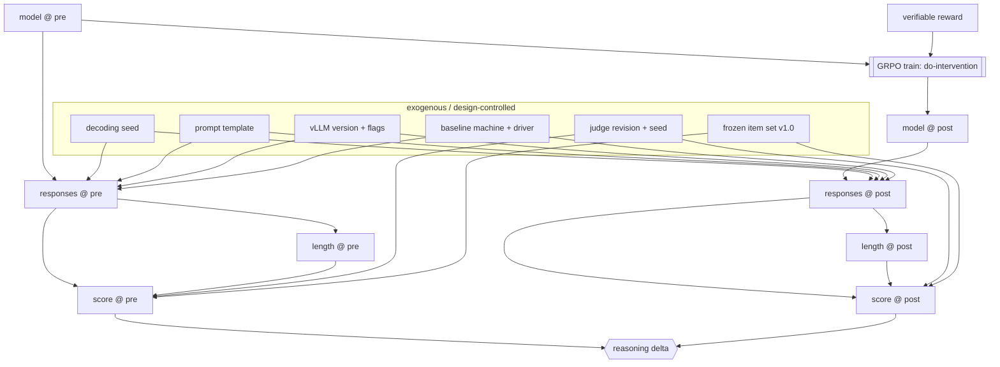

# Causal audit of the thesis eval design

**Goal.** Put the whole part to work: draw the complete causal DAG of the serve, score, and train pipeline, enumerate every threat to the validity of the reasoning-delta claim, map each threat to a mitigation that lives in a specific chapter, and freeze the result as a citable audit document. This is the part capstone and a methodology-chapter exhibit.

**Covers.** The full DAG of the serve-to-score-to-train pipeline; enumerated threats to validity with mitigations mapped to chapters; the audit as a standing exhibit that chapter 9.2 cites verbatim.

## Theory

### What an audit is, and why it is the right closing move

Chapters 4.1 through 4.5 built a toolkit: the ladder, the graph atoms, the bias taxonomy, identification, and the control-run design. An audit is what happens when I turn that toolkit back on my own experiment and try, in writing, to break it. The audit is not a defense of the thesis result. It is a structured attack on it, authored by me before the committee authors theirs, and its value is precisely that it names the weaknesses out loud and shows where each one is handled. A claim that has survived a written attack by its own author is worth more than a claim that was never questioned, and the audit is the document that proves the attack happened.

The organizing spine is the classic fourfold taxonomy of validity, which maps cleanly onto the causal machinery. **Internal validity** asks whether the delta is the effect of training rather than of a confounder; this is the backdoor and control-run material of chapters 4.4 and 4.5. **External validity** asks whether the effect generalizes beyond the exact items, seeds, and machine I measured on; this is the sampling-frame and contamination material of Part III. **Construct validity** asks whether the score measures reasoning at all rather than verbosity, formatting, or judge idiosyncrasy; this is the judge-calibration and scorer material of chapters 3.6 and 4.3. **Statistical conclusion validity** asks whether the delta is distinguishable from noise; this is the paired-bootstrap and power material of chapters 3.7 and 7.6. Each kind of validity is a different way the claim can be wrong, and a complete audit has to speak to all four.

### The full pipeline DAG, unrolled in time

The loop of Figure 0.1 is a cycle, and a cycle is not a DAG. The fix from chapter 4.2 is to unroll it in time: the model before training and the model after training are two different nodes, and the training intervention is the edge between them. Once unrolled, the whole serve-to-score-to-train pipeline is a legal DAG, and every threat to validity is a specific unwanted path on it. Here is the graph as I audit it.



Read the graph as the audit's map. The intervention I care about is the `TRAIN` node, and the estimand is its effect on `DELTA`. Every exogenous node in the top box is a potential confounder of the pre-versus-post comparison, and it is a confounder exactly when it is allowed to differ between the pre and post arms. The entire strategy of the audit is to force every one of those nodes to be identical across pre and post (held-fixed, so no backdoor path through it is open) or, where it cannot be frozen, to name it as a residual threat and bound it with sensitivity analysis. The `LEN` to `SC` edges are the verbosity mediator; the `JUDV` to `SC` edges are the judge confounder; the shared `SEED`, `TMPL`, `ENGINE`, `MACH`, `ITEMS` nodes are the pipeline invariants that must not move between the two evals. When they are all shared, the only open path from `TRAIN` to `DELTA` is the causal one through `M1`, and the delta is identified.

### Threats as unwanted paths

The discipline of the audit is to go edge by edge and ask: is there a path from a nuisance variable to the delta that is open, and if so, which mitigation closes it and where does that mitigation live? This is where the whole book becomes a single argument, because the mitigations are not invented in the audit; they are cashed out to specific chapters that already did the work. The judge confounder is closed by freezing the judge (chapter 3.6 calibrates it, chapter 4.3 diagnoses it). The verbosity mediator is handled by a declared estimand and length-controlled reporting (chapter 4.3). The pre-existing-drift threat is closed by the interrupted time series and the placebo run (chapter 4.5). The contamination threat, which would break external validity by letting the model have seen the eval items, is closed by the dataset hygiene of Part III. The noise threat is closed by paired bootstrap intervals and a power-justified item count (chapters 3.7 and 7.6). The audit's job is to make that mapping explicit and complete, so that no threat is left without an owner.

```admonish read-along title="Go deeper: [CAI] as the spine of the audit"
This chapter is where [CAI] stops being a reference and becomes a method. The audit is Ness's model-identify-estimate-refute loop applied to my own thesis: the DAG above is "model," chapter 4.4 is "identify," chapters 7.6 and 4.4's lab are "estimate," and chapter 4.5's controls plus the threats table below are "refute." If you read [CAI] end to end alongside Part IV, this chapter is the exam. The audit document the lab emits is the answer I would hand a committee, and its structure (estimand, graph, threats, mitigations-by-chapter, residual risks, sensitivity) is a template you can reuse for any causal claim in any empirical thesis, not just this one.
```

## Tooling

The tool is the audit document itself, generated from a structured specification so that it stays in sync with the rest of the book. I keep the threats as data (a list of records, each with a validity type, the graph path it corresponds to, the mitigation, the owning chapter, and a residual-risk note) and render both a human-readable markdown exhibit and a machine-readable JSON. Generating rather than hand-typing the audit matters for the same reason the bias ledger in chapter 4.3 was generated: when the design changes, the audit changes with it, and a stale audit is worse than none because it certifies a pipeline that no longer exists.

The audit is versioned. This is v1.0, frozen at the point where the thesis eval design is settled, and chapter 9.2 cites it verbatim as the methodology chapter's causal-validity exhibit. If the design changes later, the audit gets a new version and 9.2's citation updates, so there is always exactly one audit of record for any given eval design. Versioning the audit is what lets "the causal audit" be a specific, datable object rather than a vague gesture at rigor.

## Lab

The lab assembles causal audit v1.0 from the structured threat list, renders it to markdown and JSON, and writes both to disk. This is the capstone artifact of Part IV.

```python
# file: labs/p4-06-audit/build_audit.py
# /// script
# requires-python = ">=3.11"
# dependencies = []
# ///
"""Build the causal audit v1.0 of the thesis eval design.

Emits a human-readable markdown exhibit (cited verbatim in chapter 9.2) and
a machine-readable JSON. Threats are stored as data so the audit cannot drift
out of sync with the design.
"""
from __future__ import annotations
import json
from dataclasses import dataclass, asdict
from datetime import date
from pathlib import Path

@dataclass
class Threat:
    id: str
    validity: str            # internal | external | construct | statistical
    path: str                # the unwanted path on the DAG
    mitigation: str
    owner_chapter: str
    residual_risk: str

THREATS = [
    Threat("T1", "internal",
           "TRAIN -> DELTA confounded by judge revision differing pre vs post",
           "Freeze one judge (pinned revision + seed) across both evals.",
           "3.6 (calibration), 4.3 (diagnosis)",
           "API judge could update silently; bounded by E-value in 4.5."),
    Threat("T2", "internal",
           "Pre-existing KL/optimizer drift misattributed to the reward",
           "Interrupted time series (eq 5.1) + random-reward placebo run.",
           "4.5 (controls), 7.7 (run matrix)",
           "Few checkpoints on a 16GB budget; trend estimate is noisy."),
    Threat("T3", "internal",
           "Decoding seed / vLLM version / template differ across pre vs post",
           "Hold all pipeline invariants fixed; assert config equality in logs.",
           "0.4 (envs), 2.5 (vLLM ops), 4.5 (protocol invariants)",
           "Thermal/RNG state not fully controllable; treated as noise."),
    Threat("T4", "construct",
           "Score reflects verbosity/formatting via LEN -> SC, not reasoning",
           "Declare estimand; report length-controlled delta; verifiable scorer.",
           "3.4 (scorers), 4.3 (mediator vs confounder)",
           "Residual judge idiosyncrasy on borderline items."),
    Threat("T5", "construct",
           "Judge self-preference inflates in-family scores",
           "Blind, rubric-based judging; calibrate against gold labels.",
           "3.6 (judge calibration)",
           "Self-preference not fully eliminable; report gold agreement."),
    Threat("T6", "external",
           "Contamination: model may have seen frozen eval items",
           "Dataset hygiene, decontamination checks, held-out split.",
           "3.8 (contamination), 3.9 (frozen suite v1.0)",
           "Cannot prove absence of contamination for closed pretraining."),
    Threat("T7", "external",
           "Effect specific to this item set / seed / machine, not general",
           "Multiple seeds; negative-control task; report machine + driver.",
           "4.5 (negative control), 7.7 (seeds from power analysis)",
           "Single-GPU budget limits seed count; generalization is bounded."),
    Threat("T8", "statistical",
           "Delta indistinguishable from sampling noise",
           "Paired bootstrap over shared items; power-justified item count.",
           "3.7 (eval statistics), 7.6 (paired analysis)",
           "Small effect sizes need more items than the budget allows."),
    Threat("T9", "statistical",
           "Selection: dropping failed/incomplete runs conditions on a collider",
           "Score failures as failures; report completion rate separately.",
           "4.3 (collider), 3.10 (eval ops)",
           "Some crashes are non-ignorable; documented per run."),
]

DAG_MERMAID = """```mermaid
flowchart LR
    M0[model @ pre] --> SC0[score @ pre]
    M0 --> TRAIN[[GRPO: do]] --> M1[model @ post] --> SC1[score @ post]
    REWARD[verifiable reward] --> TRAIN
    JUDGE[frozen judge] --> SC0
    JUDGE --> SC1
    INV[shared invariants:\\nseed, template, engine, items, machine] --> SC0
    INV --> SC1
    SC0 --> DELTA{{reasoning delta}}
    SC1 --> DELTA
```"""

def render_md(threats: list[Threat]) -> str:
    lines = [
        "# Causal audit of the thesis eval design (v1.0)",
        f"\nFrozen {date.today().isoformat()}. Cited verbatim in chapter 9.2.",
        "\n**Estimand.** Causal effect of GRPO verifiable-reward training on "
        "SDA pass@1: E[score | do(train)] - E[score | do(no train)].",
        "\n## Pipeline DAG (unrolled in time)\n", DAG_MERMAID,
        "\n## Threats to validity\n",
        "| ID | Validity | Unwanted path | Mitigation | Owner | Residual risk |",
        "|----|----------|---------------|------------|-------|---------------|",
    ]
    for t in threats:
        lines.append(f"| {t.id} | {t.validity} | {t.path} | {t.mitigation} "
                     f"| {t.owner_chapter} | {t.residual_risk} |")
    lines += [
        "\n## Verdict",
        "The delta is identified as a causal effect **iff** every pipeline "
        "invariant is held fixed across pre and post (T3), the judge is frozen "
        "(T1, T5), the reward is shown active against a placebo (T2), the "
        "outcome is specific against a negative control (T7), failures are not "
        "filtered (T9), and the paired interval excludes zero (T8). Residual "
        "unmeasured confounding is bounded by the E-value in chapter 4.5.",
    ]
    return "\n".join(lines)

def main() -> None:
    out = Path("labs/p4-06-audit")
    out.mkdir(parents=True, exist_ok=True)
    md = render_md(THREATS)
    (out / "causal_audit_v1.0.md").write_text(md)
    (out / "causal_audit_v1.0.json").write_text(
        json.dumps({"version": "1.0", "frozen": date.today().isoformat(),
                    "threats": [asdict(t) for t in THREATS]}, indent=2))
    by_kind = {}
    for t in THREATS:
        by_kind[t.validity] = by_kind.get(t.validity, 0) + 1
    print("threats by validity type:", by_kind)
    print(f"total threats enumerated: {len(THREATS)}")
    print(f"artifact: {(out / 'causal_audit_v1.0.md').resolve()}")

if __name__ == "__main__":
    main()
```

Run it:

```bash
uv run labs/p4-06-audit/build_audit.py
```

The artifacts are `labs/p4-06-audit/causal_audit_v1.0.md` (the human exhibit, with the DAG and the full threats table) and `causal_audit_v1.0.json` (the same content as data). Together they are causal audit v1.0. The markdown is written to be dropped straight into the methodology chapter, which is why chapter 9.2 cites it verbatim rather than paraphrasing it.

**What you should see.** A count of threats by validity type on stdout (three internal, two construct, two external, two statistical, nine in total) and the audit files on disk. Open the markdown and read the threats table as a single argument: every row names a way the reasoning-delta claim could be wrong, the mitigation that closes it, the chapter that owns the mitigation, and, crucially, the residual risk that survives the mitigation. That last column is the honest part, and it is the part a committee will respect, because it shows I know which threats I have fully closed (pipeline invariants, collider filtering) and which I can only bound (silent judge updates, contamination for closed pretraining, seed count under a 16GB budget). The verdict at the bottom states the identification condition as a conjunction: the delta is a causal effect only if every listed mitigation held. If any one of them failed on a given run, the audit tells me exactly which validity type is compromised and sends me to the chapter that has to fix it before I can make the claim. That traceability, from a claim to a threat to a mitigation to a chapter, is the whole point of Part IV, and this document is the proof that the loop of the book is not just a pipeline but an argument I can defend.

```admonish substack-seed
Before a committee attacks your result, you should attack it yourself, in writing, and keep the receipts. That document has a name in the empirical sciences (a validity audit) and it has a shape you can steal: draw the causal graph of your experiment, then walk it edge by edge asking "what unwanted path could carry a false signal here, what closes that path, and where in my work is it closed." Do it honestly and you end up with a table whose last column is the uncomfortable one, the residual risk that survives every mitigation, and that column is exactly what earns trust, because it proves you know the difference between a threat you eliminated and one you could only bound. This post shows the full audit of a single-GPU reasoning-model experiment, nine threats across internal, external, construct, and statistical validity, each mapped to the specific fix that handles it, and argues that the audit, not the result, is the real deliverable of a rigorous evaluation.
```
