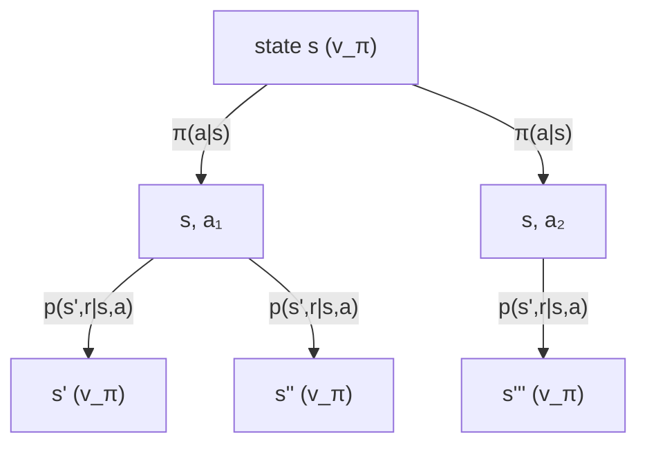

# Value functions and Bellman equations

The previous chapter left me with a return, $G_t$, and a nagging problem: the return is a random variable that I only observe after the fact, at the end of an episode. To reason about a policy *before* running it, I want to know the return I should *expect*. That expectation, as a function of state, is the value function, and the self-consistency it must obey is the Bellman equation. This chapter derives both, in the expectation and the optimality forms, and then makes an argument that matters for the rest of the thesis: on one 16GB GPU, learning a value function for a language model is expensive enough, and unreliable enough, that the modern LLM-RL recipes mostly do without one. That absence is not laziness. It is a design choice, and GRPO is its clearest expression.

## Theory

### Two value functions: $v_\pi$ and $q_\pi$

Fix a policy $\pi$. The *state-value function* is the expected return from a state when you follow $\pi$ thereafter:

$$
v_\pi(s) \;=\; \mathbb{E}_\pi\!\left[\, G_t \mid S_t = s \,\right]
\;=\; \mathbb{E}_\pi\!\left[\, \sum_{k=0}^{\infty} \gamma^{k} R_{t+k+1} \,\middle|\, S_t = s \right]. \tag{1}
$$

The subscript $\pi$ on the expectation means every action from $t$ onward is drawn from $\pi$, and every state transition from the dynamics $p$. The *action-value function* pins down the first action too:

$$
q_\pi(s,a) \;=\; \mathbb{E}_\pi\!\left[\, G_t \mid S_t = s,\, A_t = a \,\right]. \tag{2}
$$

The difference is subtle but everything downstream leans on it. $v_\pi(s)$ averages over the action you would take in $s$; $q_\pi(s,a)$ commits to action $a$ now and only then follows $\pi$. Their relationship is immediate, because $v_\pi$ is just $q_\pi$ averaged under the policy's own action distribution:

$$
v_\pi(s) \;=\; \sum_{a} \pi(a \mid s)\, q_\pi(s,a). \tag{3}
$$

The gap between them is the object the whole rest of Part V obsesses over, the *advantage* $A_\pi(s,a) = q_\pi(s,a) - v_\pi(s)$, which measures how much better action $a$ is than the policy's average behavior in state $s$. By (3), the advantage averages to zero under $\pi$, which is going to turn out to be the reason baselines are unbiased in Chapter 5.5.

### The Bellman expectation equation

Here is the central derivation of the chapter. The value function inherits the return's one-step recursion, and turning that recursion into a statement about expectations gives the Bellman expectation equation.

```admonish derivation title="Bellman expectation equation for $v_\pi$"
Begin with the definition (1) and substitute the return recursion $G_t = R_{t+1} + \gamma G_{t+1}$ from Chapter 5.1, Equation (6):

$$
v_\pi(s) = \mathbb{E}_\pi[G_t \mid S_t = s] = \mathbb{E}_\pi\!\left[ R_{t+1} + \gamma G_{t+1} \mid S_t = s \right].
$$

Linearity of expectation splits this into two terms:

$$
v_\pi(s) = \underbrace{\mathbb{E}_\pi[R_{t+1}\mid S_t=s]}_{\text{immediate}} + \gamma\, \underbrace{\mathbb{E}_\pi[G_{t+1}\mid S_t=s]}_{\text{future}}.
$$

Now expand each term by summing over what happens on the first step. The action is drawn from $\pi(a\mid s)$, and then the environment produces $(s', r)$ from $p(s',r\mid s,a)$:

$$
v_\pi(s) = \sum_a \pi(a\mid s) \sum_{s',r} p(s',r\mid s,a)\Big[\, r + \gamma\, \mathbb{E}_\pi[G_{t+1}\mid S_{t+1}=s'] \,\Big].
$$

The step that makes this work is recognizing the inner conditional expectation. By the Markov property, once I know $S_{t+1}=s'$, the past is irrelevant, so $\mathbb{E}_\pi[G_{t+1}\mid S_{t+1}=s'] = v_\pi(s')$ by the very definition (1). Substituting yields the **Bellman expectation equation**:

$$
\boxed{\,v_\pi(s) = \sum_a \pi(a\mid s) \sum_{s',r} p(s',r\mid s,a)\big[\, r + \gamma\, v_\pi(s') \,\big]\,}. \tag{4}
$$

This is a system of linear equations, one per state, relating the value of a state to the values of its successors. Read it as: the value of $s$ is the immediate reward you expect plus the discounted value of wherever you land, averaged over both your own action choice and the environment's response.
```

The same argument, but conditioning on the action instead of averaging over it, gives the action-value form:

$$
q_\pi(s,a) = \sum_{s',r} p(s',r\mid s,a)\Big[\, r + \gamma \sum_{a'} \pi(a'\mid s')\, q_\pi(s',a') \,\Big]. \tag{5}
$$

Equations (3), (4), and (5) are interchangeable views of the same fixed point. Together they let you compute any value from any other, which is the engine behind policy evaluation.

### Backup diagrams

The Bellman equation has a natural picture: value flows backward from successor states to the current state. Sutton and Barto call these *backup diagrams*. An open circle is a state, a filled circle is a state-action pair. For $v_\pi$ you branch first on the action (policy) and then on the outcome (dynamics).



Reading the diagram top to bottom is one application of (4): sum over the action branches weighted by $\pi$, then over the outcome branches weighted by $p$, accumulating $r + \gamma v_\pi(\cdot)$ at the leaves.

### The Bellman equation as a fixed point

Equation (4) is not just a relationship, it is a *fixed-point* equation, and that framing is what guarantees policy evaluation actually converges. Stack the state values into a vector $\mathbf{v}_\pi \in \mathbb{R}^{|\mathcal{S}|}$, the expected rewards into $\mathbf{r}_\pi$, and the policy-induced transition probabilities into a matrix $P_\pi$ with entries $P_\pi(s,s') = \sum_a \pi(a\mid s)\sum_r p(s',r\mid s,a)$. Then (4) is the linear system

$$
\mathbf{v}_\pi = \mathbf{r}_\pi + \gamma P_\pi \mathbf{v}_\pi
\quad\Longrightarrow\quad
\mathbf{v}_\pi = (I - \gamma P_\pi)^{-1}\mathbf{r}_\pi. \tag{6}
$$

The inverse exists whenever $\gamma < 1$ because $\gamma P_\pi$ has spectral radius at most $\gamma < 1$ (rows of $P_\pi$ sum to one, so its eigenvalues lie in the unit disk), which makes $I - \gamma P_\pi$ nonsingular. For a small MDP you could literally solve (6) by matrix inversion. For anything large you iterate instead, and the reason iteration works is a contraction argument.

```admonish derivation title="The Bellman operator is a contraction"
Define the Bellman expectation operator $T_\pi$ acting on a value vector by $(T_\pi \mathbf{v})(s) = \sum_a \pi(a\mid s)\sum_{s',r}p(s',r\mid s,a)[r + \gamma \mathbf{v}(s')]$. For any two value vectors $\mathbf{u}, \mathbf{v}$, the immediate-reward terms cancel and

$$
\|T_\pi\mathbf{u} - T_\pi\mathbf{v}\|_\infty = \gamma\,\big\| P_\pi(\mathbf{u} - \mathbf{v})\big\|_\infty \le \gamma\,\|\mathbf{u} - \mathbf{v}\|_\infty,
$$

using that $P_\pi$ is a stochastic matrix, so applying it can only average, never amplify, the max-norm. Thus $T_\pi$ is a $\gamma$-contraction in the sup norm. By the Banach fixed-point theorem it has a unique fixed point, which is $\mathbf{v}_\pi$ by (4), and iterating $\mathbf{v} \leftarrow T_\pi\mathbf{v}$ from any starting vector converges to it geometrically at rate $\gamma$. The same argument with the optimality operator (the $\max$ version) proves value iteration converges, which is the algorithm in the lab.
```

### Optimality: the best you can do

Policy evaluation tells you how good a *given* policy is. Control asks for the *best* policy. Define the optimal value functions as the pointwise maximum over all policies:

$$
v_*(s) = \max_\pi v_\pi(s), \qquad q_*(s,a) = \max_\pi q_\pi(s,a). \tag{6}
$$

There always exists at least one deterministic policy that attains this maximum in every state simultaneously (a standard result for finite MDPs, [S&B] Section 3.6). The optimal value functions satisfy their own self-consistency, the *Bellman optimality equations*, and the key change is that averaging over the policy becomes maximizing over the action.

```admonish derivation title="Bellman optimality equation"
Under an optimal policy you would never deliberately take a suboptimal action, so the value of a state equals the value of its *best* action rather than the policy-weighted average. Formally, the optimal state value is the best action value available:

$$
v_*(s) = \max_{a} q_*(s,a).
$$

Now $q_*(s,a)$ still obeys a one-step expansion over the dynamics, because whatever action you take, the environment still responds through $p$, and thereafter you act optimally, so the successor's value is $v_*(s')$:

$$
q_*(s,a) = \sum_{s',r} p(s',r\mid s,a)\big[\, r + \gamma\, v_*(s') \,\big].
$$

Substitute the first line into the second to eliminate $v_*$, or the second into the first to eliminate $q_*$, giving the two boxed forms:

$$
\boxed{\,v_*(s) = \max_a \sum_{s',r} p(s',r\mid s,a)\big[\, r + \gamma\, v_*(s') \,\big]\,}. \tag{7}
$$

$$
\boxed{\,q_*(s,a) = \sum_{s',r} p(s',r\mid s,a)\Big[\, r + \gamma \max_{a'} q_*(s',a') \,\Big]\,}. \tag{8}
$$

The only difference from the expectation equations (4) and (5) is the $\max$ where the policy average used to be. That $\max$ is what makes the optimality equations *nonlinear*: you cannot solve them by matrix inversion, you iterate (value iteration) or improve a policy repeatedly (policy iteration). But the payoff is enormous: once you have $q_*$, the optimal policy is trivial, just act greedily, $\pi_*(s) = \arg\max_a q_*(s,a)$, with no further planning required. Knowing $q_*$ turns control into a lookup.
```

### From values to a policy: greedy extraction and improvement

The reason value functions are worth all this trouble is that they hand you a *better policy* almost for free. Given any policy $\pi$ and its action values $q_\pi$, define a new policy that acts greedily with respect to them, $\pi'(s) = \arg\max_a q_\pi(s,a)$. The *policy improvement theorem* ([S&B] Section 4.2) guarantees $v_{\pi'}(s) \ge v_\pi(s)$ for every state, with strict improvement somewhere unless $\pi$ was already optimal. The one-line intuition: by construction $q_\pi(s,\pi'(s)) = \max_a q_\pi(s,a) \ge \sum_a\pi(a\mid s)q_\pi(s,a) = v_\pi(s)$, so taking the greedy action for one step and then reverting to $\pi$ already does at least as well; unrolling that inequality forever shows $\pi'$ dominates outright.

Alternating "evaluate the current policy" with "act greedily on its values" is *policy iteration*, and it converges to $\pi_*$ in finitely many steps for a finite MDP. This is the classical control loop, and it is worth seeing clearly precisely so you can appreciate what LLM policy gradients give up: they never form $q_\pi$ explicitly and never take an $\arg\max$ over the vocabulary, both because $|\mathcal{V}|$ is huge and because a hard $\arg\max$ would destroy the exploration that Chapter 5.3 argued is essential. Instead they nudge $\pi_\theta$ softly in the direction of higher-value actions, which is the policy gradient of Chapter 5.4.

### Why LLM-RL mostly avoids learned value functions

Everything above assumes you can represent and learn a value function over the state space. For a tabular gridworld with 50 states, easy. For a language model, the state is an entire token prefix, so the state space is $|\mathcal{V}|^{L}$, astronomically large and never revisited. You cannot tabulate it; you must approximate $v_\pi$ or $q_\pi$ with a neural network, a *critic*. That is exactly what PPO does, and it works, but on my hardware it carries three costs I want to name.

First, **memory**. A critic is typically a second network the size of the policy, or at least a value head plus the backbone. On the MSI Aegis R2 with a single RTX 5080 16GB, the policy, its gradients, its optimizer state, the KV cache for generation, and the reference model for the KL penalty are already competing for the same 16 GB (record the exact peak with `nvidia-smi` during a PPO step: measured on the baseline machine — record value, date, driver). Adding a full-size critic and its optimizer state can be the difference between a run that fits and one that OOMs. In Part VI and Part VII I will show the arithmetic in detail; here the point is qualitative: the critic is the most expendable large object in the budget.

Second, **the credit-assignment structure is already degenerate in our favor**. Recall from Chapter 5.1 that our reward is a single terminal scalar and the transitions are deterministic. A learned per-token value function is trying to estimate, for every token position, the expected final score given the prefix. That is a hard regression target that is noisy early in the sequence and only sharpens near the end. A critic that is wrong (and early in training it is very wrong) injects bias into the policy gradient. The bias-variance tradeoff that justifies a critic in long-horizon control (Chapter 5.6 on GAE) is much weaker when the horizon is one graded answer.

Third, **there is a cheaper baseline sitting right there**. The only reason we wanted $v_\pi(s)$ in the first place, as the next two chapters make precise, is to subtract a baseline from the return to reduce variance. But for a fixed prompt you can sample a *group* of completions and use their mean reward as the baseline, no network required. That is the entire idea of GRPO: replace the learned critic $v_\pi(s)$ with the empirical mean reward across a group of sampled completions for the same prompt. It is a Monte Carlo baseline, it is unbiased by the argument of Chapter 5.5, and it costs zero extra parameters and zero extra VRAM beyond the samples you were already generating.

```admonish gotcha title="\"No value function\" does not mean \"no baseline\""
A common misreading is that GRPO throws away the entire value-function machinery. It does not. It throws away the *learned, parameterized* value function and keeps the *role* that value function played, namely a state-dependent baseline $b(s)$ that centers the returns. The Bellman equations of this chapter are still the theoretical backbone: GRPO's group mean is a sample estimate of $v_\pi(s)$ for the prompt state $s = x$, and the group-relative advantage is a sample estimate of the advantage $q_\pi(s,a) - v_\pi(s)$. You are not escaping value functions, you are estimating them the cheapest possible way. That is why I derive the Bellman equations in full even though we will rarely fit a critic: they justify the shortcut.
```

```admonish read-along title="Read-along: Sutton & Barto, Chapters 3 and 4"
[S&B] Section 3.5 defines $v_\pi$ and $q_\pi$; Section 3.6 gives the Bellman expectation equation, my (4); Section 3.7 does optimality and the Bellman optimality equation, my (7) and (8), including the existence of a deterministic optimal policy. Chapter 4 then turns these equations into algorithms: Section 4.1 is iterative policy evaluation (solving (4) by repeated backups), Section 4.3 is policy iteration, and Section 4.4 is value iteration (turning (7) into an update rule). The lab below is a stripped-down value iteration, so read Section 4.4 next to it. Do not miss the backup diagrams in Section 3.5; they are the mental model I sketched in mermaid above.
```

## Tooling

The tool here is dynamic programming itself, which you only get to use when the dynamics $p$ are known and the state space is small. That is almost never true for an LLM, which is exactly the point: I run value iteration once, on a toy gridworld, so that I can *see* a converged $v_*$ and then appreciate why I abandon it for language models. Reuse the uv project from Chapter 5.1; no new dependencies beyond NumPy.

## Lab

The artifact is a value-iteration solver on a tiny gridworld that prints the converged optimal values and the greedy policy they induce. Watching (7) converge in a handful of sweeps on 12 states is the concrete counterpoint to "you cannot do this on $|\mathcal{V}|^{L}$ states."

```python title="labs/value_iteration.py"
"""Value iteration on a 4x3 gridworld: solve the Bellman optimality
equation (7) by repeated backups until the values stop moving.

This is the thing we CANNOT do for an LLM (state space too large,
dynamics only implicitly known). Seeing it converge here is the point.

Run:  uv run python labs/value_iteration.py
"""
from __future__ import annotations
import numpy as np

# 4 columns x 3 rows. (1,1) is a wall. Terminals: (3,2)=+1, (3,1)=-1.
ROWS, COLS = 3, 4
WALL = (1, 1)
TERMINALS = {(3, 2): +1.0, (3, 1): -1.0}
GAMMA = 0.99
LIVING_REWARD = -0.04          # small step penalty encourages short paths
NOISE = 0.2                    # 80% intended move, 10% each perpendicular
ACTIONS = {"N": (0, 1), "S": (0, -1), "E": (1, 0), "W": (-1, 0)}


def in_bounds(c, r):
    return 0 <= c < COLS and 0 <= r < ROWS and (c, r) != WALL


def transitions(c, r, a):
    """Return list of (prob, next_state) for taking action a in (c,r)."""
    dc, dr = ACTIONS[a]
    # perpendicular slips
    if a in ("N", "S"):
        perps = [ACTIONS["E"], ACTIONS["W"]]
    else:
        perps = [ACTIONS["N"], ACTIONS["S"]]
    outcomes = [(1 - NOISE, (dc, dr))] + [(NOISE / 2, p) for p in perps]
    result = []
    for prob, (mc, mr) in outcomes:
        nc, nr = c + mc, r + mr
        if not in_bounds(nc, nr):
            nc, nr = c, r      # bump into wall/edge: stay put
        result.append((prob, (nc, nr)))
    return result


def value_iteration(tol=1e-8):
    V = {(c, r): 0.0 for c in range(COLS) for r in range(ROWS)
         if in_bounds(c, r)}
    for term, val in TERMINALS.items():
        V[term] = val
    sweeps = 0
    while True:
        delta = 0.0
        newV = dict(V)
        for (c, r) in V:
            if (c, r) in TERMINALS:
                continue
            # Bellman optimality backup: max over actions.
            best = max(
                sum(prob * (LIVING_REWARD + GAMMA * V[s2])
                    for prob, s2 in transitions(c, r, a))
                for a in ACTIONS
            )
            newV[(c, r)] = best
            delta = max(delta, abs(best - V[(c, r)]))
        V = newV
        sweeps += 1
        if delta < tol:
            break
    return V, sweeps


def greedy_policy(V):
    policy = {}
    for (c, r) in V:
        if (c, r) in TERMINALS:
            policy[(c, r)] = "*"
            continue
        policy[(c, r)] = max(
            ACTIONS,
            key=lambda a: sum(prob * (LIVING_REWARD + GAMMA * V[s2])
                              for prob, s2 in transitions(c, r, a)),
        )
    return policy


def render(V, policy):
    arrow = {"N": "^", "S": "v", "E": ">", "W": "<", "*": "*"}
    for r in reversed(range(ROWS)):
        vals, pols = [], []
        for c in range(COLS):
            if (c, r) == WALL:
                vals.append("  ####"); pols.append("#")
            else:
                vals.append(f"{V[(c, r)]:+6.2f}"); pols.append(arrow[policy[(c, r)]])
        print(" ".join(vals) + "    " + " ".join(pols))


if __name__ == "__main__":
    V, sweeps = value_iteration()
    policy = greedy_policy(V)
    print(f"converged in {sweeps} sweeps (gamma={GAMMA})\n")
    print("optimal values v_*        greedy policy pi_*")
    render(V, policy)
```

**What you should see.** Value iteration converges in on the order of a few hundred sweeps at $\gamma = 0.99$ (the exact count prints), and the rendered grid shows optimal values that decay smoothly from the $+1$ terminal, with a greedy policy of arrows that route around the $-1$ trap and the wall toward the goal. The lesson is not the gridworld, it is the contrast: this took 12 states and full knowledge of $p$. A language model has neither, which is precisely why the next three chapters build policy-gradient methods that need neither the dynamics nor a tabulated value function, only the ability to sample and to score.

```admonish substack-seed
Post angle: "Why the smartest way to train a reasoning model is to refuse to predict the future." Value functions are the classic RL tool for figuring out how good a situation is, and they power the famous algorithms behind game-playing agents. But for a language model on a single desktop GPU, learning that "how good is this half-finished sentence" network is expensive and shaky, so the current crop of reasoning-model recipes (GRPO) skips it and uses a dead-simple trick instead: generate a handful of answers to the same question and grade each one against the average. The essay writes itself around the punchline that sometimes the frontier move is to *delete* the fanciest component, and that this is only possible because the reward comes from a verifier at the end, not from a critic in the middle.
```
