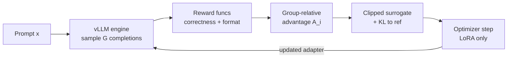

# GRPO on 16GB

This is the chapter where the card fills up. Everything before Part VII was either inference (one model, forward pass only) or the theory of the training algorithms; here I actually run GRPO on the baseline machine and have to account for every gigabyte, because a training step holds more live tensors at once than anything else in the book. The good news, which I want to state up front so the arithmetic that follows has a destination, is that a 4B policy trained with LoRA over a 4-bit base, with generation handled by the in-process vLLM engine from the last chapter, fits in 16GB with real headroom to spare. The whole job of this chapter is to show *why* it fits, line by line, and then to spend the headroom deliberately: on group size, on completion length, on batch. I will build the full config for a Qwen3-4B policy, do the complete VRAM budget for the RTX 5080, reason about throughput from the roofline, and then run a first GRPO job on a toy verifiable task with every number logged to MLflow.

## Theory

### What one GRPO step actually holds in memory

Recall the GRPO step from Part V, because the memory budget is just its data dependencies made physical. For each prompt $x$ in the batch, the trainer samples a group of $G$ completions $y_1, \dots, y_G$ from the current policy, scores each with the reward functions, and computes the group-relative advantage by centering (and, in vanilla GRPO, scaling) each reward against the group's own mean:

$$
A_i = \frac{r_i - \operatorname{mean}(r_1, \dots, r_G)}{\operatorname{std}(r_1, \dots, r_G) + \epsilon_{\text{std}}}.
$$

Then it forms the clipped surrogate objective with a KL penalty to the reference policy and takes an optimizer step on the LoRA adapter. The memory-relevant fact is that a single step touches, at various moments, four distinct large things:

1. **The base weights**, read for both generation and the policy forward/backward. One copy, shared (last chapter).
2. **The generation working set**: vLLM's KV cache for the $G$ concurrent completions it is sampling.
3. **The training activations**: the forward-pass activations of the policy on the sampled completions, kept alive for the backward pass, one micro-batch at a time.
4. **The optimizer footprint**: gradients and Adam state, but only for the LoRA adapter, which is tiny.

The reason the whole thing fits is that three of those four are small or shared, and only the training activations genuinely scale with your choices (group size, completion length, micro-batch). So the budget is mostly fixed cost plus one variable term you control. Let me make it exact.

### The complete budget

```admonish vram-budget title="A full GRPO step on the RTX 5080 16GB: Qwen3-4B, LoRA r=16, 4-bit base"
The card has $16\ \text{GiB} = 1.72\times10^{10}$ bytes. I will account for a Qwen3-4B policy (4.02B params; 36 layers, hidden $d=2560$, intermediate 9728, 32 query heads, 8 KV heads, head dim 128, vocab $V=151{,}936$) trained with LoRA rank $r=16$ over an NF4 4-bit base, group size $G=8$, prompt length $S=256$, completion length $C=768$ (so max sequence $T=1024$), sampled and trained one prompt-group at a time. Every line is arithmetic; the two lines marked *(measure)* are the ones only a run can pin down.

**1. CUDA context, PyTorch caching allocator, Triton cache.** Fixed overhead the moment you touch the GPU. Not derivable from model shape; on this stack it is roughly $0.6\ \text{to}\ 1.0\ \text{GiB}$. Budget **$\approx 0.8\ \text{GiB}$** *(measure)*.

**2. Base weights, NF4 4-bit (shared by trainer and vLLM).** NF4 stores 4 bits per weight plus a double-quantized per-block absmax, an effective $\approx 4.13$ bits/param $= 0.516$ bytes/param:
$$
4.02\times10^{9}\ \text{params} \times 0.516\ \text{byte} \approx 2.07\times10^{9}\ \text{byte} \approx \mathbf{1.93\ GiB}.
$$
This is the single copy both the trainer and the vLLM engine read.

**3. LoRA adapters (bf16, trainable).** Per layer, summing over the seven target projections, the adapter parameter count is $r \times 57{,}344$; across 36 layers that is $r \times 2{,}064{,}384$. At $r=16$: $33.0\times10^{6}$ params. In bf16:
$$
33.0\times10^{6} \times 2\ \text{byte} \approx 66\ \text{MB} \approx \mathbf{0.06\ GiB}.
$$

**4. LoRA gradients (bf16).** Same shape as the adapters: $33.0\times10^{6} \times 2\ \text{byte} \approx 66\ \text{MB} \approx \mathbf{0.06\ GiB}$.

**5. Optimizer state, 8-bit AdamW (Unsloth default).** Two moments per trainable param at 1 byte each (block-quantized):
$$
33.0\times10^{6} \times 2 \times 1\ \text{byte} \approx 66\ \text{MB} \approx \mathbf{0.06\ GiB}.
$$
(With full fp32 AdamW it would be $33.0\times10^{6}\times 8 = 264\ \text{MB}$; the 8-bit path is why the default is worth keeping.)

**6. vLLM KV cache for generation.** Per token, KV bytes $= 2 \times L \times H_{kv} \times d_{\text{head}} \times 2\ \text{byte} = 2\times36\times8\times128\times2 = 147{,}456\ \text{byte} \approx 144\ \text{KiB/token}$. Holding $G=8$ full sequences of $T=1024$ tokens needs
$$
8 \times 1024 \times 147{,}456\ \text{byte} \approx 1.21\times10^{9}\ \text{byte} \approx \mathbf{1.13\ GiB}
$$
of *live* KV. vLLM does not allocate exactly this; it claims a slab sized by `gpu_memory_utilization` and pages completions into it, so the slab is bigger than the live minimum but that headroom is what lets it batch. The live floor is 1.13 GiB, and the number that actually enters the budget below is the *slab*, which at `gpu_memory_utilization=0.16` on this 16 GiB card is $\approx 2.5\ \text{GiB}$. So the budgeted line 6 is the slab (**$\approx 2.5\ \text{GiB}$**), not the live floor.

**7. Training activations, checkpointed and chunked (the variable term).** With Unsloth's offloaded gradient checkpointing, only layer-boundary activations are kept and most are pushed to the 32GB of system DDR5, so the GPU-resident activation peak is roughly one layer's recompute buffer plus the chunked-cross-entropy block, not the whole graph. Order of magnitude for a $T=1024$ micro-sequence: a layer activation is $T \times d \times 2\ \text{byte} = 1024\times2560\times2 \approx 5.2\ \text{MB}$, and the working set across recompute plus the chunked-CE block and attention scratch lands around $1.0\ \text{to}\ 1.5\ \text{GiB}$ at peak. Budget **$\approx 1.5\ \text{GiB}$** *(measure)*, and note that *without* chunked CE this line would spike by the multi-GiB logits tensor from the last chapter.

**Sum.**
$$
0.8 + 1.93 + 0.06 + 0.06 + 0.06 + 2.5 + 1.5 \approx \mathbf{6.9\ GiB}.
$$
Against a 16 GiB card that leaves roughly **9 GiB of headroom**, which is not slack to celebrate but budget to spend: on a larger group $G$, a longer completion $C$, a bigger LoRA rank, or a 4B-plus base. The two levers that move the total most are `gpu_memory_utilization` (line 6) and completion length (lines 6 and 7 both scale with $C$). Everything else is nearly fixed. Record the two *(measure)* lines and the observed peak on the baseline machine with date and driver; the budget is a prediction the run either confirms or teaches me to correct.
```

The shape of that budget is the whole reason the loop closes on this card. The expensive things in full fine-tuning (fp32 master weights, fp32 Adam moments over *all* parameters, a full-precision reference model, the un-chunked logits tensor) are each individually larger than my entire actual footprint, and LoRA-over-4-bit plus the last chapter's kernels removes every one of them. What is left is dominated by two irreducible costs: one copy of the base weights, and the KV cache for generation. Both are shared or paged. That is why 4B fits with room, and it is also why pushing much past 4B, or to full fine-tuning, is where 16GB finally says no.

### Throughput: where the time actually goes

A GRPO step is generation-bound, not gradient-bound, and the roofline from Part II says why. The optimizer step touches only the 33M LoRA parameters, a trivial amount of compute and memory traffic. The forward/backward over the sampled completions is real work but bounded. The generation, though, decodes $G \times C = 8 \times 768 = 6144$ tokens per prompt-group, autoregressively, and decode is memory-bandwidth-bound: every token read the whole weight set. The 4-bit Qwen3-4B has a batch-1 decode ceiling of

$$
\text{tok/s}_{\max} = \frac{BW}{B_{\text{read}}} = \frac{9.6\times10^{11}}{2.07\times10^{9}} \approx 464\ \text{tok/s},
$$

but vLLM does not decode at batch 1: it batches the $G$ completions of a group (and prompts across the batch), which amortizes each weight read across many sequences and pushes aggregate generation throughput well above the single-sequence ceiling. This is exactly the reason `fast_inference` exists: naive `model.generate` would decode the group serially near that 464 tok/s ceiling, while the paged, continuous-batching vLLM engine keeps the tensor cores fed across the whole group. The practical consequence for planning: step time is roughly `(tokens generated per step) / (batched generation tok/s) + (a smaller forward/backward term)`, and you make a run faster mostly by generating fewer or shorter completions, not by touching the optimizer. The actual step time and generation throughput are measured quantities (measured on the baseline machine, record value, date, driver), and the lab logs them so the plan can be checked against reality.

## Tooling

Two objects carry a GRPO run: the model, loaded by `FastLanguageModel` exactly as in the last chapter, and `GRPOConfig`/`GRPOTrainer` from TRL, whose knobs I need to set with the budget above in mind. The config is where the abstract choices ($G$, $C$, batch) become concrete fields, so it is worth walking every one that matters on 16GB.

- **`num_generations`** is $G$, the group size: how many completions are sampled per prompt to compute the group-relative advantage. It is the single most important GRPO hyperparameter, because the advantage is only as informative as the group is diverse. Too small (say 2) and the mean/std estimate is noisy; larger (8 to 16) gives a stabler baseline at linear cost in generation time and KV cache. I start at 8.
- **`per_device_train_batch_size`** and **`gradient_accumulation_steps`** together set how many completions the trainer processes per optimizer step. In TRL's GRPO these count completions, and the total must be a multiple of `num_generations` so that whole groups are kept together. On 16GB I keep the per-device batch small (it multiplies the activation term, line 7 of the budget) and use gradient accumulation to reach an effective batch that is stable, trading step time for memory.
- **`max_prompt_length`** and **`max_completion_length`** are $S$ and $C$. Both feed the KV-cache and activation lines directly. `max_completion_length` is the one I watch hardest, because a reasoning model *wants* to generate long chains of thought and the activation spike on the backward of the longest completion in a group is the classic late-run OOM.
- **`learning_rate`** for the LoRA path is higher than full fine-tuning tolerates (the adapter is small and needs to move); a few times $10^{-6}$ to $10^{-5}$ is the usual range, warmed up.
- **`beta`** is the KL-to-reference coefficient. It is the leash on how far the policy drifts from the base model, and it is the main dial the reward-hacking chapter turns. Some recipes (DAPO-style) set it to 0 and rely on clipping alone; I start with a small positive value.
- **`epsilon`** (and `epsilon_high` for clip-higher) is the PPO clip range on the importance ratio, capping how much one step can move the policy on any token.
- **`num_iterations`** is $\mu$, the number of optimization passes over each batch of generated data (the PPO inner epochs). More reuse of expensive generations, at the risk of going off-policy.
- **`loss_type`** selects the aggregation: `"grpo"` (token-mean with the length quirk) or `"dr_grpo"` (the length-bias fix from Part V, the aggregation the DAPO recipe popularized). DAPO itself is a training recipe, not a `loss_type` value, so the valid TRL choice for its length-unbiased aggregation is `dr_grpo`. This choice interacts with reward hacking, so I name it explicitly rather than take the default.
- **`temperature`**, **`top_p`**: the sampling parameters vLLM uses to generate the group. Diversity in the group is what makes the advantage informative, so I do not sample greedily.
- **`report_to="mlflow"`** wires the trainer's metrics into the tracking spine from Part 0.

```admonish gotcha title="The batch/group divisibility trap and the length trap"
Two config mistakes account for most first-run failures. First, `per_device_train_batch_size * gradient_accumulation_steps` must be an integer multiple of `num_generations`; if it is not, TRL either errors at setup or silently regroups in a way that corrupts the advantage estimate. Keep the effective batch a clean multiple of $G$. Second, `max_completion_length` set generously "just in case" is not free even if completions are usually short: vLLM sizes its KV budget and the trainer sizes its activation headroom for the *maximum*, so an 8k cap you rarely hit still shrinks the memory available to everything else and can turn a run that would have fit into one that OOMs on the first long group. Set it to the length you actually need for the task and raise it deliberately.
```

```admonish under-the-hood title="How Unsloth and TRL split the `use_vllm` responsibility"
TRL's `GRPOConfig` has a `use_vllm` flag and a notion of a vLLM server. Under Unsloth, the in-process engine from `fast_inference=True` *is* that server, colocated in the training process and sharing weights, so you do not stand up a separate vLLM process or point the trainer at a URL. The consequence for the budget: there is no second process with its own CUDA context and its own weight copy, which would have doubled lines 1 and 2. The consequence for config: some vLLM-server-specific fields in `GRPOConfig` are handled by Unsloth's loader (`gpu_memory_utilization`, `max_lora_rank`) rather than by the trainer, which is why those live on `FastLanguageModel.from_pretrained` and not on `GRPOConfig`. Set the memory split on the loader; set the algorithm on the config.
```

## Lab: a first GRPO run on a toy verifiable task, tracked in MLflow

The goal of a first run is not to train a good model, it is to close the loop and watch every budgeted number appear in the tracker. So the task is deliberately trivial and perfectly verifiable: give the model two integers and ask it to output their sum, requiring the answer inside a specific tag so I also have a *format* signal to reward. This is a stand-in; chapter 7.3 swaps in the real thesis-suite scorers. The artifact is a saved LoRA adapter plus an MLflow run holding the config, the version lock, the reward curve, and the peak VRAM.

Set up the project, letting Unsloth pin the stack, and start the MLflow server from Part 0 (or point at the one already running).

```bash title="shell"
uv init labs/grpo-first
cd labs/grpo-first
uv add "unsloth" "unsloth_zoo" "vllm" "trl" "peft" "bitsandbytes" mlflow
uv lock
# MLflow tracking server from the Part 0 spine (localhost):
export MLFLOW_TRACKING_URI=http://127.0.0.1:5000
```

First the task and its two reward functions. The reward signature TRL expects is a callable taking `prompts`, `completions`, and arbitrary extra columns as keyword arguments, returning one float per completion.

```python title="labs/grpo-first/task.py"
"""A trivial, perfectly verifiable task: add two integers, answer in <ans>...</ans>.

Correctness reward is exact-match on the parsed integer; format reward pays for
emitting exactly one well-formed <ans> tag. This is a stand-in for the real
thesis-suite scorers wired in chapter 7.3.
"""
import random
import re

ANS_RE = re.compile(r"<ans>\s*(-?\d+)\s*</ans>")

SYSTEM = (
    "You are a careful calculator. Think briefly, then give the final answer "
    "as a single integer inside <ans></ans> tags, e.g. <ans>42</ans>."
)


def make_dataset(n: int, seed: int = 0):
    from datasets import Dataset
    rng = random.Random(seed)
    rows = []
    for _ in range(n):
        a, b = rng.randint(0, 999), rng.randint(0, 999)
        rows.append({
            "prompt": [
                {"role": "system", "content": SYSTEM},
                {"role": "user", "content": f"What is {a} + {b}?"},
            ],
            "target": a + b,           # extra column, passed through to rewards
        })
    return Dataset.from_list(rows)


def _text(completion) -> str:
    # TRL passes conversational completions as a list of {role, content} dicts.
    if isinstance(completion, list):
        return completion[-1]["content"]
    return completion


def correctness_reward(prompts, completions, target, **kwargs):
    out = []
    for comp, tgt in zip(completions, target):
        m = ANS_RE.search(_text(comp))
        out.append(1.0 if (m and int(m.group(1)) == tgt) else 0.0)
    return out


def format_reward(prompts, completions, **kwargs):
    out = []
    for comp in completions:
        matches = ANS_RE.findall(_text(comp))
        out.append(0.2 if len(matches) == 1 else 0.0)
    return out
```

Now the training script. Note the import order (Unsloth first), the memory split on the loader, and the algorithm on the config.

```python title="labs/grpo-first/train.py"
"""First GRPO run: Qwen3-4B, LoRA r=16, in-process vLLM, tracked in MLflow.

Artifact: a saved LoRA adapter in outputs/ plus an MLflow run holding the
config, the uv lock hash, the reward curve, and peak VRAM.
"""
from unsloth import FastLanguageModel  # noqa: E402  (must precede trl/transformers)

import hashlib
import os
from pathlib import Path

import mlflow
import torch
from trl import GRPOConfig, GRPOTrainer

from task import make_dataset, correctness_reward, format_reward

MODEL = "unsloth/Qwen3-4B"
MAX_SEQ = 1024
LORA_R = 16
GROUP = 8


def uv_lock_hash() -> str:
    p = Path("uv.lock")
    return hashlib.sha256(p.read_bytes()).hexdigest()[:12] if p.exists() else "nolock"


def main() -> None:
    model, tokenizer = FastLanguageModel.from_pretrained(
        model_name=MODEL,
        max_seq_length=MAX_SEQ,
        load_in_4bit=True,
        fast_inference=True,
        max_lora_rank=LORA_R,
        gpu_memory_utilization=0.16,   # line 6 of the budget: vLLM's ~2.5 GiB slab
    )
    model = FastLanguageModel.get_peft_model(
        model,
        r=LORA_R,
        target_modules=["q_proj", "k_proj", "v_proj", "o_proj",
                        "gate_proj", "up_proj", "down_proj"],
        lora_alpha=LORA_R,
        use_gradient_checkpointing="unsloth",
    )

    train_ds = make_dataset(512, seed=0)

    cfg = GRPOConfig(
        output_dir="outputs",
        num_generations=GROUP,               # G
        per_device_train_batch_size=GROUP,   # one group per device step
        gradient_accumulation_steps=1,       # effective batch = one group
        max_prompt_length=256,
        max_completion_length=768,           # watch this line hardest
        learning_rate=5e-6,
        beta=0.02,                           # KL-to-reference leash
        epsilon=0.2,                         # PPO clip
        num_iterations=1,                    # mu: one pass per batch
        loss_type="dr_grpo",                 # length-bias-corrected aggregation
        temperature=1.0,
        top_p=1.0,
        max_steps=100,                       # a short first run
        logging_steps=1,
        save_steps=50,
        report_to="mlflow",
        run_name="grpo-first-add",
        seed=0,
    )

    torch.cuda.reset_peak_memory_stats()
    mlflow.set_experiment("p7-grpo")
    with mlflow.start_run(run_name="grpo-first-add"):
        mlflow.log_params({
            "model": MODEL, "lora_r": LORA_R, "group": GROUP,
            "max_completion_length": cfg.max_completion_length,
            "beta": cfg.beta, "loss_type": cfg.loss_type,
            "uv_lock": uv_lock_hash(),
            "driver": os.popen("nvidia-smi --query-gpu=driver_version "
                               "--format=csv,noheader").read().strip(),
        })
        trainer = GRPOTrainer(
            model=model,
            processing_class=tokenizer,
            reward_funcs=[correctness_reward, format_reward],
            args=cfg,
            train_dataset=train_ds,
        )
        trainer.train()

        peak = torch.cuda.max_memory_allocated()  # caveat: misses vLLM's separate KV slab
        mlflow.log_metric("vram_peak_gib", peak / 2**30)
        adapter_dir = Path("outputs/final-adapter")
        model.save_lora(str(adapter_dir))
        mlflow.log_artifacts(str(adapter_dir), artifact_path="lora")
        print(f"peak VRAM: {peak / 2**30:.2f} GiB")
        print(f"adapter saved: {adapter_dir.resolve()}")


if __name__ == "__main__":
    main()
```

Run it, with the MLflow UI open in a browser at the tracking URI:

```bash title="shell"
uv run python train.py
```

```admonish gotcha title="`num_generations` must divide the effective batch, and rewards must return a plain list"
If TRL raises about batch size at trainer construction, it is the divisibility rule: `per_device_train_batch_size * gradient_accumulation_steps` has to be a multiple of `num_generations`. Here both equal 8, so the effective batch is one clean group. And each reward function must return a Python list of floats the same length as `completions`, not a tensor and not a numpy array; a shape or type mismatch there surfaces as a confusing error deep inside the advantage computation, not at your function, so validate your rewards on a handful of strings before launching a run.
```

### What you should see

Two artifacts land: `outputs/final-adapter/`, the trained LoRA adapter (a few tens of MB, matching budget line 3), and an MLflow run under the `p7-grpo` experiment holding the config params, the `uv.lock` hash, the driver string, the per-step reward, and `vram_peak_gib`. In the MLflow UI, the reward curve is the thing to watch: on a task this easy, `correctness_reward` should climb from near zero toward 1.0 within the 100 steps as the policy learns to actually emit the right integer, and `format_reward` should saturate near its 0.2 ceiling almost immediately, because getting the tag right is easier than getting the sum right. If correctness never moves, the usual culprits are a completion length too short to fit the model's chain of thought before the tag, a temperature so low the group has no diversity for the advantage to exploit, or a reward function silently returning zeros because the tag parse failed. The number that validates this whole chapter is `vram_peak_gib`: the budget predicted roughly 6.9 GiB, and the measured peak should land in that neighborhood, a couple of GiB either way depending on how big a slab vLLM actually claimed at `gpu_memory_utilization=0.16` and how long the longest group's completions ran. One caveat on that measurement: `torch.cuda.max_memory_allocated()` counts only the PyTorch caching allocator's peak, so it misses vLLM's separate KV slab (line 6) entirely; the honest total is the reported peak plus that slab, and `nvidia-smi` is the cross-check that catches what the torch counter cannot see. Record it with the date and driver (measured on the baseline machine, record value, date, driver). When the measured peak and the symbolic budget agree to within the *(measure)* lines' uncertainty, the accounting is trustworthy, and I can spend the remaining headroom in the next chapters knowing what each choice costs. When they disagree, the disagreement is the most useful thing the run produced, because it points at exactly which line of the budget I got wrong.



```admonish read-along
Read this alongside the GRPO derivation in Part V ([RLHF] Lambert on policy-gradient RLHF, and [S&B] ch. 13 for the policy-gradient foundation the surrogate objective rests on). The config fields here are that math's hyperparameters: `beta` is the KL coefficient in the objective, `epsilon` is the clip range, `num_generations` is the group size the advantage is normalized over, and `loss_type` is the aggregation choice whose length bias Part V dissects. If a field's effect is unclear, the derivation is where its meaning lives.
```

```admonish substack-seed
"I trained a reasoning model on a gaming GPU, and here is the memory receipt." The hook is the full byte-level budget: one 4B model, trained with reinforcement learning, on a 16GB card, and it fits at under 7 GiB with room to spare. The surprise for most readers is *why* it fits, which is a story of everything you do not pay for: no fp32 master weights (LoRA), no full-model optimizer state (LoRA again), no separate reference model (adapters off), no duplicated weights for the sampler (shared with in-process vLLM), and no multi-gigabyte logits tensor (chunked cross-entropy). What is left is two irreducible costs, one copy of the weights and the KV cache for generation, and both are shared or paged. The post turns "can you even do this on consumer hardware?" from a vibe into an accounting statement, line by line, and lands on the counterintuitive punchline that the optimizer step is the cheap part: a GRPO run is bottlenecked on generating text, not on learning from it.
```
