# Containerizing the stack

Up to here the stack has been a set of `uv` projects on one machine: `serve/` boots vLLM, `train/` runs the GRPO loop, and both are pinned to the letter by their `uv.lock` files. That worked because there was exactly one machine and I owned it. The moment I want to run something the RTX 5080's 16GB cannot hold, I have to move the stack onto a rented box I do not own, will never see, and am paying for by the second. The question this chapter answers is: how do I make the rented H100 run *exactly* the code the lock files describe, with no "works on my machine" drift, and prove it before the meter has cost me anything real?

The answer is a container image built from the lock file. A `uv.lock` pins Python packages; it does not pin the CUDA userspace, the system libraries, or the interpreter. An image pins all of it. If I build the image from the lock and pin the base image by digest, then the artifact that ships to Lambda is a single content-addressed blob that resolves to bit-identical software on my desk and on the H100. The only thing that differs between the two machines is the GPU under the floor, and that difference is the entire reason I am renting. Everything else must be held constant, or the burst run tells me nothing.

This chapter builds two images (one for `serve/`, one for `train/`), wires GPU passthrough through the NVIDIA Container Toolkit, and runs a parity smoke test that I can execute locally on the 5080 and again on the rented H100 to confirm the software stack is identical before I trust a single training number.

## Theory

### What the lock file pins, and what it doesn't

`uv.lock` is a complete, hashed resolution of the Python dependency graph: every package, every version, every wheel hash, resolved for the target platform markers. `uv sync --frozen` against that lock reproduces the exact same site-packages every time, and refuses to move if the lock and `pyproject.toml` disagree. That is a strong guarantee, but it stops at the Python boundary.

Below that boundary sit things the lock says nothing about: the glibc version, the CUDA runtime and its libraries (`libcudart`, `libcublas`, `libcudnn`), the C++ ABI, `git`, `rsync`, the interpreter's own build. PyTorch wheels bundle their own CUDA libraries, which papers over a lot, but not all of it: NCCL, driver-adjacent bits, and any package that shells out to a system tool will happily behave differently on Ubuntu 24.04 with a 570 driver than on whatever image Lambda's base OS ships. The container's job is to freeze that lower layer too, so that the pair (base image digest, `uv.lock` hash) uniquely determines the running software.

```admonish derivation title="The reproducibility identity"
Let the running software stack be a function of three inputs:

$$\text{stack} = f(\underbrace{B}_{\text{base image}},\; \underbrace{L}_{\text{uv.lock}},\; \underbrace{H}_{\text{host driver + GPU}})$$

On the baseline machine, $B$ is whatever I pin, $L$ is the committed lock, and $H = (\text{570-open driver},\ \text{RTX 5080})$. On the rented box, $B$ and $L$ are byte-identical because they travel inside the image; only $H$ changes to $(\text{Lambda driver},\ \text{H100})$. So any behavioural difference between the two runs is attributable to $H$ alone. That is exactly the isolation I want: I am buying a change in $H$ and nothing else. If $B$ or $L$ were allowed to drift, a training regression on the H100 would be unattributable, and an unattributable result on a paid machine is money set on fire.
```

### Blackwell here, Hopper there: the compute-capability gap

The one place the hardware difference leaks up into the software is GPU kernels. The RTX 5080 is Blackwell, compute capability `sm_120`; the H100 is Hopper, compute capability `sm_90`. A CUDA binary kernel is compiled for a specific capability, with PTX as a forward-compatible fallback that the driver JIT-compiles. If a wheel ships kernels for `sm_90` but not `sm_120`, it runs on the H100 and falls over on my 5080, or vice versa.

In practice modern PyTorch wheels built against CUDA 12.8+ carry cubins for a broad set of architectures including both `sm_90` and `sm_120`, plus PTX, so the same wheel runs on both. But "in practice" is not "provably," and Blackwell is new enough (it needs CUDA 12.8 and a 570-series driver at minimum) that I do not want to assume. The parity test at the end of this chapter checks `torch.cuda.get_device_capability()` and actually runs a kernel on each machine, so I catch a missing-arch problem on the ground rather than three dollars into a rented hour.

```admonish gotcha
The host driver must be new enough for the CUDA version *inside* the image, and this is a one-way street. A CUDA 12.8 image needs a driver that supports 12.8 (570-series or newer). My local 570-open is fine. Lambda's H100 images ship recent drivers, but "recent" is not a number, so I check `nvidia-smi` on the rented box the moment it boots and record the driver version, because if their driver is somehow older than my image's CUDA runtime, nothing will run and the meter is already going. Never assume the rented host's driver; read it.
```

### Two projects, two images

The two-environment doctrine from Part 0 carries straight through to containers: `serve/` and `train/` have separate lock files because they have genuinely conflicting dependency graphs (vLLM's pins versus Unsloth/TRL's pins), and forcing them into one environment was the original sin I refused to commit. So they get two images. `serve.Dockerfile` builds the vLLM serving environment; `train.Dockerfile` builds the training environment. They share a base and a build pattern but resolve different locks. On the H100 I might run only `train`, or run `serve` and `train` side by side (vLLM generating rollouts, the trainer consuming them), and keeping the images separate means I compose them however the run demands without dragging one project's dependency conflicts into the other.

### Why multi-stage, and why not bake weights in

Two build disciplines matter for burst economics. First, **multi-stage builds**: resolve and install dependencies in a builder stage, then copy only the finished virtual environment into a slim runtime stage. This keeps the shipped image smaller, which matters because I pull it over the network onto the rented box and pulling is billable wall-clock time. Second, **never bake model weights or datasets into the image**. Weights are gigabytes, they change independently of code, and (the part that matters for this whole part of the book) baking data into an image blurs the open-data boundary I am about to spend the next chapter defending. Code goes in the image; weights and data are mounted or fetched at runtime from their own pinned sources. The image stays a pure function of $(B, L)$.

## Tooling

### The NVIDIA Container Toolkit and how passthrough actually works

A container does not get a GPU by magic and it does not ship its own driver. The kernel-mode NVIDIA driver lives on the *host* and is the one piece that cannot be containerized: it is a kernel module bound to the running kernel. The NVIDIA Container Toolkit is the bridge. It registers a container-runtime hook that, at container start, injects the host's driver libraries and device nodes into the container's filesystem and cgroup. The image carries the CUDA *userspace* (toolkit, `libcudart`, and so on); the host provides the *driver*; the toolkit staples them together at launch.

The consequence is exactly the parity property I want. The same image, run on my 5080 and on the H100, picks up whichever host driver is present and talks to whichever GPU is wired in. I build once and the toolkit handles the hardware swap. On modern setups the injection is described by CDI (the Container Device Interface), and you request a device with `--gpus all` (Docker) or a `--device` flag (Podman); older flows used `--runtime=nvidia`. Either way the pattern is: install the toolkit on both hosts, then ask for the GPU at `docker run`.

```bash title="shell: install the toolkit on any host (local or rented), Ubuntu"
# Add NVIDIA's container-toolkit apt repo (see NVIDIA docs), then:
sudo apt-get update && sudo apt-get install -y nvidia-container-toolkit
sudo nvidia-ctk runtime configure --runtime=docker
sudo systemctl restart docker

# Smoke test: does a stock CUDA image see the GPU through the toolkit?
docker run --rm --gpus all nvidia/cuda:12.8.0-base-ubuntu24.04 nvidia-smi
```

That last `nvidia-smi` printing a GPU table is the whole passthrough chain working: host driver, toolkit injection, container userspace. Run it on both machines before anything else; it is the cheapest possible check that the plumbing is sound.

### Building from the lock with uv, the right way

`uv` has a documented Docker pattern and it is worth following exactly, because the naive `pip install` inside a Dockerfile throws away every guarantee the lock gives me. The key moves:

- Copy `pyproject.toml` and `uv.lock` **first**, run `uv sync --frozen --no-install-project` to build the dependency layer, *then* copy the source and sync again. This caches the expensive dependency layer so that editing my own code does not re-resolve the world on every rebuild.
- Use `--frozen` (or `--locked`) so the build **fails** rather than silently re-resolving if the lock is stale. A build that quietly drifts from the lock defeats the entire point of shipping the lock.
- Use `--no-dev` so test-only and lint-only dependencies do not bloat the runtime image.
- Pin the base image **by digest**, not just by tag. Tags are mutable: `nvidia/cuda:12.8.0-runtime-ubuntu24.04` can be repushed. A `@sha256:...` digest cannot. The digest is half of my reproducibility identity, so I nail it down.

The official `ghcr.io/astral-sh/uv` images provide the `uv` binary you copy in via `COPY --from`, which avoids a curl-pipe-to-shell install inside the build and keeps `uv` itself pinned.

## Lab: build the serve and train images and prove parity

The artifacts are two Dockerfiles, a `.dockerignore`, and a parity smoke-test script, plus the two built images on disk. I build and test them locally on the 5080 in this chapter; the next chapter carries the same images to the H100.

### Project layout

```text title="repo layout (relevant parts)"
thesis-tech-stack/
  .dockerignore           # MUST live at the build-context root (context is `.`)
  serve/                  # vLLM serving project (has its own uv.lock)
    pyproject.toml
    uv.lock
    src/serve/...
  train/                  # GRPO training project (has its own uv.lock)
    pyproject.toml
    uv.lock
    src/train/...
  docker/
    serve.Dockerfile
    train.Dockerfile
    parity_check.py
    build.sh
```

### The serve image

```dockerfile title="docker/serve.Dockerfile"
# syntax=docker/dockerfile:1.7

# --- Base pinned by digest: CUDA 12.8 runtime on Ubuntu 24.04. ---
# Replace the digest with the one you resolve on the run date:
#   docker buildx imagetools inspect nvidia/cuda:12.8.0-runtime-ubuntu24.04
ARG CUDA_BASE=nvidia/cuda:12.8.0-runtime-ubuntu24.04@sha256:REPLACE_WITH_RESOLVED_DIGEST

# ---------- builder ----------
FROM ${CUDA_BASE} AS builder

# Bring in a pinned uv binary rather than curl|sh.
COPY --from=ghcr.io/astral-sh/uv:0.5.11 /uv /uvx /bin/

ENV UV_COMPILE_BYTECODE=1 \
    UV_LINK_MODE=copy \
    UV_PYTHON_INSTALL_DIR=/opt/python

WORKDIR /app/serve

# Dependency layer first: copy only the resolution inputs, sync deps.
COPY serve/pyproject.toml serve/uv.lock ./
RUN --mount=type=cache,target=/root/.cache/uv \
    uv sync --frozen --no-install-project --no-dev

# Now the project source, then install the project itself.
COPY serve/ ./
RUN --mount=type=cache,target=/root/.cache/uv \
    uv sync --frozen --no-dev

# ---------- runtime ----------
FROM ${CUDA_BASE} AS runtime

# Minimal system tools the runtime actually needs.
RUN apt-get update && apt-get install -y --no-install-recommends \
        git rsync ca-certificates \
    && rm -rf /var/lib/apt/lists/*

# Copy the built interpreter + venv from the builder. Nothing is re-resolved.
COPY --from=builder /opt/python /opt/python
COPY --from=builder /app/serve /app/serve

ENV PATH="/app/serve/.venv/bin:${PATH}" \
    HF_HOME=/data/hf \
    VLLM_NO_USAGE_STATS=1

WORKDIR /app/serve

# Weights are NOT baked in; /data is mounted at runtime.
# vLLM's OpenAI-compatible server listens on 8000.
EXPOSE 8000
ENTRYPOINT ["vllm", "serve"]
CMD ["--help"]
```

### The train image

```dockerfile title="docker/train.Dockerfile"
# syntax=docker/dockerfile:1.7

# Training uses the -devel base (nvcc, headers) because some kernels
# (Unsloth/Triton, flash-attn if used) can compile at install or import time.
ARG CUDA_BASE=nvidia/cuda:12.8.0-devel-ubuntu24.04@sha256:REPLACE_WITH_RESOLVED_DIGEST

# ---------- builder ----------
FROM ${CUDA_BASE} AS builder

COPY --from=ghcr.io/astral-sh/uv:0.5.11 /uv /uvx /bin/

ENV UV_COMPILE_BYTECODE=1 \
    UV_LINK_MODE=copy \
    UV_PYTHON_INSTALL_DIR=/opt/python

WORKDIR /app/train

# Dependency layer.
COPY train/pyproject.toml train/uv.lock ./
RUN --mount=type=cache,target=/root/.cache/uv \
    uv sync --frozen --no-install-project --no-dev

# Project source + install.
COPY train/ ./
RUN --mount=type=cache,target=/root/.cache/uv \
    uv sync --frozen --no-dev

# ---------- runtime ----------
FROM ${CUDA_BASE} AS runtime

RUN apt-get update && apt-get install -y --no-install-recommends \
        git rsync ca-certificates build-essential \
    && rm -rf /var/lib/apt/lists/*

COPY --from=builder /opt/python /opt/python
COPY --from=builder /app/train /app/train

ENV PATH="/app/train/.venv/bin:${PATH}" \
    HF_HOME=/data/hf \
    MLFLOW_TRACKING_URI=file:/data/mlruns \
    TOKENIZERS_PARALLELISM=false

WORKDIR /app/train

# Entry is the training CLI defined in the train/ project.
ENTRYPOINT ["python", "-m", "train.run"]
CMD ["--help"]
```

### The dockerignore

Keep the build context tiny and, more importantly, keep weights, datasets, and MLflow runs out of the image. This is the first line of the open-data boundary: things that could carry non-open data never enter the build context. Docker only reads `.dockerignore` from the root of the build context, and `build.sh` builds with the context set to the repo root (the trailing `.` in each `docker build`), so this file lives at the repo root, not inside `docker/`. Put it anywhere else and Docker silently ignores it, and the weights, data, mlruns, and `.venv` excludes never apply.

```text title=".dockerignore"
**/.venv
**/__pycache__
**/*.pyc
**/.git
**/.pytest_cache
**/mlruns
**/data
**/*.safetensors
**/*.gguf
**/*.bin
**/checkpoints
**/.env
```

### The parity check

This is the script I run on both machines. It prints the software fingerprint (versions, the `sm_` arches the wheels support, the actual device capability) and runs a real matmul so a missing-arch kernel fails here, cheaply, rather than mid-training.

```python title="docker/parity_check.py"
"""Print the stack fingerprint and run one real GPU kernel.

Run identically on the local 5080 and the rented H100. The Python/torch/
package versions MUST match line for line (that is the point of the image);
only the device name and capability are allowed to differ.
"""
import hashlib
import json
import platform
import subprocess
import sys


def _driver_version() -> str:
    try:
        out = subprocess.check_output(
            ["nvidia-smi", "--query-gpu=driver_version",
             "--format=csv,noheader"], text=True)
        return out.strip().splitlines()[0]
    except Exception as e:  # noqa: BLE001
        return f"unavailable: {e}"


def main() -> int:
    import torch  # imported here so a broken CUDA userspace surfaces cleanly

    fp = {
        "python": platform.python_version(),
        "torch": torch.__version__,
        "torch_cuda": torch.version.cuda,
        "cuda_available": torch.cuda.is_available(),
        "device_name": torch.cuda.get_device_name(0)
        if torch.cuda.is_available() else None,
        "device_capability": ".".join(
            map(str, torch.cuda.get_device_capability(0)))
        if torch.cuda.is_available() else None,
        "arch_list": torch.cuda.get_arch_list(),  # sm_XX the wheel supports
        "driver_version": _driver_version(),
    }

    # Real kernel: if the wheel lacks this device's arch (and PTX JIT also
    # fails), this raises instead of silently returning garbage.
    if torch.cuda.is_available():
        a = torch.randn(2048, 2048, device="cuda", dtype=torch.bfloat16)
        b = torch.randn(2048, 2048, device="cuda", dtype=torch.bfloat16)
        c = (a @ b).float()
        torch.cuda.synchronize()
        fp["matmul_ok"] = bool(torch.isfinite(c).all().item())

    # Hash only the SOFTWARE fields so the fingerprint matches across machines.
    sw = {k: fp[k] for k in ("python", "torch", "torch_cuda", "arch_list")}
    fp["software_fingerprint"] = hashlib.sha256(
        json.dumps(sw, sort_keys=True).encode()).hexdigest()[:16]

    print(json.dumps(fp, indent=2))
    return 0


if __name__ == "__main__":
    sys.exit(main())
```

### The build script

```bash title="docker/build.sh"
#!/usr/bin/env bash
set -euo pipefail

# Resolve the base digest ONCE and paste it into both Dockerfiles so the two
# images pin the same base. TAG defaults to the current git short SHA.
TAG="${TAG:-$(git rev-parse --short HEAD)}"

echo "Building serve:${TAG} and train:${TAG}"
docker build -f docker/serve.Dockerfile -t thesis-serve:"${TAG}" .
docker build -f docker/train.Dockerfile -t thesis-train:"${TAG}" .

# --entrypoint python OVERRIDES each image's ENTRYPOINT (vllm serve /
# python -m train.run); without it the args just append and the parity
# script never runs. Redirect stdout (pure JSON) into its own clean file.
echo "Parity check (serve image):"
docker run --rm --gpus all --entrypoint python \
    -v "$(pwd)/docker":/chk thesis-serve:"${TAG}" \
    /chk/parity_check.py > docker/parity_serve.json

echo "Parity check (train image):"
docker run --rm --gpus all --entrypoint python \
    -v "$(pwd)/docker":/chk thesis-train:"${TAG}" \
    /chk/parity_check.py > docker/parity_train.json
```

Before the first build, resolve the base digest by hand and paste it over `REPLACE_WITH_RESOLVED_DIGEST` in *both* Dockerfiles (run `docker buildx imagetools inspect nvidia/cuda:12.8.0-runtime-ubuntu24.04` for the serve base and the `-devel` variant for train). `build.sh` does not resolve the digest for you, and with the placeholder still in place the build fails immediately on an unresolvable base. Then build and run it locally:

```bash title="shell: on the baseline 5080"
chmod +x docker/build.sh
TAG=local ./docker/build.sh
# build.sh writes two clean JSON files, docker/parity_serve.json and
# docker/parity_train.json, each a single JSON object ready for json.load.
```

### What you should see

Two images build (`thesis-serve:local` and `thesis-train:local`), and each parity check prints a JSON block. On the baseline machine the interesting lines read something like `"device_name": "NVIDIA GeForce RTX 5080"`, `"device_capability": "12.0"`, an `"arch_list"` that **includes** both `sm_90` and `sm_120`, and `"matmul_ok": true`. The `"software_fingerprint"` is a short hash of the Python/torch/arch fields only, so it is deliberately blind to which GPU ran it.

The point of the exercise is the *next* run, not this one. When I bring the same `thesis-train` image up on the rented H100 in the next chapter and run the identical `parity_check.py`, the `device_name` flips to `"NVIDIA H100"` and the capability to `"9.0"`, and the driver version reads whatever Lambda ships (record it: measured on the rented H100, with date and driver). But the `software_fingerprint` must be **byte-identical** to the one I just wrote to `docker/parity_train.json` (the train image is the one I carry to the H100). If it is, the image did its job: I have changed $H$ and only $H$. If it differs, I stop and rebuild before spending another rented minute, because I have lost the one guarantee that makes a burst result trustworthy. Keep `docker/parity_serve.json` and `docker/parity_train.json` next to the Dockerfiles; the one matching the image I burst is the reference the rented box gets compared against.

```mermaid
flowchart LR
    L[uv.lock] --> IMG[image = f&#40;base@digest, lock&#41;]
    B[base @ sha256] --> IMG
    IMG --> LOCAL[run on RTX 5080<br/>host 570 driver]
    IMG --> REMOTE[run on rented H100<br/>Lambda driver]
    LOCAL --> FP1[software_fingerprint]
    REMOTE --> FP2[software_fingerprint]
    FP1 -. must match .- FP2
```



```admonish substack-seed
"Rent the GPU, not the bugs." The trap in cloud GPU work is that you are not just renting compute, you are inheriting a stranger's software stack, and every difference between their box and yours is a place your training run can silently diverge. The fix is to treat the whole environment as a content-addressed artifact: pin the base image by digest, build from a hashed lock file, ship the pair, and reduce the host to exactly one variable, the GPU. Then a five-line parity check that prints a software fingerprint on both machines turns "works on my machine" from a shrug into a falsifiable claim you verify *before* the meter starts. A short post on why the container, not the cloud console, is the real unit of reproducibility.
```
