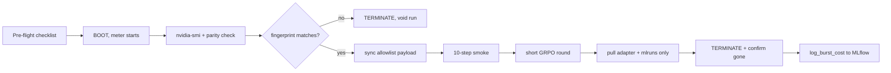

# The Lambda workflow

The image from the last chapter is a frozen artifact; this chapter is about the perishable one, the rented instance, which starts costing money the instant it boots and does not stop until I destroy it. That single fact reorganizes everything. On the baseline machine a forgotten Jupyter kernel is a warm laptop; on a rented H100 it is a slow leak of dollars that runs all night while I sleep. So the Lambda workflow is not really about H100s. It is a discipline for working against a meter: boot late, sync fast, verify parity, run one thing, pull the artifacts back, and kill the box the moment the last byte is home.

Two constraints bound the whole workflow. The first is money, and it is handled by lifecycle discipline plus per-experiment cost logging. The second is the open-data boundary: this thesis is built so that only open data ever leaves my machine, and a rented box on someone else's network is precisely where that boundary is easiest to breach by accident. Both constraints resolve into checklists, because a checklist is what you follow when you are tired and the meter is running, which is exactly when good intentions fail.

The lab is one real fine-tune round-trip: boot, sync, run a short GRPO round on the H100, pull the adapter and metrics back, and terminate. The artifact is a burst runbook and its checklist, plus the pulled adapter and an MLflow run whose cost is logged in dollars.

## Theory

### The meter is always on

Lambda's on-demand GPU instances bill for wall-clock time from boot to termination, at a published per-GPU-hour rate (cite current Lambda price, $/GPU-hr, as of the run date). There is no partial credit for an idle GPU and, importantly, **stopping is not the same as terminating**: on most on-demand cloud GPU offerings a stopped-but-not-terminated instance either keeps billing or holds reserved capacity you are still paying for, and its attached storage bills regardless. The only state that costs nothing is "does not exist." So the mental model is not "turn it off when done," it is "destroy it when done, and rebuild from the image next time."

```admonish derivation title="What a rented hour actually costs"
Let the on-demand rate be $r$ dollars per GPU-hour (cite current Lambda price as of the run date) and let $g$ be the number of GPUs on the instance. The billable cost of a session is set by wall-clock time from boot $t_0$ to termination $t_1$, not by the time the GPU spent doing useful math:

$$C_{\text{session}} = r \cdot g \cdot (t_1 - t_0)$$

Decompose the wall-clock into phases: boot and setup $t_{\text{setup}}$, image pull $t_{\text{pull}}$, data/weight sync $t_{\text{sync}}$, the actual run $t_{\text{run}}$, and pull-back plus teardown $t_{\text{down}}$:

$$C_{\text{session}} = r \cdot g \cdot \big(t_{\text{setup}} + t_{\text{pull}} + t_{\text{sync}} + t_{\text{run}} + t_{\text{down}}\big)$$

Every term except $t_{\text{run}}$ is **overhead I am paying full GPU rate for while the GPU sits idle**. A worked example with a placeholder single-GPU rate $r = \$3.00/\text{GPU-hr}$ (cite the real current rate) and $g=1$: if setup+pull+sync+down sum to 18 minutes and the run itself is 40 minutes, then

$$C = 3.00 \times 1 \times \tfrac{18 + 40}{60} = 3.00 \times 0.967 \approx \$2.90,$$

of which $3.00 \times 18/60 = \$0.90$, about 31%, bought me nothing but overhead. The entire lifecycle discipline below is an attack on the non-$t_{\text{run}}$ terms: prebuilt images shrink $t_{\text{pull}}$, staged open data shrinks $t_{\text{sync}}$, and a scripted teardown shrinks $t_{\text{down}}$ to seconds. Record the real per-phase minutes on the rented H100 with date and driver; the ratio of overhead to run time is the single number that tells me whether bursting this job was worth it.
```

### The open-data-only boundary

The thesis makes a promise: the pipeline can be reproduced from open weights and open datasets, and nothing that leaves my machine carries anything non-open. A rented instance is the highest-risk moment for that promise because I am pushing bytes to a third-party network. Three things could go wrong: I could push a dataset that is not actually open; I could push local artifacts (notes, `.env` files, private eval seeds) mixed in with the code; or I could pull back something the rented box synthesized from non-open inputs. The boundary is enforced by never letting non-open data near the sync in the first place, and by verifying provenance on the way out.

Concretely: weights come from an open model card (a pinned Hugging Face repo revision), datasets come from open dataset cards (again pinned by revision), and the only things I push from my machine are the container image (pure code, already scrubbed by `.dockerignore`) and, if anything, an open dataset I have already vetted. Everything with a provenance question mark stays home. The checklist in the lab makes this mechanical.

```admonish gotcha
The failure modes here all share a shape: the meter is on while you debug the thing that should have been checked on the ground. A short list of the ones that have actually bitten people, each of which the checklist pre-empts.

- **The forgotten instance.** You get the adapter, close the laptop, and the H100 bills all weekend. Fix: teardown is a scripted step, not a mental note, and you confirm termination in the console before you walk away.
- **Stopped, not terminated.** You "stopped" it to save money; the attached volume (and possibly reserved capacity) keeps billing. Fix: terminate and destroy the volume; rebuild from the image next time.
- **Sync-then-discover-the-bug.** You `rsync` 40GB of weights, then find the training config is wrong. Fix: run the parity check and a 10-step smoke run *before* the full sync of anything large.
- **Provenance leak.** A "just for testing" local file rides along in the rsync. Fix: sync from an explicit allowlist directory, never from `.` or `$HOME`.
- **Egress surprise.** Pulling large artifacts back can incur egress fees on some providers. Fix: pull only the adapter and metrics (megabytes), never full merged checkpoints (gigabytes) you can re-merge locally.
```

### Why rsync, and what actually moves

The sync tool is `rsync` over SSH: it is delta-based (only changed blocks move), resumable, and it preserves the directory structure the container expects at `/data`. What moves *to* the box is deliberately small: the container image (or a registry pull), the training config, and any already-vetted open dataset not already on a public hub. What moves *back* is even smaller: the trained LoRA adapter (tens to low-hundreds of MB), the MLflow run directory, and logs. The base model weights never move back because I already have them, pinned by revision, and re-merging an adapter onto open weights is a local operation. Keeping the pull-back tiny is both a cost lever (less egress, less $t_{\text{down}}$) and a boundary lever (fewer bytes to audit for provenance).

## Tooling

### Lambda Cloud lifecycle, via CLI or console

Lambda exposes instances through a web console and a REST API (and community CLIs wrap the API). Whichever I use, the lifecycle verbs are the same: **launch** an instance of a named GPU type in a region with an SSH key; **list** to get its IP and state; **terminate** to destroy it. The discipline is to script launch and terminate so that "boot" and "kill" are one command each and neither depends on me clicking carefully through a console while tired. I keep the instance ID in a file the teardown script reads, so terminate is not something I can fat-finger.

The one manual step that stays manual is the *confirmation* of termination: after the script reports the instance destroyed, I re-list and confirm it is gone, because the most expensive bug in this whole workflow is believing a box is dead when it is not.

### MLflow as the cost ledger

MLflow already tracks every run's git SHA, lock hash, driver, and metrics (Part 0 set that up). For burst runs I add cost as first-class logged data: the per-GPU-hour rate, GPU count, billable minutes, and the derived dollar cost, all logged as MLflow params and metrics on the same run that holds the training curves. This means "what did this experiment cost" is answerable by querying MLflow, not by reconciling a cloud invoice a month later. The rate is a parameter I pass in (from the current Lambda price on the run date), and the billable minutes come from timestamps the runbook records at boot and teardown.

```python title="train/src/train/cost.py"
"""Log burst cost to the active MLflow run.

Cost is wall-clock, not GPU-busy time: the meter bills boot-to-terminate.
Rate is passed in from the current Lambda on-demand price on the run date.
"""
from __future__ import annotations
import datetime as dt
import mlflow


def log_burst_cost(
    *,
    rate_per_gpu_hr: float,   # cite current Lambda price, $/GPU-hr, run date
    gpu_count: int,
    boot_utc_iso: str,        # recorded by the runbook at instance boot
    teardown_utc_iso: str,    # recorded by the runbook at terminate
    provider: str = "lambda",
    instance_type: str = "gpu_1x_h100",
) -> float:
    boot = dt.datetime.fromisoformat(boot_utc_iso)
    down = dt.datetime.fromisoformat(teardown_utc_iso)
    billable_hours = (down - boot).total_seconds() / 3600.0
    cost = rate_per_gpu_hr * gpu_count * billable_hours

    mlflow.log_params({
        "burst_provider": provider,
        "burst_instance_type": instance_type,
        "burst_gpu_count": gpu_count,
        "burst_rate_per_gpu_hr_usd": rate_per_gpu_hr,
        "burst_boot_utc": boot_utc_iso,
        "burst_teardown_utc": teardown_utc_iso,
    })
    mlflow.log_metrics({
        "burst_billable_hours": round(billable_hours, 4),
        "burst_cost_usd": round(cost, 4),
    })
    return cost
```

## Lab: one real H100 fine-tune round-trip

The artifact is a burst runbook (`burst/runbook.sh`) with an embedded checklist, plus the pulled adapter and an MLflow run carrying its dollar cost. The run itself is a short GRPO round on a 7-8B model, sized properly in the next chapter; here the point is the *round-trip discipline*, not the training science.

### The pre-flight checklist

I keep this as a comment block at the top of the runbook and read it top to bottom before every burst. It is boring on purpose.

```text title="burst/CHECKLIST.md"
BURST PRE-FLIGHT (read before boot; the meter starts at boot)
[ ] Image built and pushed/loadable; software_fingerprint recorded locally
[ ] Base model pinned by HF revision (open model card)
[ ] Dataset pinned by HF revision (open dataset card), provenance = OPEN
[ ] Sync source is an explicit allowlist dir, never "." or $HOME
[ ] Lambda price for the day recorded: ______ $/GPU-hr (as of run date)
[ ] SSH key + instance-id file path set
[ ] Teardown script tested (dry run) BEFORE launch

ON THE BOX (minimize idle GPU time)
[ ] nvidia-smi: record driver version + GPU name
[ ] parity_check.py: software_fingerprint MATCHES local reference
[ ] 10-step smoke run OK before full data sync / full run

ON THE WAY OUT (small + audited)
[ ] Pull back ONLY: adapter + mlruns + logs (megabytes)
[ ] Verify no non-open bytes were pushed (git status of sync dir)
[ ] Record teardown timestamp
[ ] TERMINATE instance; re-list console to CONFIRM it is gone
[ ] log_burst_cost() -> MLflow; sanity-check $ against expected
```

### The runbook

```bash title="burst/runbook.sh"
#!/usr/bin/env bash
set -euo pipefail

# ---- config (edit per run) -------------------------------------------------
: "${REMOTE:?set REMOTE=ubuntu@<instance-ip>}"       # from lambda list
SSH_KEY="${SSH_KEY:?set SSH_KEY=path to private key}"
INSTANCE_ID="${INSTANCE_ID:?set INSTANCE_ID for teardown}"
RATE="${RATE:?set RATE= current Lambda price $/GPU-hr on the run date}"
GPUS="${GPUS:-1}"

SYNC_SRC="burst/payload"     # ALLOWLIST dir: only vetted, open bytes go here
IMAGE="thesis-train:local"   # built in the previous chapter
SSH="ssh -i ${SSH_KEY} -o StrictHostKeyChecking=accept-new ${REMOTE}"
RS="rsync -avz -e 'ssh -i ${SSH_KEY}'"

# BOOT_UTC must be the INSTANCE LAUNCH time (when the meter starts), not now:
# the box is already booted by the time this runbook runs, so recording `date`
# here undercounts billed time by the boot + SSH-wait interval. Capture it at
# launch (from the lambda launch response / console) and pass it in; the
# fallback below is only for when you truly launched seconds ago.
BOOT_UTC="${BOOT_UTC:-$(date -u +%FT%T)}"; echo "BOOT_UTC=${BOOT_UTC}"

# ---- 1. verify plumbing + parity BEFORE moving anything large --------------
$SSH 'nvidia-smi --query-gpu=name,driver_version --format=csv,noheader'

# Ship the built image to the box: save -> ssh -> load. (Or push to a registry
# and `docker pull` on the box; save/load needs no registry.) The remote
# docker run below cannot execute until the image actually exists on the box.
docker save "${IMAGE}" | $SSH docker load

eval $RS docker/parity_check.py "${REMOTE}:~/parity_check.py"
# --entrypoint python OVERRIDES the image ENTRYPOINT (python -m train.run);
# without it the parity args just append and the script never runs.
$SSH "docker run --rm --gpus all --entrypoint python -v ~/:/chk ${IMAGE} /chk/parity_check.py" \
    | tee burst/parity_remote.json

# Fail loud if the software fingerprint drifted from the local reference.
# The software fingerprint (from 8.1, stored in docker/parity_train.json) is the
# SHA256 over the pinned python / torch / torch-CUDA / arch-list, deliberately
# blind to the GPU model: a match means identical software, so any behavioral
# delta between local and remote is attributable to the hardware, not the stack.
python - <<'PY'
import json, sys
loc = json.load(open("docker/parity_train.json"))["software_fingerprint"]
rem = json.load(open("burst/parity_remote.json"))["software_fingerprint"]
print(f"local  fingerprint: {loc}")
print(f"remote fingerprint: {rem}")
if loc != rem:
    sys.exit(f"FINGERPRINT DRIFT: local {loc} != remote {rem}; run is void.")
print("fingerprints match; proceeding.")
PY

# ---- 2. sync ONLY the allowlist payload (open data + config) ---------------
test -d "${SYNC_SRC}" || { echo "no payload dir; refusing to sync \$HOME"; exit 1; }
eval $RS "${SYNC_SRC}/" "${REMOTE}:~/payload/"

# ---- 3. smoke run (10 steps) then the real short GRPO round ----------------
$SSH "docker run --rm --gpus all -v ~/payload:/data ${IMAGE} \
        --config /data/config.yaml --max-steps 10 --smoke"
$SSH "docker run --rm --gpus all -v ~/payload:/data ${IMAGE} \
        --config /data/config.yaml"

# ---- 4. pull back ONLY small artifacts (adapter + metrics + logs) ----------
eval $RS "${REMOTE}:~/payload/out/adapter/" "burst/pulled/adapter/"
eval $RS "${REMOTE}:~/payload/out/mlruns/"  "burst/pulled/mlruns/"

# ---- 5. teardown (SCRIPTED), then CONFIRM, then log cost -------------------
TEARDOWN_UTC="$(date -u +%FT%T)"; echo "TEARDOWN_UTC=${TEARDOWN_UTC}"

# Terminate is ONE scripted call against INSTANCE_ID, never a manual note:
# a box you forgot to kill bills all weekend. Lambda Cloud terminate endpoint.
: "${LAMBDA_API_KEY:?set LAMBDA_API_KEY for the terminate call}"
curl -sf -u "${LAMBDA_API_KEY}:" \
    https://cloud.lambdalabs.com/api/v1/instance-operations/terminate \
    -H "Content-Type: application/json" \
    -d "{\"instance_ids\": [\"${INSTANCE_ID}\"]}" \
    && echo "terminate requested for ${INSTANCE_ID}"

# Confirm it is actually gone: re-list and fail if the instance is still alive.
curl -sf -u "${LAMBDA_API_KEY}:" https://cloud.lambdalabs.com/api/v1/instances \
    | python -c "import json,sys; alive=[i for i in json.load(sys.stdin)['data'] if i['id']=='${INSTANCE_ID}' and i.get('status')!='terminated']; sys.exit('STILL ALIVE: ${INSTANCE_ID}, check the console' if alive else 0)" \
    && echo "confirmed gone: ${INSTANCE_ID}"

python - "$RATE" "$GPUS" "$BOOT_UTC" "$TEARDOWN_UTC" <<'PY'
import sys, mlflow
sys.path.insert(0, "train/src")
from train.cost import log_burst_cost
rate, gpus, boot, down = float(sys.argv[1]), int(sys.argv[2]), sys.argv[3], sys.argv[4]
mlflow.set_tracking_uri("file:burst/pulled/mlruns")
with mlflow.start_run(run_name="burst-cost"):
    c = log_burst_cost(rate_per_gpu_hr=rate, gpu_count=gpus,
                       boot_utc_iso=boot, teardown_utc_iso=down)
    print(f"logged burst cost: ${c:.2f} "
          f"(rate ${rate}/GPU-hr x {gpus} GPU x wall-clock)")
PY
```

### What you should see

By the end of one round-trip there are three things on my local disk: `burst/pulled/adapter/` holding a LoRA adapter trained on the H100, `burst/pulled/mlruns/` holding an MLflow run whose curves came off the rented box, and `burst/parity_remote.json` whose `software_fingerprint` matches the local reference from the previous chapter (if it does not, the run is void and I say so). The MLflow run carries a `burst_cost_usd` metric computed from the boot and teardown timestamps and the day's rate, so the answer to "what did this experiment cost" is a number in the tracker, not a guess: on the rented H100, record the actual billable minutes, the rate used, and the resulting dollars, with date and driver. The instance itself should no longer exist, confirmed by a fresh `list` returning nothing, which is the only proof that the meter has stopped. If I sum the per-phase minutes from the runbook's timestamps, the overhead-to-run ratio from the cost derivation becomes concrete, and it is the number I carry into the next chapter to decide whether this job should have been bursted at all.



```admonish read-along title="[RLHF] ch. 6, infrastructure notes"
Lambert's infrastructure chapter frames RLHF/post-training as an engineering problem where the cost is dominated by generation and the orchestration of separate serving and training processes, not by the gradient step alone. Read it alongside this chapter for the systems framing: it justifies why `serve/` and `train/` stay separate processes even on one rented box (the trainer consumes rollouts the server produces), and why "the meter is always on" is really a statement about keeping expensive accelerators busy with the phase that matters. His notes on the practical messiness of distributed RLHF infra are the reason my burst discipline is a checklist and not a diagram.
```

```admonish substack-seed
"The meter is always on." Renting an H100 changes your engineering psychology more than it changes your code: every idle second is billed at the same rate as every training second, so the enemy stops being slow math and becomes wasted wall-clock. The counterintuitive lesson is that most of what makes cloud GPU work cheap has nothing to do with the GPU, it is prebuilt images so you do not pull for ten minutes, staged open data so you do not sync for twenty, and a scripted teardown so a forgotten box does not bill all weekend. A post on treating a rented accelerator like a stopwatch you are racing, with a five-item checklist that has saved more money than any kernel optimization.
```
