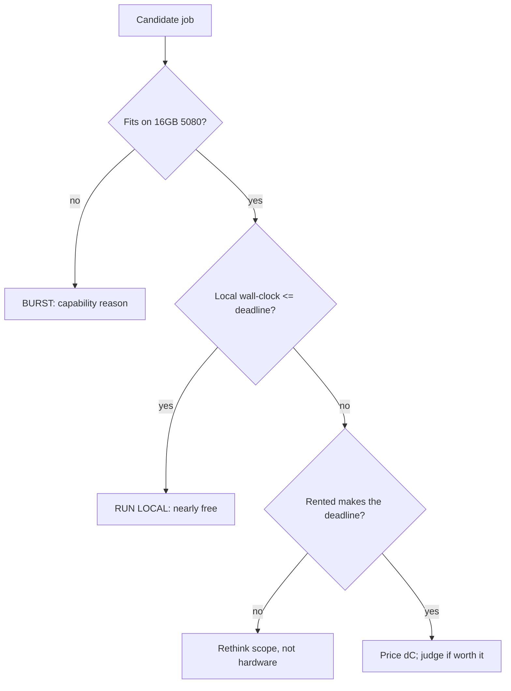

# When to burst

The previous two chapters were about *how* to burst: build the image, rent the box, keep the meter honest. This one is about *whether* to, which is the more important question and the one it is easiest to answer with your gut instead of arithmetic. The gut says "the H100 is faster, so use the H100." The arithmetic says something more useful: bursting is only rational when a job either does not fit on the 16GB card at all, or fits but would take so long locally that the deadline (not the dollar) forces your hand. Most jobs are neither, and the discipline of this chapter is knowing which is which before I spend a cent.

There is a real asymmetry to respect. The RTX 5080 is already paid for; its marginal cost per hour is electricity, call it pennies. The H100 costs its full on-demand rate per hour whether or not I am using it well. So local hours are nearly free and slow; rented hours are expensive and fast. The decision is never "which is better," it is "for *this* job, does the speedup buy back enough to justify the rate, given when I need the result." That is a break-even calculation, and once it is written down the answer is usually obvious.

The chapter builds that break-even model, sizes a 7-8B GRPO run on an H100 so I know what actually fits and why, and covers DDP and FSDP at reading level so the multi-GPU vocabulary is in place for the post-contract rig even though today's burst is a single H100.

## Theory

### Three reasons to burst, only two of them good

Strip the decision down. There are exactly three reasons a job leaves the baseline machine.

1. **It does not fit.** The model, its optimizer state, the KV cache for the rollouts, and the activations do not fit in 16GB even at the most aggressive quantization and offload I am willing to accept. This is a *capability* reason and it is unarguable: no amount of patience on the 5080 produces the result. A full 7-8B GRPO run with unquantized rollouts is the canonical example.
2. **It fits but the deadline says no.** The job would run locally, but the wall-clock time exceeds the time I have before a committee meeting, a Substack deadline, or my own patience threshold. This is a *time* reason and it is legitimate, but only after I have priced it.
3. **The H100 is shiny.** No.

The first two are the real gate. Everything below is machinery for deciding, in case (2), whether the deadline is worth the rate, and for confirming, in case (1), that the job genuinely does not fit rather than that I gave up on offload too early.

### The break-even model

The core comparison is between doing the job locally for nearly free but slowly, and renting for a price but quickly. Let me define the quantities and then find the point where renting starts to make sense.

```admonish derivation title="Local-hours vs rented-hours vs the deadline"
Let a job require $W$ units of work (say, training steps, or token-generations for the rollouts). Define:

- $s_L$ = local throughput on the 5080 (work per hour), and $s_R$ = throughput on the rented H100.
- $r$ = rented rate in dollars per GPU-hour (cite current Lambda price, $/GPU-hr, as of the run date), $g$ = GPU count on the rented instance.
- $p_L$ = local marginal cost per hour (electricity), which is small: on the order of the board's power draw times the local $/kWh$ rate.
- $D$ = the deadline, in hours from now, by which I need the result.

**Local wall-clock** is $T_L = W / s_L$ at cost $C_L = p_L \cdot T_L$.
**Rented wall-clock** is $T_R = W / (s_R \cdot g) + t_{\text{ovh}}$, where $t_{\text{ovh}}$ is the boot/sync/teardown overhead from the last chapter, at cost $C_R = r \cdot g \cdot T_R$.

**Gate 1, feasibility.** If the job does not fit locally, $s_L = 0$ (equivalently $T_L = \infty$) and the decision is made: burst, because local is not an option. Skip the rest of the math.

**Gate 2, deadline.** If it does fit locally, renting is only *necessary* when local misses the deadline:

$$T_L = \frac{W}{s_L} > D \quad\Longrightarrow\quad \text{local cannot make it; consider renting.}$$

If $T_L \le D$, local makes the deadline for pennies and renting is pure waste, no matter how much faster the H100 is. Speed you do not need is not worth paying for.

**The price of the deadline.** When local misses the deadline, renting costs me an extra

$$\Delta C = C_R - C_L = r g\!\left(\frac{W}{s_R g} + t_{\text{ovh}}\right) - p_L \frac{W}{s_L}$$

dollars to move the finish line from $T_L$ (too late) to $T_R$ (in time). The question is simply whether the result, delivered by $D$ instead of $T_L$, is worth $\Delta C$. That is a judgment, but now it is a judgment about a *specific number of dollars for a specific number of hours saved*, not a vibe.

**A worked example (placeholder throughputs; record the real ones).** Suppose a job is $W = 1$ (one full run), local would take $T_L = 30$ h, and the deadline is $D = 12$ h, so local misses. On a single H100 the run takes $T_R = 6$ h wall-clock including $t_{\text{ovh}} = 0.5$ h. With a placeholder rate $r = \$3.00/\text{GPU-hr}$ (cite the real current Lambda rate) and $g = 1$:

$$C_R = 3.00 \times 1 \times 6 = \$18.00,$$

versus a local electricity cost of, say, $p_L \approx \$0.10/\text{h} \times 30\,\text{h} = \$3.00$. So the deadline costs about $\Delta C \approx \$15$ to move the finish line forward by $T_L - T_R = 30 - 6 = 24$ hours (of which only the last 18, the gap $T_L - D$, is the minimum saving actually needed to hit $D$). Whether that is a good trade depends entirely on what the deadline is for. Plug in the *measured* $s_R$ from the rented H100 (record value, date, driver) before trusting any absolute number here.
```

The model's punchline is the ordering of the gates. Feasibility first: does it fit. Then deadline: does local miss it. Only if both point to renting do I look at the dollar delta, and even then the delta is a decision input, not a verdict. The most common correct answer, for the small experiments that make up most of a thesis, is "run it locally overnight for free."

### Sizing a 7-8B GRPO run on an H100

The clearest "does not fit" case is a full-precision GRPO run on a 7-8B model, so it is worth knowing what such a run needs, both to justify the burst and to size the instance. GRPO's memory footprint has an extra term that plain fine-tuning does not: it generates a *group* of rollouts per prompt and scores them, so a serving-shaped generation cost sits next to the training cost.

```admonish derivation title="Rough memory budget for 7-8B GRPO"
Take a 7.6B-parameter model as the example and account the big terms in bytes. The exact coefficients depend on optimizer and offload choices; this is the order-of-magnitude budget that tells me a single H100's 80GB is comfortable and the 5080's 16GB is not.

- **Weights (BF16):** $7.6\times10^{9} \times 2\,\text{byte} \approx 15.2\,\text{GB}$.
- **Gradients (BF16):** another $\approx 15.2\,\text{GB}$ if training full parameters.
- **Optimizer state (Adam, FP32 moment pair + master weights):** the classic factor is $\approx 12$ bytes/param for full fine-tuning, so $7.6\times10^{9}\times 12 \approx 91\,\text{GB}$, already past one H100 on its own. This is the term that forces a choice.

The choice that makes it fit is **LoRA/QLoRA**: freeze the base weights (no gradients, no optimizer state on 7.6B params) and train small adapters. Then the heavy optimizer term applies only to the adapter's few tens of millions of parameters, collapsing that $91\,\text{GB}$ to well under a gigabyte. What is left on the H100 is roughly: base weights (quantized to 4-bit for QLoRA, $\approx 7.6\times10^{9}\times0.55 \approx 4.2\,\text{GB}$, or BF16 at $15.2\,\text{GB}$), adapter grads/state (small), activations, and the **rollout KV cache** for the GRPO group.

- **Rollout KV cache:** GRPO samples $G$ completions per prompt. KV cache scales with (layers $\times$ 2 $\times$ hidden $\times$ context $\times$ dtype-bytes $\times$ concurrent sequences). A group of $G = 8$ completions at a few-thousand-token reasoning context is a serving-sized allocation of several GB that plain SFT never pays.

Summing the QLoRA path: a handful of GB of quantized base weights + small adapter state + several GB of rollout KV cache + activations lands comfortably inside 80GB with room for a real batch and long reasoning traces. The same sum against 16GB is a constant fight with offload and tiny groups. That gap, comfortable on H100 and a grind on the 5080, is the concrete "does not fit well" that justifies bursting a full-precision, real-group GRPO run.

Record the actual peak VRAM on the rented H100 (measured, with date and driver); the budget above is what I expect to see, not what I measured.
```

The sizing also explains *why* the 5080 does small GRPO at all (Part VII): shrink the model, quantize hard, cut the group size $G$, shorten the context, and offload. Every one of those is a compromise the H100 lets me drop. So bursting a GRPO run is not just "faster," it is "the version of the experiment without the compromises," which is sometimes the only version worth putting in front of a committee.

### DDP and FSDP at reading level

Today's burst is one H100 and needs neither of these, but the post-contract rig (the one I would buy if the thesis turns into something) is multi-GPU, and the vocabulary should be in place. Two ideas cover most of it.

**DDP, Distributed Data Parallel,** puts a *full copy* of the model on every GPU and gives each GPU a different slice of the batch. Each computes gradients on its slice, then all GPUs average their gradients (an all-reduce) so every copy takes the same step. DDP is simple and fast and scales throughput almost linearly, but it does nothing for memory: if the model plus optimizer state does not fit on one GPU, DDP does not help, because every GPU still holds the whole thing. DDP is the answer to "it fits, I just want it faster."

**FSDP, Fully Sharded Data Parallel,** attacks memory instead. It *shards* the parameters, gradients, and optimizer state across GPUs so no single GPU holds the full set. When a layer is needed for the forward or backward pass, its shard is gathered just-in-time from the other GPUs, used, then released. This trades communication for memory: you can fit models far larger than one GPU's RAM, at the cost of more inter-GPU traffic. FSDP (and ZeRO, its conceptual sibling) is the answer to "it does not fit on one GPU at all."

```admonish gotcha
The two are answers to different questions and mixing them up wastes money. DDP does not lower per-GPU memory, so renting a 2x or 4x instance with DDP to fit a model that overflows one GPU will not work, since every GPU still needs the whole model. FSDP lowers per-GPU memory but adds communication overhead, so using it when a single GPU already fits the model is paying a bandwidth tax for nothing. On a single rented H100, neither applies: it is one GPU, and the levers are quantization, LoRA, batch size, and group size, exactly as on the 5080 but with 5x the headroom. Reach for DDP/FSDP only when the instance actually has multiple GPUs and you have decided which problem, speed or fit, you are solving.
```

## Tooling

The tool here is the break-even model itself, made runnable so the decision is a script, not a mood. It takes the job's parameters and today's Lambda rate and prints the two gates and, if both fire, the dollar delta. It deliberately refuses to recommend renting when local makes the deadline, because that is the discipline the whole chapter is defending.

```python title="burst/should_i_burst.py"
"""Decide whether to burst, by the two-gate model.

Feasibility first (does it fit locally at all), then deadline (does local
miss it). Only if both point to renting do we price the delta. Throughputs
are inputs you measure; the Lambda rate is the current price on the run date.
"""
from __future__ import annotations
import argparse
from dataclasses import dataclass


@dataclass
class Job:
    work: float            # abstract units (e.g. runs, or step-count)
    s_local: float         # local throughput (work/hour); 0.0 => does NOT fit
    s_rented: float        # rented per-GPU throughput (work/hour)
    deadline_h: float      # hours from now until the result is needed
    rate_per_gpu_hr: float # cite current Lambda price, $/GPU-hr, run date
    gpus: int = 1
    overhead_h: float = 0.5   # boot+sync+teardown from the runbook
    local_power_usd_h: float = 0.10  # 5080 board draw x local $/kWh


def decide(j: Job) -> None:
    # Gate 1: feasibility.
    if j.s_local <= 0.0:
        t_r = j.work / (j.s_rented * j.gpus) + j.overhead_h
        c_r = j.rate_per_gpu_hr * j.gpus * t_r
        print("GATE 1: does NOT fit locally -> BURST (no local option).")
        print(f"  rented wall-clock ~ {t_r:.2f} h, cost ~ ${c_r:.2f}")
        return

    t_l = j.work / j.s_local
    c_l = j.local_power_usd_h * t_l
    print(f"GATE 1: fits locally. local wall-clock ~ {t_l:.2f} h, "
          f"cost ~ ${c_l:.2f} (electricity).")

    # Gate 2: deadline.
    if t_l <= j.deadline_h:
        print(f"GATE 2: local MAKES the deadline ({t_l:.2f} h <= "
              f"{j.deadline_h:.2f} h) -> RUN LOCAL. Renting is waste.")
        return

    t_r = j.work / (j.s_rented * j.gpus) + j.overhead_h
    c_r = j.rate_per_gpu_hr * j.gpus * t_r
    print(f"GATE 2: local MISSES the deadline ({t_l:.2f} h > "
          f"{j.deadline_h:.2f} h).")
    if t_r > j.deadline_h:
        print(f"  ...but rented also misses ({t_r:.2f} h). Rethink scope, "
              f"not hardware.")
        return
    print(f"  rented makes it: {t_r:.2f} h <= {j.deadline_h:.2f} h.")
    print(f"  price of the deadline: dC ~ ${c_r - c_l:.2f} "
          f"to save {t_l - t_r:.2f} h. Is that worth it? (judgment)")


if __name__ == "__main__":
    ap = argparse.ArgumentParser()
    ap.add_argument("--work", type=float, default=1.0)
    ap.add_argument("--s-local", type=float, required=True,
                    help="0 means it does not fit locally")
    ap.add_argument("--s-rented", type=float, default=5.0)
    ap.add_argument("--deadline-h", type=float, required=True)
    ap.add_argument("--rate", type=float, required=True,
                    help="current Lambda $/GPU-hr on the run date")
    ap.add_argument("--gpus", type=int, default=1)
    a = ap.parse_args()
    decide(Job(a.work, a.s_local, a.s_rented, a.deadline_h, a.rate, a.gpus))
```

## Lab: run the decision for a real job

The artifact is a small decision record on disk: the parameters of an actual candidate job, the model's verdict, and my one-line rationale, saved next to the burst runbook so the "why did I rent" question has a written answer months later.

### Three candidate jobs

```bash title="shell: price three candidate jobs against today's rate"
# Use the REAL current Lambda rate for --rate (cite $/GPU-hr as of the run date).
RATE=3.00   # placeholder; replace with the day's price

# A) Small GRPO smoke experiment: fits locally, 3h, deadline 24h.
uv run python burst/should_i_burst.py \
    --work 1 --s-local 0.33 --s-rented 2.0 --deadline-h 24 --rate $RATE
# expect: GATE 2 -> RUN LOCAL (3h <= 24h). Renting is waste.

# B) Full 7-8B GRPO, real group, BF16 rollouts: does NOT fit 16GB.
uv run python burst/should_i_burst.py \
    --work 1 --s-local 0 --s-rented 0.17 --deadline-h 48 --rate $RATE
# expect: GATE 1 -> BURST (no local option).

# C) Big local job that misses a hard deadline: fits but 30h vs 12h.
uv run python burst/should_i_burst.py \
    --work 1 --s-local 0.033 --s-rented 0.17 --deadline-h 12 --rate $RATE
# expect: GATE 2 -> local misses; rented makes it; prints dC to decide.
```

### The decision record

```text title="burst/decisions/2026-07-22-full-grpo.md"
# Burst decision: full 7-8B GRPO, real group

Job:        Qwen 7-8B, GRPO, G=8, BF16 rollouts, ~2-4k ctx
Gate 1:     does NOT fit 16GB at real group/precision (see sizing budget)
Gate 2:     n/a (feasibility already forces the burst)
Verdict:    BURST, single H100 (80GB), QLoRA base, full group
Instance:   gpu_1x_h100
Rate used:  <cite current Lambda $/GPU-hr, run date>
Expected:   run wall-clock T_R = ____ h + overhead ____ h  (fill from runbook)
Measured:   peak VRAM ____ GB, run ____ h, cost $____  (H100; date; driver)
Rationale:  this is the no-compromise version of the Part VII experiment;
            the 16GB card can only do the shrunk-down version, which is not
            what goes in front of the committee.
```

### What you should see

Running the three candidates prints three different verdicts from the same script, and that variety is the whole point: (A) fits and makes its deadline, so the tool refuses to rent and I run it overnight for pennies; (B) does not fit at all, so Gate 1 forces the burst with no dollar argument needed; (C) fits but misses a hard deadline, so the tool prints the dollar delta and hands the judgment back to me. The artifact on disk is `burst/decisions/2026-07-22-full-grpo.md`, a decision record whose "Expected" line I fill from the model before booting and whose "Measured" line I fill from the H100 afterward (peak VRAM, run hours, dollars, with date and driver). Months later, when I or the committee ask "why did this one experiment cost $18 when everything else was free," the answer is a file, not a memory: it did not fit on the 5080, here is the sizing budget that proves it, and here is what it actually cost. That written trail is what keeps the burst honest, and it is the reason the decision lives in a script and a record rather than in the moment's enthusiasm for a faster GPU.



```admonish read-along title="[RLHF] ch. 6, infrastructure notes"
Lambert's infra chapter is the reading-level companion to this one. It lays out why post-training compute is dominated by generation (the rollouts), which is exactly the term that makes GRPO's memory budget balloon past 16GB and forces the burst, the KV-cache-for-a-group cost I sized above is his "generation dominates" observation in bytes. His treatment of data-parallel versus sharded training is the conceptual source for the DDP-vs-FSDP split here: DDP for throughput when it fits, sharding for fit when it does not. Read it to connect the cost model of this chapter (when renting is rational) to the systems reality of the last two (why serving and training stay separate processes, and why keeping the accelerator busy is the whole game).
```

```admonish substack-seed
"When NOT to rent the H100." The honest version of a cloud-GPU post is mostly a list of times you should keep your laptop closed and let the cheap card grind overnight. Bursting is rational in exactly two cases, the job does not fit at all, or it fits but misses a hard deadline, and everything else is paying premium rates for speed you do not need. The useful artifact is a two-gate decision script that refuses to recommend renting when your own machine makes the deadline, plus a memory-budget back-of-envelope that shows precisely why a full-group GRPO run on a 7-8B model overflows 16GB but sits comfortably on an 80GB H100. A post that reframes cloud GPUs from "faster is better" to "faster is a purchase, and here is how to know if you should make it."
```
