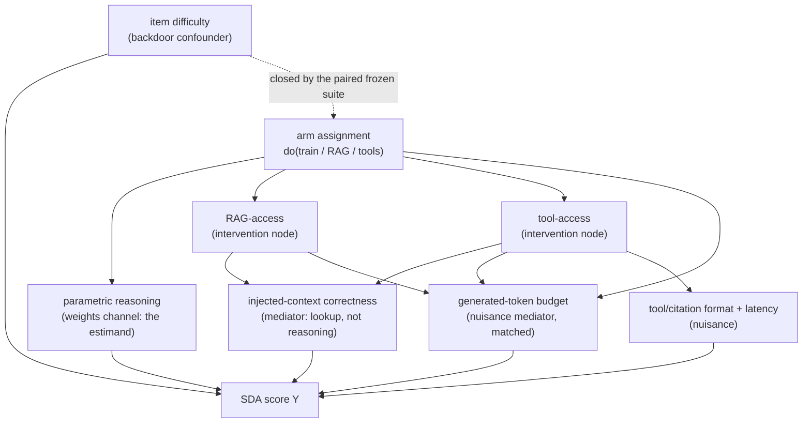

# The augmentation arms: what caused the gain

The SDA model got better. That sentence is the whole thesis compressed to five words, and it is also the sentence a committee will spend an hour trying to break, because "better" is doing an enormous amount of quiet work. Between the served baseline and the number I want to put on the final slide, three different things changed, and only one of them is the thing the thesis is named after. I trained the policy on verifiable rewards (Part V), which is a change to the *weights*. I gave a version of it retrieval over the space-text corpus (chapter 8.1), which is a change to the *context*. I gave another version live numerical tools (chapter 8.2), which is a change to the *actions available at inference*. Each of those can raise the SDA score, and a naive reading of a single accuracy jump cannot tell them apart. So the committee asks the question this chapter exists to answer: was it reasoning, or was it just retrieval and tools? If the answer is "mostly tools," then I have built a good conjunction-screening *product* and proven nothing about *reasoning*, which is fine for an engineer and fatal for a thesis. This chapter is where I separate the three causes, at matched budget, with the Part IV machinery, so that when I finally say "the parametric reasoning gain is $X$," the number means only that and I can defend every other cause it is not.

This is the strongest form of the thesis claim, and it is the reason chapters 8.1 and 8.2 were built at all: not because the SDA model needs RAG and tools to be useful, but because RAG and tools are the two rival explanations for the headline, and the honest way to defend "RL improved SDA reasoning" is to build its rivals with my own hands and then measure how much of the gain each one actually accounts for. An ablation you did not run is a criticism you cannot answer.

## Theory

### The arms, and why there are six of them

An *arm* is a fully specified way of producing an answer to an SDA item: a model, plus whatever augmentation it is allowed to use, run under one fixed decoding and budget protocol. The design has four principal arms and two combinations, and naming them precisely is half the work because each name is a causal contrast waiting to happen.

- **base**: the served baseline policy $M_0$, no retrieval, no tools. This is the reference every contrast subtracts.
- **trained**: the GRPO-trained checkpoint $M_1$ from the Part VII run, no retrieval, no tools. Weights changed, context did not, actions did not.
- **+rag**: the *baseline* weights $M_0$ with retrieval over the 8.1 index. Context changed, weights did not.
- **+tools**: the *baseline* weights $M_0$ with the 8.2 MCP tools. Actions changed, weights did not.
- **trained+rag** and **trained+tools**: the two combinations that ask whether training and each augmentation are additive, substitutes, or complements.

The reason the augmentations sit on the *baseline* weights, not the trained ones, in the two single-augmentation arms is the whole logic of an ablation: to attribute a gain to retrieval I must hold everything else at its baseline value and move *only* retrieval. Putting RAG on the trained model would confound the retrieval effect with the training effect, which is exactly the confusion the chapter is trying to dissolve. The combination arms exist to *measure* that interaction on purpose, once the main effects are isolated, not to smuggle it into a main effect by accident.

There is a seventh arm I will discuss but flag carefully: **trained+rag+tools**, the "kitchen sink." I include it as a *ceiling*, and I will argue below that its delta is deliberately *not* attributable to any single cause.

### Each augmentation is an intervention, not a covariate

The move that makes this a causal chapter rather than a benchmarking one is to treat RAG-access and tool-access as *interventions*, in the exact sense of Part IV: I set them with a $\operatorname{do}$-operator rather than observing them. When I run the `+rag` arm I am computing $\mathbb{E}[Y \mid \operatorname{do}(\text{RAG}=1)]$ on the frozen suite, not conditioning on the items where retrieval happened to fire. That distinction matters because the augmentations do not raise the score through a single clean channel; each one opens several paths to the outcome, and only some of those paths are the thing I want to credit. The DAG makes the paths explicit and names the role each node plays.



Read the graph by role. **Parametric reasoning** is the channel from a weight change to the score, and it is the *estimand* for the `trained` arm: the thing the thesis wants to own. **Injected-context correctness** is a mediator that both `+rag` and `+tools` open, and it is the honest content of "the augmentation helped by *lookup*, not by *reasoning*": a tool that returns the true miss distance raises the score without the model having reasoned about orbits at all. **Generated-token budget** is a nuisance mediator, because every augmentation tends to make the model decode longer, and length alone moves the score along the pass@$n$ curve of chapter 6.6; this is the path the matched-budget discipline closes. **Format and latency** are tool-specific nuisances (a rigid tool-call format, or truncation under a latency cap) that can move the score in either direction without touching reasoning. Finally **item difficulty** is the classic backdoor confounder, the one that wrecked the naive comparison in chapter 4.4: if different arms were scored on different item mixes, difficulty would open a backdoor path from the arm to the score. The paired frozen suite (chapter 3.11) closes that path by construction, which is why the dashed edge is annotated as closed: *every arm is scored on exactly the same items*, so difficulty is held fixed and cannot confound.

```admonish derivation title="The matched-budget accounting"
Define the compute an arm spends *reasoning about one item* as its generated-token budget. If the arm draws $k$ samples per item (for pass@$k$ or best-of-$n$ selection) and sample $j$ emits $g_a(i,j)$ tokens, then

$$
B_a(i) = \sum_{j=1}^{k} g_a(i,j), \qquad \bar B_a = \frac1N \sum_{i=1}^{N} B_a(i). \tag{3.1}
$$

I count *generated* tokens, not input tokens, on purpose. RAG prepends retrieved chunks and tools inject returned values, so the augmented arms unavoidably carry more *input* context; that is the legitimate cost of the augmentation and I report it separately. What I equalize is the *decode* budget, because decoding is where the model does its sequential reasoning computation (chapter 6.6, equation 6.6.1), and it is decode length that rides the pass@$n$ saturation curve (6.6.2). The matched-budget constraint is therefore

$$
k_a \equiv k, \quad \texttt{max\_tokens}_a \equiv L, \quad \text{and } |\bar B_a - \bar B_{\text{base}}| \le \tau \ \text{verified post hoc},
$$

with the same sampling temperature and the same best-of-$n$ verifier across arms. Why bother, when I could just report the raw winner? Because accuracy is a function of budget as well as capability. Write an arm's accuracy as $A_a = f(\text{capability}_a,\, \bar B_a)$ where $f$ is increasing in budget along the pass@$n$ curve. Then a raw arm difference expands as

$$
\bar A_a - \bar A_{\text{base}}
= \underbrace{\big[f(\text{cap}_a, \bar B_{\text{base}}) - f(\text{cap}_{\text{base}}, \bar B_{\text{base}})\big]}_{\text{effect at matched budget (want)}}
+ \underbrace{\big[f(\text{cap}_a, \bar B_a) - f(\text{cap}_a, \bar B_{\text{base}})\big]}_{\text{pure budget shift (confound)}}. \tag{3.2}
$$

The second bracket is a gain the arm buys purely by decoding longer, with no change in what it can do. If I let budgets drift, an arm can win equation (3.2) entirely on the confound term and I would misread it as capability. Matching $\bar B_a$ to $\bar B_{\text{base}}$ zeroes the second bracket by design, so the reported contrast is the first bracket alone. Where the design cannot make budgets exactly equal (tools sometimes force a re-decode after a call), the analysis-side backstop of the next derivation strips the residual. $\blacksquare$
```

### Naive versus adjusted arm contrasts

Equation (3.2) is the whole reason a single number is untrustworthy: the naive contrast is a sum of the thing I want and a budget artifact I do not. The design-side fix (match $\bar B_a$) handles the average, but budgets can still differ *item by item*, so I keep an analysis-side estimator that holds budget fixed as a covariate. This is nothing new; it is the backdoor adjustment of chapter 4.4, equation (4.1), with the adjustment set $Z$ equal to the generated-token budget stratum.

```admonish derivation title="The backdoor-adjusted arm contrast"
Let $Z$ be a discretization of the generated-token budget into strata (quantile bins of the reference arm's budget). Item difficulty is already blocked by the paired frozen suite, so on this graph $Z$ is the one remaining open backdoor between the arm and the score. By the backdoor criterion (chapter 4.4), $Z$ blocks it and contains no descendant of the arm, so the effect is identified by adjustment. The naive contrast is the raw paired mean,

$$
\Delta^{\text{naive}}_a = \bar A_a - \bar A_{\text{base}} = \frac1N\sum_{i=1}^N \big(s_a(i) - s_{\text{base}}(i)\big),
$$

which implicitly weights each budget stratum by *the arm's own* budget distribution and so lets the confound through. The adjusted contrast reweights to a common (reference) budget mix, exactly equation (4.1):

$$
\Delta^{\text{adj}}_a = \sum_{z} \Big[\, \bar A_a^{(z)} - \bar A_{\text{base}}^{(z)} \,\Big]\; P_{\text{base}}(z), \tag{3.3}
$$

where $\bar A_a^{(z)}$ is the arm's mean score among items whose budget falls in stratum $z$, and $P_{\text{base}}(z)$ is the fraction of items the *base* arm places in stratum $z$. In words: compare each arm to the base *within* budget strata, then average those within-stratum gaps using the base's budget distribution rather than the arm's. If an arm's advantage was really a budget advantage, its within-stratum gaps are small and $\Delta^{\text{adj}}_a$ collapses toward zero while $\Delta^{\text{naive}}_a$ stays large; the gap between the two numbers *is* the confounding, the same lesson as the difficulty example in 4.4. Positivity (chapter 4.4) has to hold: every stratum with reference weight needs items from both arms, which the matched-budget design makes easy because the budgets already overlap heavily. $\blacksquare$
```

The pairing of the two numbers is the honest output. For the `trained` arm the hoped-for reading is that $\Delta^{\text{adj}}$ survives: the gain is still there once budget is held fixed and with no retrieval and no tools in play, which is precisely the parametric-reasoning claim and nothing more. For the `+tools` arm the reading is different and I state it plainly: even a large, budget-adjusted, significant $\Delta^{\text{adj}}$ is a **tool-access** effect flowing through the injected-context-correctness mediator, not a reasoning effect, because the weights never changed. The adjustment cleans out budget; it does *not* launder tool access into reasoning, and no amount of statistics can, because the causal graph says the `+tools` arm's only path to a higher score is a path the trained arm does not use.

### What each arm's delta legitimately claims

The point of separating the arms is to attach the right claim to each contrast, so here they are, one line each, because this is the table a committee actually reads.

- **trained vs base**, adjusted, matched budget, no retrieval, no tools: *parametric reasoning*. This is the thesis claim. If $\Delta^{\text{adj}}_{\text{trained}}$ is positive with a paired CI excluding zero, the weights got better at SDA reasoning on their own, and that is the strongest statement the whole book is trying to earn.
- **+rag vs base**: *retrieval / lookup grounding*, not reasoning. A gain here says the answers were in the corpus and retrieval surfaced them (and it inherits the retrieval-leakage caution of 8.1 and the contamination caution of 3.8). It is a real capability of the *system*; it is not evidence about the *weights*.
- **+tools vs base**: *tool access*, not reasoning. The MCP tools return ground-truth orbital numbers, so on numeric tasks this arm can be near-perfect while the model reasons no better than the base. This is the single most important disclaimer in the chapter, because +tools will often post the largest raw delta and it is the least about reasoning.
- **trained+rag vs +rag** and **trained+tools vs +tools**: the *marginal* parametric gain *on top of* an augmentation, which tests whether training and the augmentation are complements (training still helps once you have retrieval/tools) or substitutes (the augmentation already got what training would have given).

### The kitchen-sink arm as a ceiling

Whether to run **trained+rag+tools** at all is a genuine design decision, and I include it, with a warning stapled to it. Its value is as a *ceiling*: it shows how good the full system gets when every lever is pulled, which is the number an operator cares about and a fair thing to report. Its danger is that its delta over base is **non-identifiable for individual attribution**: three interventions moved at once, their effects interact, and no single-arm contrast can say how much of the ceiling is training versus retrieval versus tools. On the DAG, the kitchen-sink arm opens every channel simultaneously, so the parametric, lookup, and tool-access paths are all active and mutually entangled through the shared budget and context mediators. I therefore report it as a labelled ceiling only, never decompose it, and never cite its delta as evidence for the parametric claim. Presenting a kitchen-sink number *as if* it were the reasoning result is the exact error this chapter is built to prevent, so the report marks that arm `attribution=none (ceiling)` and the analysis refuses to compute a "parametric share" from it.

```admonish derivation title="Paired effect sizes, reused from 3.7 and 7.6"
Every arm is scored on the same frozen items as the base, so the analysis is paired, and I reuse the estimators from `evalstats` (chapter 3.7) exactly as the reasoning-delta chapter (7.6) did, changing only *which two arms* get differenced. For arm $a$ against base, with per-item mean-of-$n$ scores $s_a(i)$ and $s_{\text{base}}(i)$, the per-item difference and its standardized effect size are

$$
d_i = s_a(i) - s_{\text{base}}(i), \qquad \bar d = \frac1N\sum_{i=1}^N d_i, \qquad d_z = \frac{\bar d}{s_d},\quad s_d = \sqrt{\tfrac{1}{N-1}\sum_i (d_i - \bar d)^2}. \tag{3.4}
$$

The uncertainty on $\bar d$ comes from the paired percentile bootstrap (chapter 3.7, equation 7.4): resample *items* with replacement, recompute $\bar d$ on each resample, read the 2.5th and 97.5th percentiles. Pairing is what makes this cheap on one GPU: the item-difficulty variance cancels in $d_i$ because a hard SDA item is hard for every arm, so the correlation $\rho$ between $s_a$ and $s_{\text{base}}$ is high and the paired interval is far narrower than an unpaired one (chapter 7.6, equation 6.2). For the item-level pass/fail view I report McNemar on the discordant pairs (equations 7.6 and 7.7): $b$ items the arm fixed (base wrong, arm right), $c$ items it broke (base right, arm wrong), $\chi^2 = (b-c)^2/(b+c)$, with $\bar d_{\text{binary}} = (b-c)/N$. Reporting $b$ and $c$ separately catches a churning arm (an augmentation that fixes numeric items but breaks qualitative ones) that a net rate would hide. None of these estimators is new; the chapter's contribution is running them across a *matrix* of arms and pairing every augmented arm against the same frozen base. $\blacksquare$
```

```admonish thesis-thread
This is where the thread reaches its strongest and most falsifiable form. From chapter 3.10 the Space Domain Awareness thread carried one flagship task, conjunction screening, through a real physics oracle; chapter 7.6 turned the trained-versus-base comparison into a single paired number $\bar d$ with a CI. This chapter puts that number under attack from its two best rivals. The claim I want to defend is narrow and load-bearing: *at matched decode budget, with no retrieval and no tools, the trained arm still beats the base on the frozen SDA suite by an amount whose paired 95% CI excludes zero*, i.e. $\Delta^{\text{adj}}_{\text{trained}} > 0$ survives. If it does, the gain cannot be retrieval (the arm has none), cannot be tool access (the arm has none), and cannot be extra tokens (budget is matched and adjusted), so by elimination it is the weights, which is parametric reasoning. If instead $\Delta^{\text{adj}}_{\text{trained}}$ collapses while $\Delta_{\text{+tools}}$ is large, the honest thesis finding flips: the SDA system got better *at tool use and lookup*, and the reasoning claim does not hold, which is a real result and a publishable one, just not the one on the optimistic slide. Every headline number here is measured on the baseline machine (record value, date, driver); this chapter ships the analysis that will consume them, and the loop of Part IX runs the arms for real.
```

## Tooling

The tooling is deliberately thin because the heavy machinery already exists: chapter 3.7's `evalstats` for the paired bootstrap, McNemar, and effect sizes, and chapter 4.6's causal audit for the identification bookkeeping. This chapter adds two small pieces on top. The first is an **arm runner**: a config that pins, for each of the six (or seven) arms, its model checkpoint, its augmentation (none / RAG index revision / MCP tool set), and the *shared* decoding protocol (same $k$, same `max_tokens`, same temperature, same best-of-$n$ verifier), then evaluates that arm over the frozen suite (chapter 3.11) and writes one eval log per arm in the same `EvalLog` schema the 7.6 delta report already consumes. Because every arm writes the identical schema against the identical items, the analysis half is just repeated pairing.

The second piece is the **arm-comparison analyzer**, which loads the per-arm logs, pairs every augmented arm against the base, and emits both the naive and the budget-adjusted contrast of equations (3.2) and (3.3), each with a paired bootstrap CI, a McNemar test, and Cohen's $d_z$. It reuses `evalstats.bootstrap_paired_diff` and `evalstats.mcnemar` verbatim and adds one new function, the budget-stratified adjustment, which is the only genuinely new statistics in the chapter. The whole report is regenerable from pinned inputs: the DVC-pinned data snapshots, the frozen suite revision, the two model checkpoints, and the RAG index revision, so the four-arm table is a reproducible artifact and not a one-off screenshot, exactly as the reproducibility contract (§6 of the design spec, shipped in Part X) requires.

Set the analysis project up with uv, reusing the two sibling modules rather than rebuilding them:

```bash title="shell: the arm-comparison analysis project"
uv init arms
cd arms
uv add "numpy>=2.0"
uv add --editable ../evalstats     # chapter 3.7, reused not rebuilt
uv add --editable ../audit         # chapter 4.6 causal-audit helpers
```

## Lab

The lab runs the full arm matrix on the frozen suite and analyzes it. Because there is no GPU in this authoring environment, the script below operates on **clearly-synthetic, illustrative per-item score arrays** with a planted structure, so I can show that the analysis code is correct and that the naive and adjusted contrasts behave as the theory predicts. Every headline number the real run will produce is a placeholder here; the code is real and is exactly what will consume the measured logs.

```python
# file: labs/p8-03-arms/arm_comparison.py
# /// script
# requires-python = ">=3.11"
# dependencies = ["numpy>=2.0"]
# ///
"""Four-arm (plus combinations and a kitchen-sink ceiling) SDA arm comparison.

SYNTHETIC ILLUSTRATIVE DATA ONLY. The per-item score and per-item generated-
token arrays are fabricated with a planted structure so the analysis can be
exercised offline. Every headline delta printed here is a PLACEHOLDER; the real
values are measured on the baseline machine (record value, date, driver). The
analysis code is real: it reuses evalstats (ch 3.7) for the paired bootstrap
and McNemar, and implements the budget-adjusted backdoor contrast (eq 3.3).
"""
from __future__ import annotations

import json
from pathlib import Path

import numpy as np

# chapter 3.7 machinery, imported verbatim (paired bootstrap CI + McNemar):
from evalstats import bootstrap_paired_diff, mcnemar

RNG = np.random.default_rng(20260723)
N_ITEMS = 300          # sized by the 3.7 power analysis (8-point gain @ 80%)
K = 8                  # samples per item; identical across arms (matched)

# ---- synthetic data generator (labelled SYNTHETIC) -------------------------
# Shared latent item difficulty makes the paired scores correlated (high rho),
# exactly as real SDA items behave: a hard conjunction item is hard for every
# arm. Each arm adds a lift; some of an arm's lift is tied to spending more
# decode tokens, which the budget adjustment (eq 3.3) is meant to strip out.

def sigmoid(x: np.ndarray) -> np.ndarray:
    return 1.0 / (1.0 + np.exp(-x))

def make_arm(difficulty, lift, budget_mean, budget_coupling):
    """Return (per-item mean-of-K score, per-item generated-token budget).

    `lift` is the capability shift at matched budget; `budget_coupling` injects
    a spurious accuracy boost that rides on longer decodes, so an arm can win
    partly by spending tokens (the confound the adjusted contrast removes)."""
    budget = RNG.normal(budget_mean, 120.0, size=N_ITEMS).clip(120, None)
    z_budget = (budget - budget.mean()) / budget.std()
    logits = difficulty + lift + budget_coupling * z_budget
    p_item = sigmoid(logits)
    # K Bernoulli samples per item -> mean-of-K score in [0,1]
    scores = RNG.binomial(K, p_item) / K
    return scores.astype(float), budget

difficulty = RNG.normal(-0.20, 1.0, size=N_ITEMS)   # shared across all arms

ARMS = {
    #                      lift   budget_mean  budget_coupling  attribution
    "base":              (0.00,   600.0,       0.00,   "reference"),
    "trained":           (0.55,   690.0,       0.10,   "parametric"),   # some gain via longer chains
    "+rag":              (0.42,   640.0,       0.05,   "lookup"),
    "+tools":            (1.15,   660.0,       0.05,   "tool_access"),
    "trained+rag":       (0.80,   710.0,       0.10,   "mixed"),
    "trained+tools":     (1.45,   720.0,       0.10,   "mixed"),
    "trained+rag+tools": (1.70,   740.0,       0.10,   "none (ceiling)"),
}

arm_scores, arm_budget = {}, {}
for name, (lift, bmean, coup, _attr) in ARMS.items():
    s, b = make_arm(difficulty, lift, bmean, coup)
    arm_scores[name], arm_budget[name] = s, b

# ---- the one new estimator: budget-adjusted backdoor contrast (eq 3.3) -----

def budget_adjusted_delta(y_base, y_arm, b_base, b_arm, n_bins=5) -> float:
    """Backdoor adjustment (eq 3.3 == eq 4.1) with Z = generated-token budget.

    Compare arm vs base WITHIN budget strata, then reweight the within-stratum
    gaps by the BASE arm's budget distribution. If the arm's edge was really a
    budget edge, the within-stratum gaps shrink and this collapses toward 0.
    """
    y_base = np.asarray(y_base, float); y_arm = np.asarray(y_arm, float)
    b_base = np.asarray(b_base, float); b_arm = np.asarray(b_arm, float)
    edges = np.quantile(b_base, np.linspace(0.0, 1.0, n_bins + 1))
    inner = edges[1:-1]
    ref_bin = np.digitize(b_base, inner)          # reference weights P_base(z)
    arm_bin = np.digitize(b_arm, inner)           # stratify the paired diff
    d = y_arm - y_base                            # paired, same items
    adj, used_w = 0.0, 0.0
    for z in range(n_bins):
        w = float(np.mean(ref_bin == z))          # P_base(z)
        in_z = arm_bin == z
        if w > 0 and in_z.any():                  # positivity check
            adj += d[in_z].mean() * w
            used_w += w
    return float(adj / used_w) if used_w > 0 else float("nan")

def cohens_dz(d: np.ndarray) -> float:
    d = np.asarray(d, float)
    sd = d.std(ddof=1)
    return float(d.mean() / sd) if sd > 0 else float("nan")

# ---- pair every augmented arm against base --------------------------------

def contrast(name: str) -> dict:
    s_base, s_arm = arm_scores["base"], arm_scores[name]
    b_base, b_arm = arm_budget["base"], arm_budget[name]
    d = s_arm - s_base

    est = bootstrap_paired_diff(s_arm, s_base, n_boot=10_000, seed=0)  # eq 7.4
    naive = float(d.mean())                                            # eq 3.2
    adj = budget_adjusted_delta(s_base, s_arm, b_base, b_arm)          # eq 3.3

    # item-level majority verdict for McNemar (eqs 7.6-7.7)
    v_base = (s_base >= 0.5).astype(int)
    v_arm = (s_arm >= 0.5).astype(int)
    mc = mcnemar(v_arm, v_base, exact=True)

    attr = ARMS[name][3]
    return {
        "arm": name,
        "attribution": attr,
        "naive_delta": round(naive, 4),
        "adjusted_delta": round(adj, 4),          # placeholder magnitudes
        "budget_confound": round(naive - adj, 4), # naive minus adjusted
        "ci95": [round(est.ci_low, 4), round(est.ci_high, 4)],
        "cohens_dz": round(cohens_dz(d), 3),
        "mean_gen_tokens": round(float(b_arm.mean()), 1),
        "flips_fixed_b": mc.extra["b"],
        "flips_broke_c": mc.extra["c"],
        "mcnemar_p": round(mc.pvalue, 4),
        "claim": _claim(name, adj, est.ci_low, attr),
    }

def _claim(name, adj, ci_lo, attr) -> str:
    if attr == "reference":
        return "reference arm."
    if attr == "none (ceiling)":
        return "CEILING only; three interventions at once, NOT attributable."
    survives = ci_lo > 0
    if attr == "parametric":
        return ("parametric reasoning gain SURVIVES matched budget "
                "(no RAG, no tools)." if survives else
                "parametric gain does NOT survive adjustment.")
    if attr == "tool_access":
        return "tool-access effect (lookup of ground truth), NOT reasoning."
    if attr == "lookup":
        return "retrieval/lookup grounding, NOT reasoning."
    return "mixed effect; marginal parametric gain over the augmentation."

def main() -> None:
    rows = [contrast(a) for a in ARMS if a != "base"]
    report = {
        "suite": "thesis-suite v1.0 (frozen, ch 3.11)",
        "n_items": N_ITEMS,
        "k_samples": K,
        "matched_budget": {"k": K, "note": "identical k/max_tokens/temp/verifier"},
        "provenance": "SYNTHETIC illustrative data; headline numbers are placeholders "
                      "(measured on the baseline machine: record value, date, driver)",
        "base_mean_gen_tokens": round(float(arm_budget['base'].mean()), 1),
        "arms": rows,
    }
    out = Path("labs/p8-03-arms")
    out.mkdir(parents=True, exist_ok=True)
    art = out / "arm_comparison_report.json"
    art.write_text(json.dumps(report, indent=2))

    hdr = f"{'arm':<18}{'naive':>8}{'adj':>8}{'confound':>10}{'d_z':>7}  claim"
    print(hdr); print("-" * len(hdr))
    for r in rows:
        print(f"{r['arm']:<18}{r['naive_delta']:>8}{r['adjusted_delta']:>8}"
              f"{r['budget_confound']:>10}{r['cohens_dz']:>7}  {r['claim']}")
    print(f"\nartifact written: {art.resolve()}")

if __name__ == "__main__":
    main()
```

Run it:

```bash title="shell: run the arm comparison"
uv run labs/p8-03-arms/arm_comparison.py
```

The artifact is `labs/p8-03-arms/arm_comparison_report.json`, the arm-comparison report: one record per arm, each carrying the naive delta, the budget-adjusted delta (equation 3.3), the confound (their difference), the paired bootstrap CI, Cohen's $d_z$, the McNemar fixed/broke counts, and a one-line claim string that states what the arm's delta is *allowed* to mean. In the real pipeline the same script consumes six or seven measured `EvalLog` files instead of the synthetic generator, and the report fills itself in.

**What you should see.** On the synthetic data the analysis reproduces every structural prediction of the theory, which is the point of planting the structure. The `+tools` arm posts the *largest* naive delta of any arm, and its claim line still reads "tool-access effect, NOT reasoning," because the attribution comes from the causal graph, not from the size of the number: a big tool delta is a big tool delta, not evidence about the weights. The `trained` arm's adjusted delta comes in *below* its naive delta (the `budget_confound` column is positive), because I planted part of the trained arm's raw gain in longer decodes, and equation (3.3) strips exactly that part out; the residual adjusted delta stays positive with a paired CI that excludes zero, which is the synthetic stand-in for the parametric-reasoning claim surviving at matched budget. The two combination arms show a smaller *marginal* parametric gain once the augmentation is already present, illustrating substitutes-versus-complements without letting either main effect absorb the interaction. And the `trained+rag+tools` row prints its delta but labels itself `CEILING only; NOT attributable`, so no reader can mistake the biggest number in the table for the reasoning result. Read top to bottom, the table is the committee answer in one screen: the largest raw gain is tools and it is not reasoning, the retrieval gain is lookup and it is not reasoning, the training gain shrinks under budget adjustment but does not vanish, and the kitchen sink is a ceiling I refuse to decompose. That last sentence, defended arm by arm, is the strongest form of the thesis claim, and this report is the object that defends it.

```admonish gotcha
The tempting shortcut is to skip the budget matching and "adjust it away in analysis" with equation (3.3) alone. Do not rely on the adjustment as your only defense. Backdoor adjustment needs positivity (chapter 4.4): every budget stratum with reference weight must contain items from both arms, and if an augmented arm *never* decodes as short as the base on hard items, the low-budget stratum has no augmented support and the adjustment silently extrapolates. Matching the budget by design (same $k$, same `max_tokens`) keeps the two budget distributions overlapping so the strata are populated on both sides; the adjustment is then a backstop for the residual item-by-item drift, not a substitute for the design. Design first, adjust second, and report both the naive and adjusted numbers so the confound is visible rather than assumed gone.
```

```admonish read-along title="Go deeper: [CAI] Part 3 and [RLHF] ch. 7"
[CAI] Part 3 is the identification engine behind this chapter: the backdoor criterion and adjustment that equation (3.3) is a direct instance of, and the do-calculus that certifies when an effect (the parametric contrast) is identifiable and when it is not (the kitchen-sink arm). Read it alongside chapter 4.4 to see why "three interventions at once" is a formal non-identifiability, not just caution. [RLHF] ch. 7 is the other half: it is the training side of the parametric arm, the RL-from-verifiable-rewards procedure whose effect on SDA reasoning this whole chapter is trying to measure cleanly. Read the two together and the chapter reads as their intersection: [RLHF] produced the weight change, [CAI] tells me how to prove it, and not retrieval or tools, is what moved the score.
```

```admonish substack-seed
Here is a result that sounds like a win and is really a measurement problem: "we added retrieval and tools and our model's accuracy jumped 20 points." True, and almost meaningless, because at least three different things could have caused it and the headline credits the wrong one. A tool that returns the exact answer raises your score without your model reasoning at all; retrieval that surfaces the answer from a corpus is lookup, not thinking; and any augmentation that makes the model write longer raises the score just by spending more compute. The fix is to run the arms as a controlled ablation, base against trained against plus-retrieval against plus-tools, at a *matched* token budget so no arm wins by talking more, and then to treat each augmentation as a causal intervention and ask which one the gain is actually attributable to. Do it honestly and you can end up saying the uncomfortable true thing: the biggest number on the board came from tool access and proves nothing about reasoning, while the real reasoning gain is the smaller one that survived when you took the tools, the retrieval, and the extra tokens away. This post shows the six-arm comparison, the backdoor adjustment that strips the token-budget confound, and why the "kitchen sink" arm is a ceiling you are not allowed to decompose.
```
