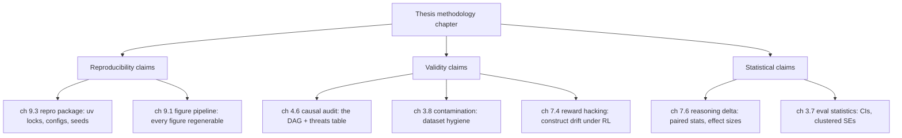

# Writing the methodology chapter

The methodology chapter is where a thesis lives or dies in the committee room. It is not where you report results and it is not where you sell the idea. It is where you convince three skeptical people that if they had run what you ran, they would have gotten what you got, and that what you got means what you say it means. Everything in this book has been building toward being able to write that chapter without flinching.

The good news is that I have not been writing a thesis and a book as two separate acts of labor. Every chapter left an artifact on disk: a config, a task suite, a logged run, a figure script, a causal audit. The methodology chapter is mostly an act of *mapping*, pointing at artifacts that already exist and saying "here is the evidence for that claim, at this path, under this commit." This chapter is about doing that mapping deliberately, and about pre-loading the answers to the three challenges committees always raise: construct validity, statistics, and contamination.

```admonish read-along
This is the one thesis-facing chapter in Part IX, so it talks about the thesis document (a private LaTeX repo) as well as the book. The methodology skeleton I build in the lab is public and lives in the repo; the filled-in thesis prose stays private until after the defense, per the licensing split in chapter 9.3. Where I quote a measured result I write "(measured on the baseline machine, record value, date, driver)" because I will not fabricate numbers, and the real values come off the MSI Aegis R2 (RTX 5080 16GB) into the private thesis, not into this book.
```

## Theory

### What a methodology chapter is actually for

A results chapter answers "what happened." A methodology chapter answers "why should I believe it, and how would I redo it." Those are different burdens. The second one decomposes into three questions a reader is entitled to ask, and a good methodology chapter answers all three before the reader has to ask:

The first is **reproducibility**: given your artifacts, can I re-run this and get the same thing? This is the easiest to satisfy mechanically and the one this book is built to nail, because every run is in MLflow, every figure is regenerable (chapter 9.1), and every config is version-pinned in the reproducibility package (chapter 9.3).

The second is **validity**: does your measurement measure the construct you claim? A number can be perfectly reproducible and still measure the wrong thing. If my "reasoning delta" is really a "format-compliance delta" because the scorer rewards a boxed final answer and the model just learned to box its guesses, then I have a reproducible measurement of the wrong construct. This is construct validity, and it is where the causal work in Part IV earns its place in the thesis.

The third is **inference**: are your statistical claims warranted by your design and sample size? An improvement of a few points across three seeds is a different epistemic object depending on whether it is a paired comparison on shared items with an effect size and an interval, or two bar heights with no uncertainty at all. Chapter 7.6 did this work; the methodology chapter has to surface it.

### The mapping principle

The central move is to treat the thesis methodology chapter as an index into the book, not a re-derivation. Every methodological claim in the thesis should resolve to an artifact: a file, a commit, a chapter, a logged run ID. If a claim can't be resolved to an artifact, it is either unsupported or it belongs in the discussion as a limitation. That discipline does two things. It keeps the methodology chapter honest, because every sentence has a pointer or it gets cut. And it keeps it short, because the heavy machinery lives in the book and the appendices, and the chapter just routes to it.



Read that diagram as the table of contents for the methodology chapter. Each leaf is a place the book already did the work.

### The three challenges, and where the book pre-answers each

**Construct validity: "how do you know you measured reasoning?"** This is the sharpest question a committee asks about an RL-from-evals thesis, because the whole design has a built-in failure mode: reinforcement learning optimizes whatever the scorer rewards, so if the scorer is a bad proxy for reasoning, the model will get better at the proxy and the "reasoning delta" will be an artifact of the reward, not a real capability gain. This is Goodhart's law wearing a lab coat. The book confronts it in three places. Chapter 7.4 (reward hacking and Goodhart) is the direct treatment: how scorers get gamed and how I detect it. Chapter 4.6 (the causal audit) is the formal treatment: a DAG of the whole serve-to-score-to-train pipeline with the threats to validity enumerated and each one mapped to a mitigation. And chapter 3.8 (contamination) rules out the specific validity threat where the "reasoning" was memorized. In the thesis, I quote the audit and point at these three chapters, and the construct-validity question is answered before it is asked.

**Statistics: "is this improvement real or is it noise?"** Committees have seen too many deltas that evaporate under a proper test. The book's answer is that the reasoning delta was always designed as a paired comparison. Chapter 3.7 sets up the statistics of evals: accuracy is a mean of Bernoulli trials, so it has a binomial confidence interval, and when items are grouped (multiple samples per prompt, or prompts sharing a source) the naive SE understates uncertainty and you need a clustered or hierarchical estimate. Chapter 7.6 applies that to the pre/post design: same items before and after, a paired test on the per-item score differences, an effect size (standardized mean difference) with an interval, and a separate look at whether the gain is a shift in the mean or a shift in pass@k. The methodology chapter states the design (paired, shared items, seeds as the unit of replication), names the test, and points at 7.6 for the worked computation.

**Contamination: "was the eval in the training data?"** For any model trained on a large web corpus, the null hypothesis a committee holds is that the benchmark leaked into pretraining. The book's answer is chapter 3.8, dataset hygiene: how I built the thesis task suite (chapter 3.9) to reduce contamination risk, the decontamination checks I ran, and the honest statement of residual risk for items I couldn't fully clear. The methodology chapter reports the hygiene procedure and cites the audit's treatment of contamination as a formal threat.

### The line between methodology and limitations

A methodology chapter is stronger when it knows where it ends. Not every threat gets fully closed, and pretending otherwise is the fastest way to lose a committee's trust, because they will find the gap you papered over. So I draw an explicit line: threats I mitigated go in the methodology chapter with their mitigation and evidence, and threats I could only bound or partially address go in the limitations section of the discussion, stated plainly with the residual risk quantified where I can quantify it. The causal audit is what lets me draw that line honestly, because it enumerates every threat, and each one gets sorted into "closed here, see chapter X" or "bounded, residual risk is Y, discussed in limitations." A committee reading that split sees someone who understands their own design well enough to know its edges, which is a far better position than claiming a design with no edges. The mapping tool below encodes this by giving every claim a challenge category and an artifact; a claim whose best available artifact is "bounded, not closed" is a signal to route that threat to limitations rather than to overstate it in methodology.

### Citing the causal audit verbatim

The causal audit from chapter 4.6 is the single most useful methodology exhibit in the book, because it is already written in the register a committee wants: a DAG, an enumerated threat list, and a mitigation for each threat with a pointer to where it was handled. In the thesis I quote it verbatim rather than paraphrase, so the methodology chapter and the causal chapter cannot drift apart. The audit's framing statement, quoted as it appears in chapter 4.6, is:

> "The estimand is the causal effect of the GRPO update on reasoning capability, not on scorer output. We treat the scorer as a measurement instrument sitting on the causal path from capability to reward, and every threat below is a way that path can be confounded, blocked, or short-circuited so that reward moves without capability moving. A result is admissible as evidence of a reasoning delta only if the threat that would produce the same reward movement without a capability change has been ruled out or bounded." (chapter 4.6, causal audit v1.0)

That paragraph does more work in a committee room than any results table, because it states plainly that I know the difference between "reward went up" and "the model got better at reasoning," and that my design is built to tell them apart. The audit's threats table, also quoted verbatim in the thesis, enumerates the specific ways reward can move without capability (reward hacking, contamination, decoding-parameter confounds between the baseline and post-training serve, selection on solved items, judge-model drift) and points each at its mitigation chapter. The methodology chapter's job is to reproduce that table and let it stand.

```admonish gotcha
The most common self-inflicted wound in a methodology chapter is quoting your own earlier work approximately. If the thesis paraphrases the audit and the audit later gets revised, the two say slightly different things and a careful reader (or examiner) catches the seam. Quote verbatim with a version tag ("causal audit v1.0, chapter 4.6") and treat the audit as a single source of truth that both the book and the thesis point at. When the audit changes, bump its version and re-quote, never let two copies of a methodological claim exist that can disagree.
```

## Tooling

### The artifact-to-section map as a real file

I don't keep the mapping in my head. It lives in a YAML file in the thesis repo, one entry per methodological claim, each with the thesis section it supports, the book chapter that backs it, the artifact path, and the challenge category it answers. That file is the source that generates the methodology skeleton, and it is also a checklist: any claim without a resolved artifact path is visibly unfinished. The lab below builds this.

### Why a skeleton, not a draft

I generate a *skeleton* with pointers rather than trying to auto-write prose, for the same reason I don't auto-write the thesis: the prose is where I do the thinking, and I want to do that thinking, not launder it through a template. What the tool gives me is the scaffolding that guarantees I addressed every challenge and cited every artifact. The prose I write by hand into the scaffold. The skeleton is public (it reveals structure, not results); the filled draft is private until the defense.

## Lab

The artifact is a methodology skeleton with pointers into the book: a YAML claim map plus a generator that turns it into a Markdown skeleton with the three-challenge structure, verbatim audit quote slots, and artifact links. No GPU.

### The claim map

```yaml title="thesis/methodology/claim_map.yaml"
# One entry per methodological claim. Every claim MUST resolve to an artifact.
# challenge: one of {reproducibility, validity, statistics}
# A claim with artifact: null is unfinished and the generator flags it.

audit_version: "v1.0"          # chapter 4.6 causal audit; quoted verbatim
task_suite_version: "v1.2.0"   # chapter 3.9 thesis task suite

claims:
  - id: repro-env
    section: "3.1 Computational environment"
    challenge: reproducibility
    claim: "The full software stack is pinned and re-instantiable from lockfiles."
    book_chapter: "9.3 The reproducibility package"
    artifact: "repro/uv.lock, repro/configs/"

  - id: repro-figures
    section: "3.2 Analysis and figures"
    challenge: reproducibility
    claim: "Every figure is regenerated by script from a frozen, hashed export."
    book_chapter: "9.1 From logs to figures"
    artifact: "figures/build_all.py, export/export_manifest.json"

  - id: valid-estimand
    section: "3.3 What we measure"
    challenge: validity
    claim: "The estimand is the causal effect of the update on capability, not on reward."
    book_chapter: "4.6 Causal audit of the thesis eval design"
    artifact: "book/src/p4-causal/06-causal-audit.md"
    quote_audit: true

  - id: valid-reward-hacking
    section: "3.4 Threats to construct validity"
    challenge: validity
    claim: "Reward hacking is detected and bounded, not assumed absent."
    book_chapter: "7.4 Reward hacking and Goodhart"
    artifact: "book/src/p7-loop/04-reward-hacking.md"

  - id: valid-contamination
    section: "3.5 Dataset hygiene"
    challenge: validity
    claim: "The task suite is decontaminated; residual risk is stated per item."
    book_chapter: "3.8 Contamination and dataset hygiene"
    artifact: "repro/task_suite/decontamination_report.json"

  - id: stat-paired
    section: "3.6 Statistical design"
    challenge: statistics
    claim: "The delta is a paired comparison on shared items with an effect size and interval."
    book_chapter: "7.6 Measuring the reasoning delta"
    artifact: "book/src/p7-loop/06-reasoning-delta.md"

  - id: stat-clustered
    section: "3.6 Statistical design"
    challenge: statistics
    claim: "Uncertainty accounts for item clustering; seeds are the replication unit."
    book_chapter: "3.7 The statistics of evals"
    artifact: "book/src/p3-evals/07-eval-statistics.md"
```

### The verbatim audit quote, kept in one place

```yaml title="thesis/methodology/audit_quotes.yaml"
# Single source of truth for verbatim audit text. The book and the thesis
# BOTH pull from here, so they can never drift. Bump `version` when 4.6 changes.
version: "v1.0"
source: "chapter 4.6, causal audit v1.0"
framing: >
  The estimand is the causal effect of the GRPO update on reasoning
  capability, not on scorer output. We treat the scorer as a measurement
  instrument sitting on the causal path from capability to reward, and every
  threat below is a way that path can be confounded, blocked, or
  short-circuited so that reward moves without capability moving. A result is
  admissible as evidence of a reasoning delta only if the threat that would
  produce the same reward movement without a capability change has been ruled
  out or bounded.
threats:
  - name: "Reward hacking (Goodhart on the scorer)"
    mitigation: "7.4 Reward hacking and Goodhart"
  - name: "Contamination (benchmark in pretraining)"
    mitigation: "3.8 Contamination and dataset hygiene"
  - name: "Decoding-parameter confound (baseline vs post serve differ)"
    mitigation: "2.6 Benchmarking without lying to yourself"
  - name: "Selection on solved items"
    mitigation: "7.6 Measuring the reasoning delta"
  - name: "Judge-model drift"
    mitigation: "3.6 Judge models"
```

### The skeleton generator

```python title="thesis/methodology/make_skeleton.py"
"""Turn the claim map + audit quotes into a methodology chapter skeleton.

Output is a Markdown scaffold: the three-challenge structure, one section per
claim with its artifact pointer, and the verbatim audit quote dropped in
wherever a claim sets quote_audit: true. Prose is written by hand into this
scaffold, the tool guarantees coverage, not content.

Run: uv run python make_skeleton.py
Deps: uv add pyyaml
"""
from __future__ import annotations

from pathlib import Path

import yaml

HERE = Path(__file__).parent
CHALLENGES = ["reproducibility", "validity", "statistics"]
CHALLENGE_TITLES = {
    "reproducibility": "Reproducibility: can it be re-run?",
    "validity": "Validity: does it measure the construct?",
    "statistics": "Statistical inference: is the claim warranted?",
}


def load():
    claims = yaml.safe_load((HERE / "claim_map.yaml").read_text())
    quotes = yaml.safe_load((HERE / "audit_quotes.yaml").read_text())
    return claims, quotes


def render(claims: dict, quotes: dict) -> str:
    lines: list[str] = []
    lines.append("# Methodology (SKELETON: pointers, not prose)\n")
    lines.append(
        f"_Generated from claim_map.yaml. Audit {claims['audit_version']}, "
        f"task suite {claims['task_suite_version']}. "
        f"Fill each section with prose by hand; do not commit results until "
        f"after the defense._\n"
    )

    unfinished = [c for c in claims["claims"] if not c.get("artifact")]

    for ch in CHALLENGES:
        lines.append(f"\n## {CHALLENGE_TITLES[ch]}\n")
        group = [c for c in claims["claims"] if c["challenge"] == ch]
        for c in group:
            lines.append(f"### {c['section']}, {c['id']}\n")
            lines.append(f"**Claim.** {c['claim']}\n")
            lines.append(f"**Backed by.** {c['book_chapter']}\n")
            art = c.get("artifact") or "**MISSING ARTIFACT, resolve before defense**"
            lines.append(f"**Artifact.** `{art}`\n")
            if c.get("quote_audit"):
                lines.append(f"> {quotes['framing'].strip()}\n")
                lines.append(f"> {quotes['source']}\n")
                lines.append("\n**Threats table (verbatim from the audit):**\n")
                lines.append("\n| Threat | Mitigation |")
                lines.append("\n|---|---|")
                for t in quotes["threats"]:
                    lines.append(f"\n| {t['name']} | {t['mitigation']} |")
                lines.append("\n")
            lines.append("\n_[write prose here]_\n")

    lines.append("\n## Coverage check\n")
    if unfinished:
        ids = ", ".join(c["id"] for c in unfinished)
        lines.append(f"UNFINISHED CLAIMS (no artifact): **{ids}**\n")
    else:
        lines.append("All claims resolve to an artifact. Coverage complete.\n")
    return "".join(lines)


def main():
    claims, quotes = load()
    assert quotes["version"] == claims["audit_version"], (
        f"audit version mismatch: quotes={quotes['version']} "
        f"claim_map={claims['audit_version']}, re-sync before generating"
    )
    out = HERE / "methodology_skeleton.md"
    out.write_text(render(claims, quotes))
    print(f"wrote {out}")


if __name__ == "__main__":
    main()
```

### Run it

```bash title="thesis/methodology/run.sh"
cd thesis/methodology
uv init --package . 2>/dev/null || true
uv add pyyaml
uv run python make_skeleton.py
```

### What you should see

A `methodology_skeleton.md` file with three top-level sections in the fixed order reproducibility, validity, statistics. Under validity, the `valid-estimand` entry carries the audit's framing paragraph as a block quote attributed to "chapter 4.6, causal audit v1.0," followed by the verbatim threats table mapping each threat (reward hacking, contamination, decoding-parameter confound, selection on solved items, judge-model drift) to its mitigation chapter. Every claim shows its thesis section, the book chapter that backs it, and a concrete artifact path. The final "Coverage check" section prints "All claims resolve to an artifact. Coverage complete." Now delete the `artifact:` line from any claim in `claim_map.yaml` and regenerate: that claim renders with "MISSING ARTIFACT, resolve before defense" and the coverage check names it as unfinished. That is the skeleton doing its job. It will not let me walk into a defense with a methodological claim I can't point at a file for. The prose I still write myself, section by section, into a private copy of this scaffold. What the tool guarantees is that I addressed all three challenges the committee will raise, quoted the audit exactly rather than approximately, and left no claim floating without evidence.

```admonish substack-seed
"How to pre-answer your thesis committee." Every eval-based ML thesis faces the same three questions: can it be re-run, does it measure the thing, and is the improvement real. This post turns that into a reusable pattern: a claim map that forces every methodological sentence to resolve to an artifact on disk, and a generator that fails when a claim has no evidence. The sharpest angle is the construct-validity trap specific to training-from-evals, reinforcement learning optimizes the scorer, so "reward went up" and "the model got smarter" are different claims, and your methodology has to be built to tell them apart before anyone asks.
```
